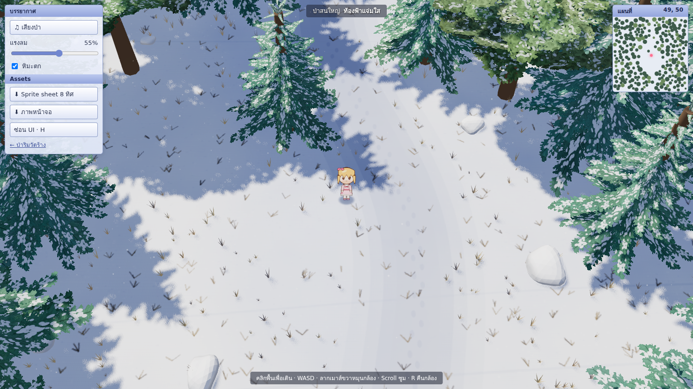

# Thai Native Online

แผนที่ต้นแบบสำหรับเกม RPG แฟนตาซีไทยยุคกรุงศรีอยุธยา สร้างด้วย Three.js และ Vite

## เริ่มใช้งาน

ต้องใช้ Node.js 22.12+ (หรือเวอร์ชันใหม่ที่ Vite รองรับ)

```sh
npm install
npm run dev
```

เปิด URL ที่ Vite แสดงใน terminal สำหรับ production ใช้ `npm run build` และตรวจด้วย `npm run preview`

## แผนที่แรก: ป่าริมวัดร้าง

- กล้อง Orthographic มุม 2.5D รองรับหน้าจอ Full HD 1920 × 1080 และปรับตามขนาดหน้าจอ
- ป่าเขตร้อน ต้นไม้ใบกว้าง กอไผ่ หญ้าแบบ instancing พร้อม shader ลม
- พื้นผิว procedural 2048 × 2048 ทางดิน เงาแสงเช้าและแสงเย็น
- เจดีย์ทรงระฆัง ซากกำแพงอิฐ ศาลาไม้หลังคาไทย ศาลเจ้าป่า และคลองบัว
- ละอองแสง ใบไม้ร่วง น้ำเคลื่อนไหว และเสียงลมกับนกที่สร้างด้วย Web Audio
- เดินสำรวจ ชนสิ่งกีดขวาง แผนที่ย่อ และการสำรวจจุดสำคัญ

## แผนที่ที่สอง: ป่าสนใหญ่ (`/forest.html`)



- ต้นสนและต้นไม้ใบกว้างมีหิมะเกาะ ลำต้นโค้งตามแรงลมเป็นระลอก (gust) และปลายกิ่งพริ้วไหว เงาบนหิมะก็ไหวตาม
- แสงแดดอุ่น เงาสีฟ้านุ่ม เงาเมฆเคลื่อนผ่าน หิมะตก หญ้าแห้งโผล่พ้นหิมะ
- ตัวละคร sprite สไตล์ Ragnarok Online วาดด้วย canvas: 8 ทิศ × (เดิน 4 เฟรม + ยืน 2 เฟรม) พร้อมเงาวงกลมใต้เท้า กดปุ่มในเกมเพื่อดาวน์โหลด sprite sheet เป็น PNG ([ตัวอย่าง](docs/novice-8dir-spritesheet.png))
- เสียงป่าใหญ่จาก Web Audio: นก 7 ชนิด (trill, เสียงหวีดสองโน้ต, warble, นกกาเหว่าไกล ๆ, นกหัวขวาน, เสียงแหลมเล็ก, อีกา) กระจายซ้าย-ขวา ลม/ใบไม้ไหวตามแรงลม เสียงก้องในป่า และเสียงเหยียบหิมะ
- คลิกพื้นเพื่อเดินแบบ RO, ลากเมาส์ขวาหมุนกล้อง, ใบไม้ที่บังตัวละครจะโปร่งให้เห็น
- เครื่องที่ GPU อ่อน เปิด `/forest.html?low`

โค้ด: `src/forest/scene.js` (ป่า ลม หิมะ), `src/forest/sprite.js` (ตัวละคร), `src/forest/audio.js` (เสียง), `src/forest/main.js`

## ควบคุม

| การกระทำ | ปุ่ม |
| --- | --- |
| เดิน | W A S D / ลูกศร / ปุ่มสัมผัสบนมือถือ |
| เดินไปยังจุด | คลิกพื้น (เส้นตรง ไม่มี pathfinding; ใช้ WASD เดินอ้อม) |
| เลื่อนมุมกล้อง | ลากเมาส์ขวา |
| ซูม | Scroll |
| คืนมุมกล้อง | R |
| สำรวจจุดสำคัญ | E / แตะข้อความสำรวจ |
| ซ่อน UI ชมแผนที่ | H |
| ปิดแผงตั้งค่า | Escape |

ภาพและโมเดลทั้งหมดสร้างจาก geometry และ canvas ในโค้ด ไม่มี assets เกมจากแหล่งอื่น ฟอนต์ Noto โหลดจาก Google Fonts และมี system fallback เมื่อ offline สถาปัตยกรรมเป็นการตีความเพื่อเกม ไม่ใช่แบบจำลองโบราณคดี

## ขอบเขตเวอร์ชัน 0.1

เวอร์ชันนี้เน้น map และการเดินสำรวจ แถบสถานะผู้เดินทางเป็น UI ต้นแบบ ยังไม่มีระบบต่อสู้ EXP ดรอปไอเท็ม บอส multiplayer หรือ persistence

โครงสร้าง (แผนที่แรก): `src/world.js` สร้างโลกและ player; `src/main.js` จัดการ render, controls, UI และเสียง; `src/style.css` จัดหน้าจอ

## ขั้นต่อไป

1. โหลด character และ animation ที่สมบูรณ์ แทนตัวเดินทางแบบ geometry
2. เพิ่ม combat, monster spawn, EXP, inventory และ loot tables
3. เพิ่มลานบอส การบันทึกเกม และระบบออนไลน์
