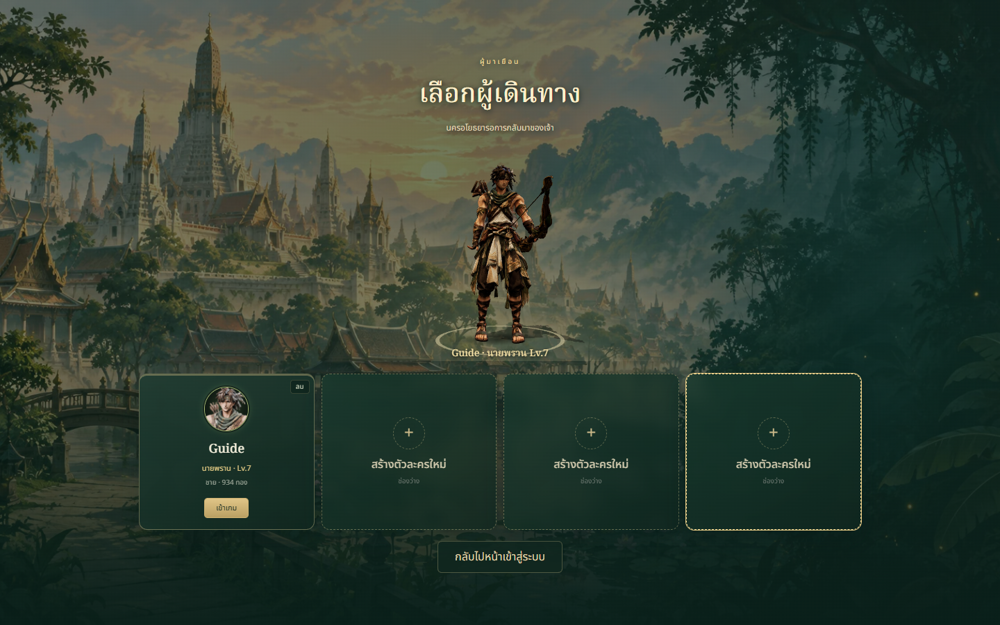
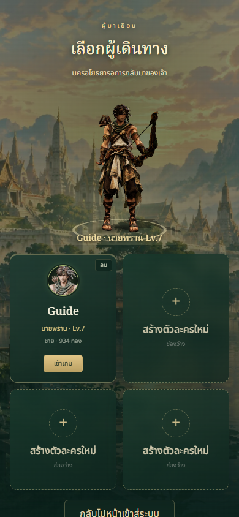

# Character selection background

Character selection now shares the illustrated dawn capital with the login
entrance. A dark jade vignette keeps labels readable, while the transparent
turntable stage lets the model stand in the landscape. Wider desktop content,
rounded lacquer cards and a warm gold enter button replace the isolated dark
rectangle. Phones retain two-column slots and vertical scrolling.

Changed files: `src/account/screens.js` adds the scoped selection class,
decorative background and welcome line; `src/account/account.css` defines
selection-only backgrounds, stage and responsive card treatment. This report
and two screenshots document the result. Existing login illustration is reused;
no new image download, dependency or WebGL context is introduced.

Validation: 281 tests and production build pass. Browser screenshots at
1440x900 and 390x844 show the hunter preview and populated/empty slots.
Background loads, no horizontal page overflow or page exceptions occur, and
choosing an empty slot reaches character creation. Decorative layers do not
receive pointer input. Model, account data and slot actions are unchanged.

Limitations: physical-device and formal art-director review remain pending.
Existing bundle-size warning remains. This branch has not been deployed.
