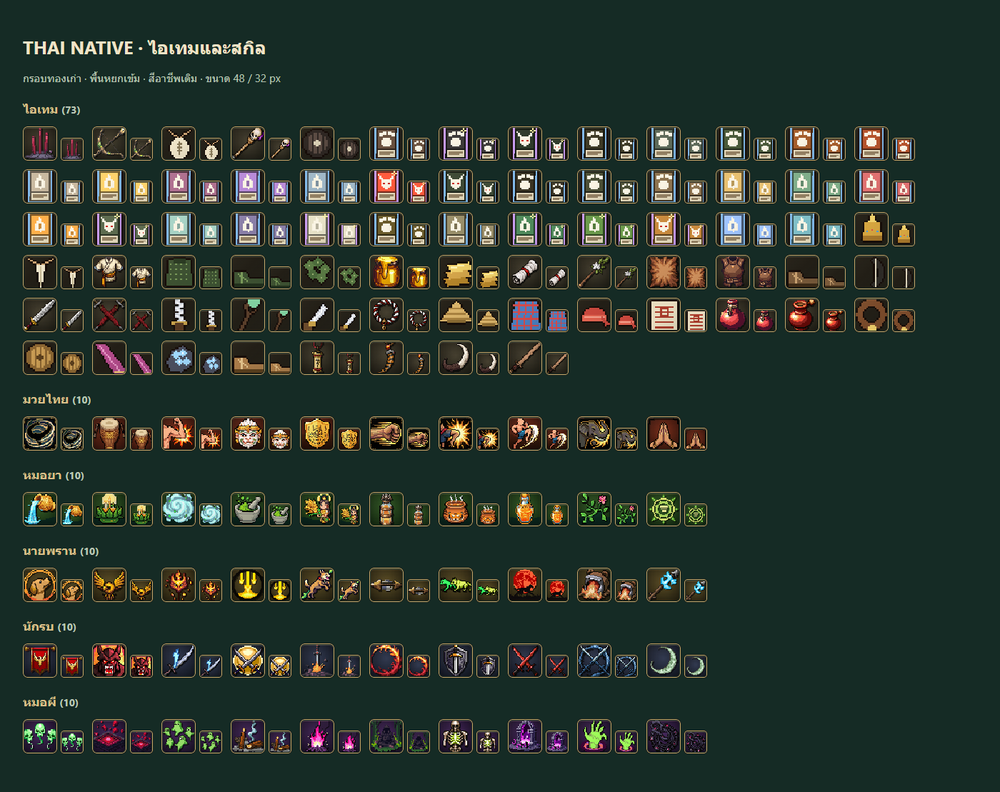
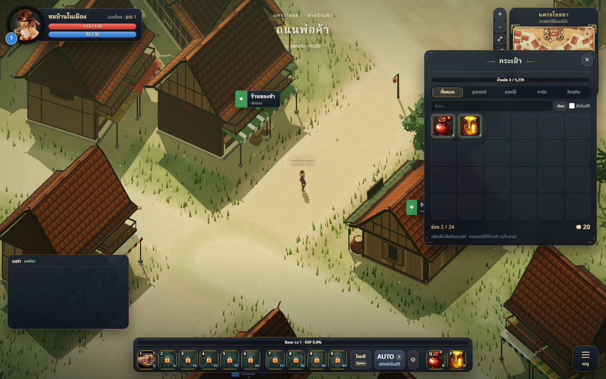
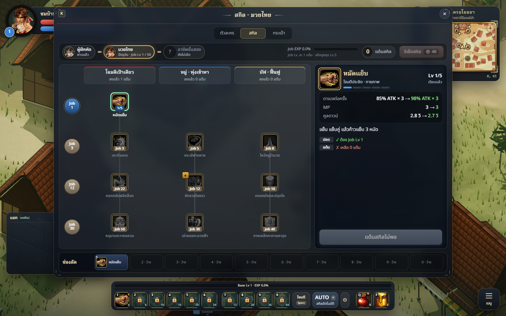

# Shared item and skill icon theme

The shared treatment uses an antique-gold rim, rounded corners, jade lacquer
backing and a restrained warm highlight. Existing subject art and class colours
remain recognizable. The live frame crops the four-pixel baked outer rim rather
than adding another heavy border. Rarity remains on the parent inventory slot;
counts, hotkeys, locks and cooldowns remain separate overlays.

## Changed files

- `src/ui/icons.js`: shared assetIcon markup, with escaped URLs and alt text.
- `src/ui/icon-theme.css`: frame, crop, size rules and inventory inner-box sizing.
- `src/main.js`: loads the shared theme for the game.
- `src/ui/ActionBar.js`, `src/ui/autoSettings.js`, `src/classes/fx/hotbar.js`:
  action-bar and AUTO icons use the same helper.
- `src/character/ui/SkillPanel.js`, `src/character/ui/CreationScreen.js`:
  skill tree, detail, assigned slots and character creation use the same helper.
- `tests/icons.test.js`: verifies shared markup, base path and attribute escaping.
- `tools/asset-review.html`: development-only review of all 73 item and 50 skill
  images at actual UI sizes. This report and four screenshots provide visual QA.

## Validation and limitations

276 tests and production build pass. Browser review loads all 123 images without
page exceptions, at 1400px and 390px viewport widths; the narrow gallery has no
horizontal overflow. Actual city inventory, skill tree and action bar were
visually inspected. Locked skills remain dimmed, counts and hotkeys visible.
No new raster downloads or texture memory are added; each icon adds a wrapper
and a decorative pseudo-element. Source PNGs are unchanged.

This unifies presentation, not a complete repaint of every subject. Monster
cards intentionally retain their inner card illustration borders. Skill VFX and
3D item models are outside this icon pass. Real-device performance and every
shop/social window still need playtesting; no formal art-director score is
claimed. Existing bundle-size warning remains. Deployment is delegated to
Claude; this branch has not been deployed by Codex.
