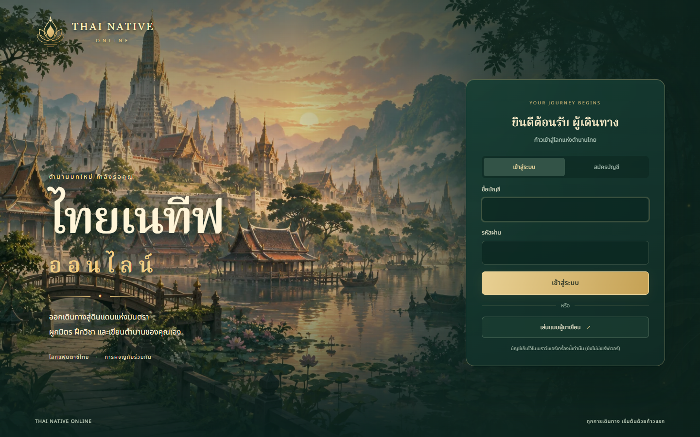

# Illustrated game entrance

The login screen now opens on an original Thai fantasy riverside capital at dawn,
with a jade and antique-gold form, a large Thai wordmark and a separate welcome
area. Desktop uses a two-column layout; phones use a vertically scrolling layout.
The generated illustration is shipped as a 282,120-byte WebP. No animation loop
or additional runtime package is required.

Changed implementation: `src/account/screens.js`, `src/account/account.css`, and
`public/ui/login/royal-dawn.webp`. Login-only selectors override the existing
touch layout without changing character selection or gameplay panels.

The logo refinement replaces the letter seal with an original SVG lotus/flame
crest (`public/ui/login/native-crest.svg`) and a larger serif wordmark. The
updated screenshot below shows the refinement. Login behavior and the 266-test
suite/build still pass; physical-device and art-director review remain pending.

## Verification

- 266 tests pass and the production build passes.
- Browser checks at 1440×900 and 390×844 report no page exceptions.
- Registration reveals password confirmation; mismatched passwords show an error.
- Switching back hides confirmation; guest entry reaches character selection.
- The mobile form stays within the viewport and the screen scrolls vertically.

## Limits

The existing production bundle warning remains. Real server login, Google OAuth,
physical mobile devices and the final art-director score have not been exercised
as part of this visual change. This report describes the local branch; UAT
deployment is a separate operation.
