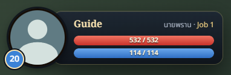
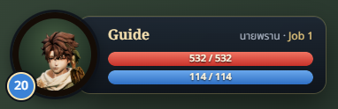
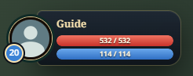
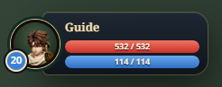
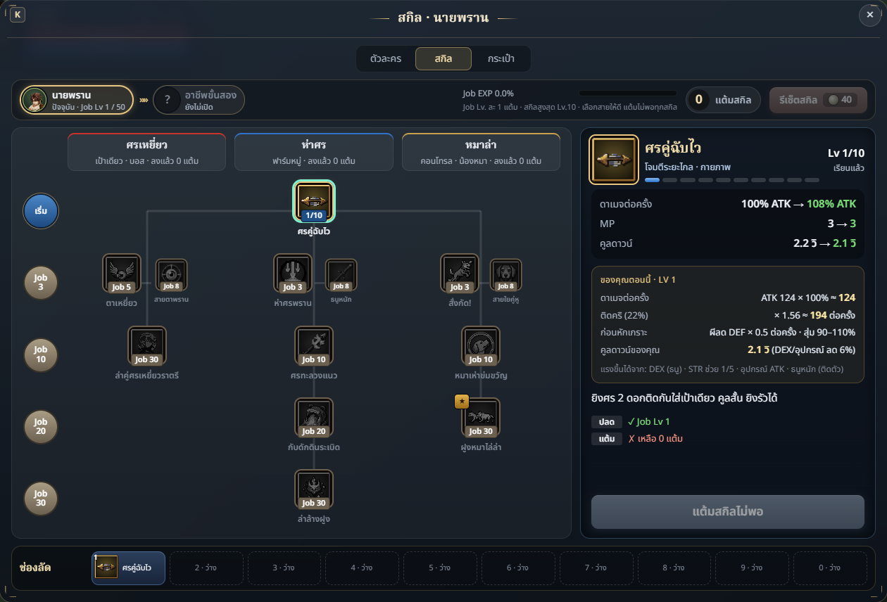

# Account portrait and current-class skill path

## Summary

The player HUD uses the profile photo of the account's most recently verified
Google identity. Accounts without a linked Google photo, guests and local-only
accounts retain the existing class portrait. Loading, missing, rejected and
failed images also retain that default. The profile affects only the player HUD;
character-selection, equipment and class icons continue to show character art.

The skill path now starts at the class chosen during character creation. The
fictitious completed trainee stage has been removed. The existing unavailable
second-class placeholder remains; progression and skills have not changed.

## Changed files

- `server/accounts.js`, `server/store.js`: save/refresh photos only after the
  existing Google token verification; nullable `picture` and `profile_updated`
  columns added idempotently. The authenticated `/api/me` returns the photo.
  Multiple links select the most recently verified identity.
- `src/account/profile-picture.js`: HTTPS Google image-host URL validation used
  by both client and server. No client-supplied character-save photo is admitted.
- `src/account/AccountPortrait.js`: memory-only current-account photo state,
  successful-load overlay, error fallback and stale-image rejection.
- `src/account/index.js`: fetch the profile after login/resume and refresh after
  linking Google. Guests clear the account photo.
- `src/character/ui/CharacterUI.js`, `character.css`: bind the photo to the
  existing portrait frame, preserve layout and draw the level above the photo.
- `src/character/ui/SkillPanel.js`: remove the nonexistent trainee chip.
- `tests/accounts-server.test.js`, `tests/google-profile.test.js`: profile
  response, ownership, refresh, URL admission and multiple-link regressions.
- This review, browser receipt and five screenshots.

## Art / Tech review

Independent specialist review approved the final implementation and all five
screenshots. Its multiple-Google-link finding was fixed and regression-tested.
Actual production styles supply square portrait bounds and visible level badges
at desktop and mobile sizes. Class defaults, HUD dimensions and controls stay intact.

## Validation

- Full Node suite: 758 passing, zero failures or skipped tests.
- Production build passes. Existing large-bundle warning remains.
- Browser QA: nine passing checks, zero page errors. Actual account entry,
  server-account client and CharacterUI modules were exercised with a local
  MemoryStore/Accounts verified-claims stub and a synthetic Google photo fixture.
- Checks cover resumed profile, Google client login, reload, photo/default frame
  geometry, failed image, late old-image rejection, 390px mobile, switching to a
  password-only account and the current-class skill path.
- One headless Edge browser/page was reused and closed afterward.

## Screenshots

These are captures of the actual UI. The silhouette in the Google-photo cases is
a synthetic QA fixture, not a real user's Google picture.

## Known limitations

- Existing Google links have no photo until the user signs in through Google or
  relinks it once; then the URL is stored for resumed sessions. Google photos
  update on subsequent verified sign-ins/relinks, not through background polling.
- Real Google popup authentication and a real PostgreSQL migration have not
  been exercised in this task; server verification was stubbed in QA. The SQL
  migration is additive, nullable and idempotent; existing links are retained.
- A profile request taking over three seconds uses the class default until the
  next refresh. Blocked/expired remote photos also use the default.
- Photos are shown only in the owner's HUD, not exposed through multiplayer.

Google's `picture` claim is documented in the
[official OpenID Connect reference](https://developers.google.com/identity/openid-connect/reference).
