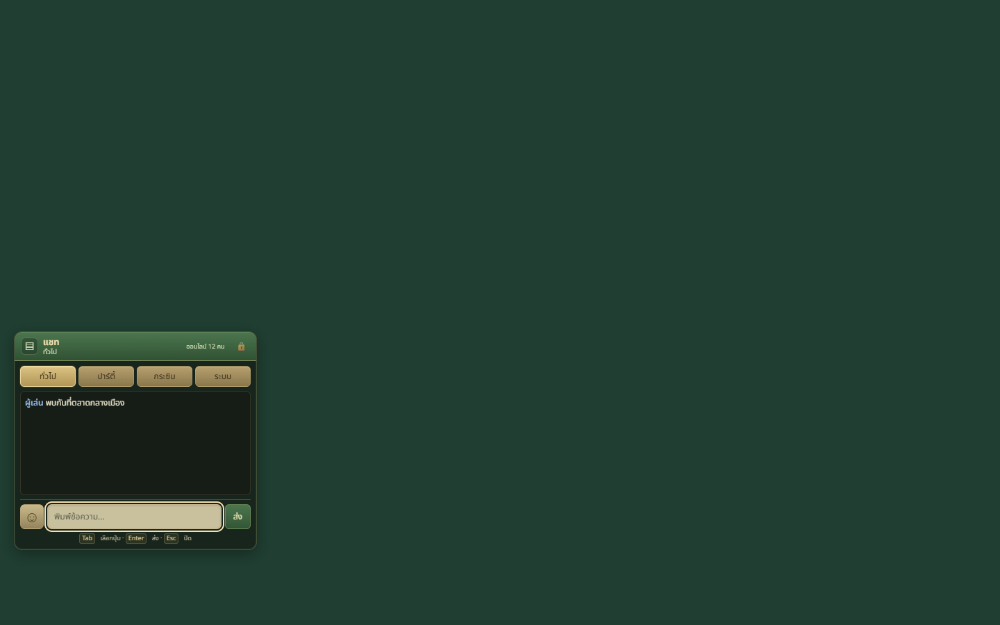
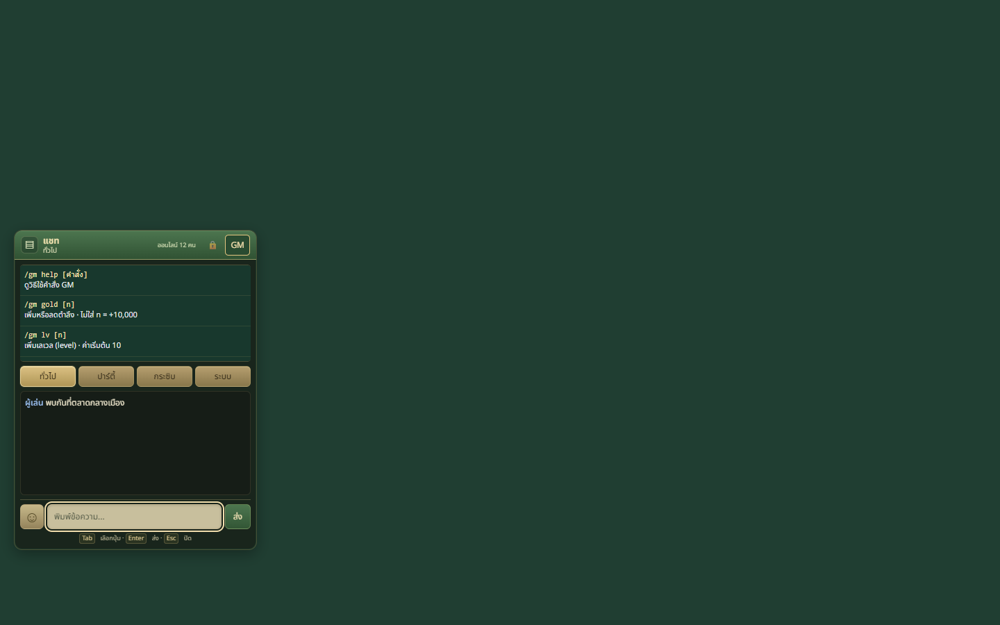
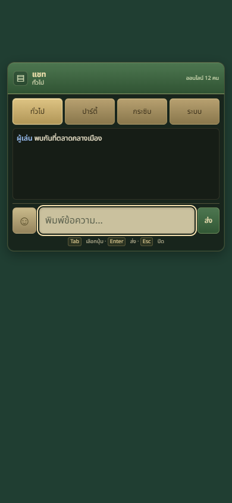
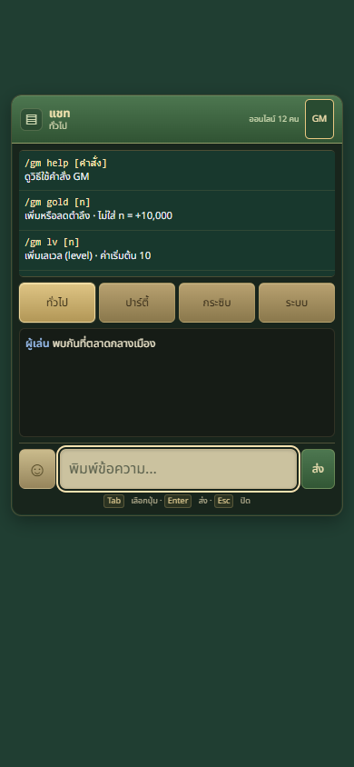
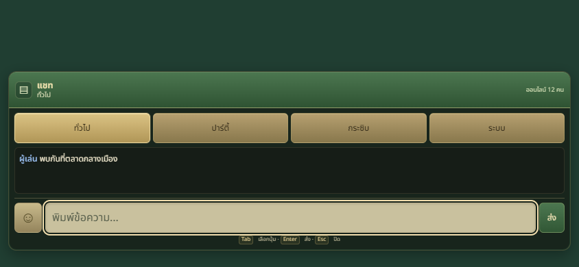
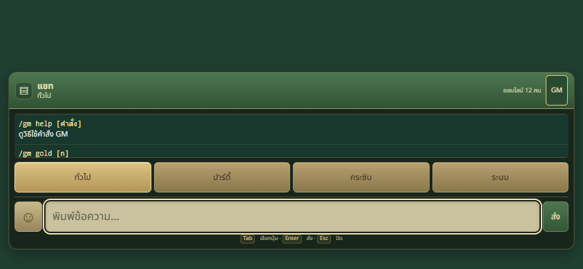
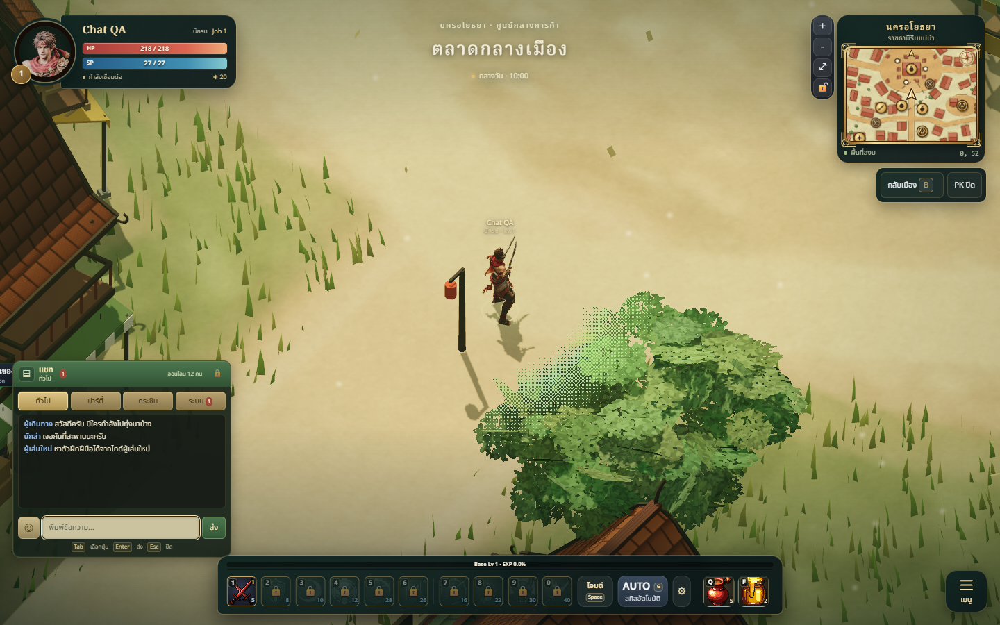
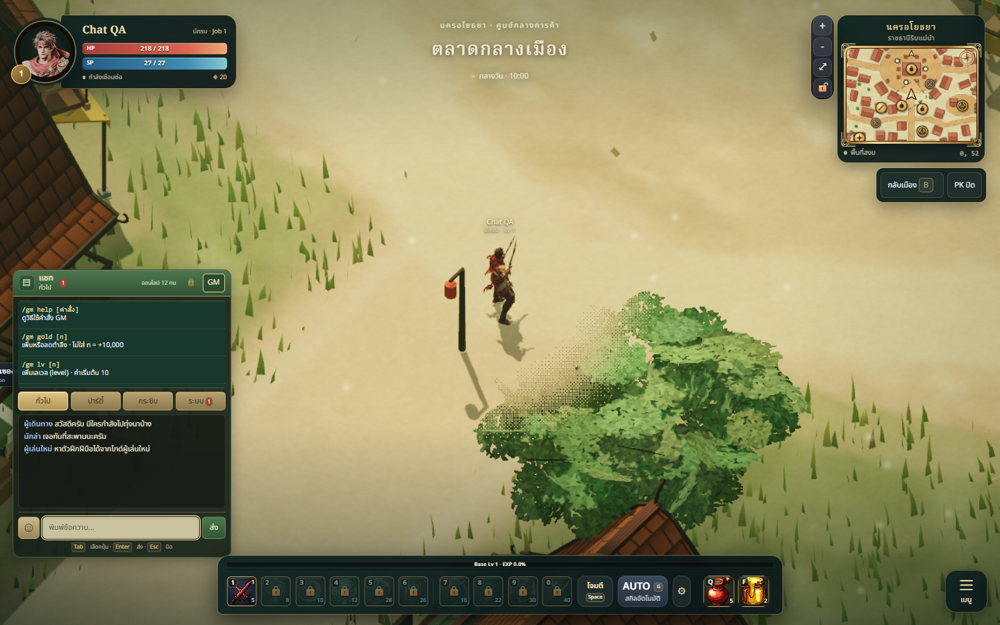

# Themed chat and admin command UI review

The supplied chat reference informs a green header, gold tabs, dark message
history and a stable bottom composer, adapted to the game's existing Thai
fantasy palette. The four working channels remain general, party, whisper and
system. Emoji insertion is functional and respects the 120-character input
limit. The panel remains at the playfield edge and collapses on small screens.

The existing ChatBox gains a private server-supplied list of 25 GM commands.
The GM button and command list are absent for ordinary players. Clicking an
entry fills the input; it does not execute the command. Disconnect, logout or
revocation removes the controls and private GM history.

These are isolated captures of the actual ChatBox component, not a whole-game
3D playtest. Account permissions are checked separately through the real local
HTTP/WebSocket server, using isolated accounts and the MemoryStore.

| Size | Ordinary player | Admin |
| --- | --- | --- |
| Desktop |  |  |
| Portrait |  |  |
| Landscape |  |  |

All six cases fit the viewport without document overflow or JavaScript errors.
Ordinary cases contain zero GM buttons and command entries. Admin cases contain
one button and 25 entries. Click-to-fill and removal after revocation pass.
See `checks.json` for the component checks.

The gold text and dark green panel preserve the game's style. The list scrolls
inside the chat panel on small screens; closing it restores history in landscape.
Channel routing, keyboard focus, offline draft retention, collapse and desktop
drag checks pass. Touch drag remains intentionally locked. Independent visual
review approves style 9/10, readability 8.5/10 and technical usability 9/10.

See [server command and authority documentation](../../../technical/SERVER_GM.md)
for command usage, persistent roles, validation and operational limits.

## Actual desktop Game check

Fresh 1440×900 captures show the loaded hero and city with the chat at the edge;
the minimap, action bar and central playfield remain visible. The isolated guest
uses an explicit private catalog fixture and blocks WebSocket/API writes; this
does not grant server privileges. Real server authorization is tested separately.
See `game-checks.json`: ordinary and revoked states have zero GM controls;
focused typing moves the player 0m in twenty fixed simulation steps; Enter sends
the exact Thai draft to the UI callback; history scrolls without zooming and
right drag leaves camera yaw unchanged. JavaScript errors: zero.

Full suite: 856 tests, 854 passed, zero failed and two existing skips. Build:
302 modules passed with the existing chunk warning. Nineteen focused GM tests
pass. Actual desktop and six component cases pass; physical mobile keyboards
and a live PostgreSQL server were not tested. Fixed steps do not measure FPS.

[Thai command sheet](../../../technical/GM_COMMANDS.md)

Ryuuuu is configured as the protected bootstrap admin in Railway UAT through
`ADMIN_IDS`, without triggering a deployment. This takes effect on the next main
deployment. No account credentials or database connection strings are recorded.
