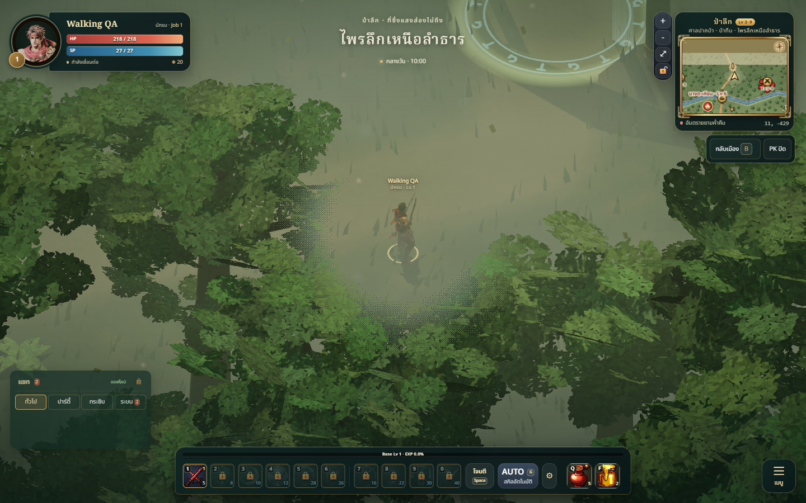
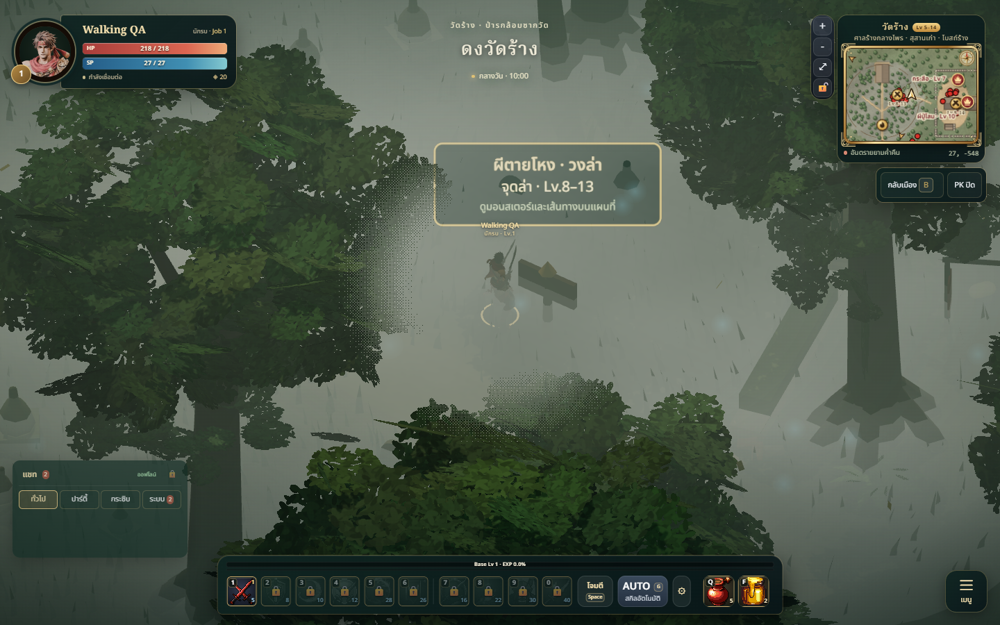
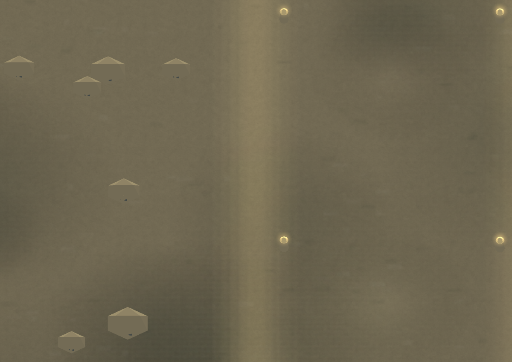
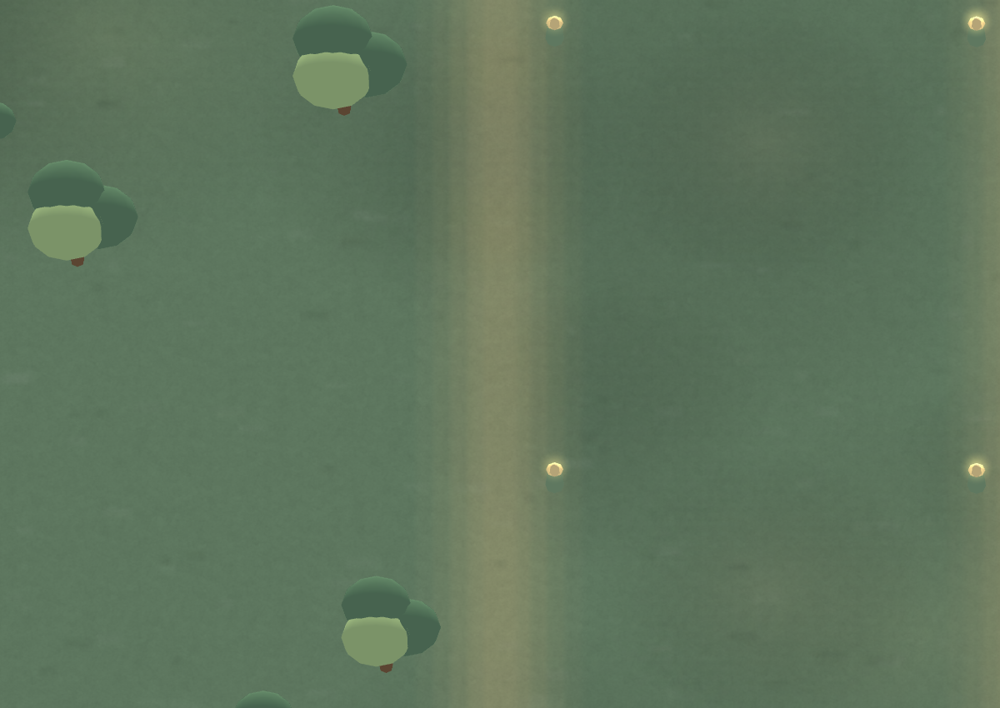

# All-map walking review

Candidate: `codex/all-map-walking`, based on deployed main
`15857934edfd51cb328b7c4405a287178adf79c8`.

## Matched actual Game captures

Before uses the deployed `/assets/main-Q85Bz-kJ.js` bundle. After uses the
frozen local candidate. Guest state is isolated and network writes are blocked.
Camera, starting coordinates and time of day match within each pair.

| Location | Before | After |
| --- | --- | --- |
| Forest portal arrival |  |  |
| Temple cemetery approach |  |  |

Both original standing checks fail; both candidate checks pass. Actual Game
click movement reaches each goal within 0.2m, using 70 and 99 fixed 1/60s steps.
Trusted W+D input advances 1.4m in twenty fixed Game steps. No JavaScript errors.
See `game-before.json` and `game-after.json`. These establish controller
behavior, not wall-clock FPS. The temple after capture shows the selection
marker and scenery while the asynchronously loaded hero asset is not visible.

## Expedition trail placement

| Location | Original whole map | Candidate whole map |
| --- | --- | --- |
| Giant valley |  |  |
| Himmapan |  |  |

Representative candidate side loops (different camera from the whole-map pairs):

Art/technical review approved style 8/10, trail readability 8.5/10 and technical
parity 8.5/10. Review covered fourteen top-down maps plus Game and side-loop views.

## Validation

- Fourteen actual loaded maps; 16,982 authored-road samples.
- Thirty dry-height false rejections reduced to zero.
- All 293,296 expedition usable-band probes pass with player-body padding.
- All 186 portal, arrival and hunt approaches reachable.
- Water geometry hashes unchanged; original six-map colliders retained.
- Retained expedition seeded props preserve exact positions; 192 lantern
  pillars relocated, reserved trail decoration removed.
- All service customer approaches accessible. Five duplicate staff-anchor
  records remain occupied; these are not player destinations.
- Full suite: 849 tests, 847 passed, zero failed, two existing skips.
- Build: 304 modules passed, existing large-chunk warning.
- Exported collision source hash matches the frozen source.

An earlier concurrent full run had an unrelated world-boss day-window timing
failure. Its isolated 2/2 rerun and the final full suite passed without source
changes. See [technical report](../../../technical/ALL_MAP_WALKABILITY.md)
and the compact `comparison.json` and `service-access.json` receipts. Full raw
sample reports remain local under `artifacts/all-map-walking/before/report.json`
and `artifacts/all-map-walking/after/report.json`; the audit tools reproduce them.

Solid scenery, deep water and map boundaries remain blocked. Every NPC schedule
and purchase flow was not exercised. This review does not include deployment.
