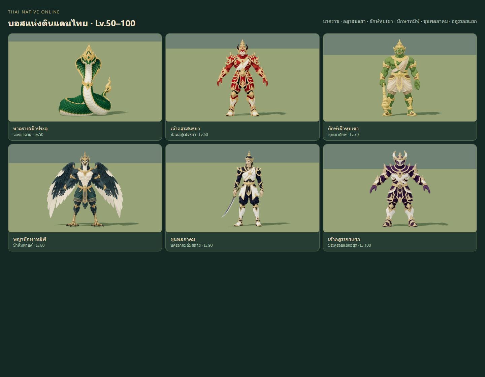

# Meshy bosses Lv50–100 — delivery

Six Thai boss bodies now use reviewed Meshy models instead of their fallback
geometry. Each has idle, walk, attack, hurt and defeat clips, with unchanged
server stats, spawns, loot, collision and authoritative skill timing. Existing
VFX remains attached to the same twelve boss skills. This batch supplies body
models and animation; it does not introduce twelve new VFX implementations.

| Boss | Level | Runtime rest height | Triangles | Bones | GLB bytes |
|---|---:|---:|---:|---:|---:|
| นาคราชเฝ้าประตู | 50 | 3.2 m | 12,548 | 6 | 1,559,336 |
| เจ้าอสูรสนธยา | 60 | 3.6 m | 12,495 | 16 | 1,581,120 |
| ยักษ์เฝ้าหุบเขา | 70 | 4.0 m | 12,489 | 17 | 1,437,052 |
| พญาปักษาทมิฬ | 80 | 3.8 m | 12,528 | 18 | 1,578,368 |
| ขุนพลอาคม | 90 | 3.8 m | 12,465 | 17 | 1,484,852 |
| เจ้าอสูรรอยแยก | 100 | 4.2 m | 12,504 | 16 | 1,496,980 |

All six use one material draw, decoded 1024-square base colour and 512-square
normal textures, and at most four normalized bone influences. Measured ground
anchors account for the Giant's club and Commander's sword; the Commander also
uses its measured facing. Final height adjustments from the initial brief are
Giant 4.2→4.0 m, Commander 3.6→3.8 m and Rift 4.0→4.2 m, accepted in the matching
native identification views. Collision sizes are unchanged.

## Anatomy, motion and presentation

The Naga has one continuous serpent body, no humanoid limbs and a fixed grounded
coil. Biped hands retain the generated natural fingers, without finger
retargeting. Giant's real club and Commander's real curved dha stay attached to
the right hand; Garuda has two independent arms and two separate wings. Missing
weapons in the initial Giant/Commander jobs were rejected and regenerated with
Meshy, rather than patched with substitute geometry.

Source-topology cloth/forearm weights repair the measured deformation failures.
Stronger torso/head recoil and supported defeat poses resolve sampled reaction
readability. Existing three lower-level boss rigs retain their default motion
behavior. Material clones apply 35% painted fill and 45% atmospheric fog
contribution only to this batch; cached materials and the global fog remain
unchanged. Floors and safe skill footprints are not moved to hide defects.

## Changed files

- Runtime: `src/combat/MonsterModels.js`, `src/combat/BossMaterial.js`, six
  `public/models/monsters/*.glb` files.
- Authoring: `tools/monster-models/meshy/` species rig/export helpers, source
  candidates, references, provenance, frozen `rigs/` recipes/calibrations,
  `qa_boss.js`, `qa-runtime.cjs`, and `scenes/map-bosses-50-100.blend`.
- Review: `tools/boss-review.js` and this directory's receipts/screenshots.
- Regression tests: `tests/boss-material.test.js`, `tests/boss-rig-weights.test.js`,
  `tests/naga-rig.test.js`.
- `.gitattributes` preserves this batch's exact frozen JSON bytes across platforms
  so Git newline conversion cannot invalidate the recorded receipt hashes.

## Validation and review

`npm test`: **461 passed**, zero failures/skips. `npm run build`: **233 modules**,
success; the existing large bundle warning remains.

[Runtime QA](runtime-qa.json) samples every exported key plus 24 Hz, using actual
indexed surface edges. Unchanged gates: edge ratio >2 **and** extension >1 cm;
limb-length error 5 mm; idle foot/coil drift 1.5 mm; native flat-ground clearance
-10 mm. All six have zero failures across five clips. The worst measured native
floor clearance is approximately -0.551 mm; maximum limb-length error is about
0.0223 mm. Rigid prop/wing skin matrices agree with their assigned parent within
the unchanged 0.0001 bound. This is not a palm-surface-contact measurement.

Each boss has 25 studio poses, four retained VFX stills, 14 direct motion samples
and desktop/touch native identification captures. Thirty additional closeups
target measured local contraction witnesses. See [final Art review](FINAL_ART_REVIEW.md),
[technical review](TECH_REVIEW.md), [static source review](STATIC_ART_REVIEW.md)
and [delivery hashes](delivery-manifest.json). Current Art targets reach >=8 in
the stated scope; earlier failed revisions remain historical and rejected.

[Packed-source receipt](source-export.json) verifies 12,140,638 bytes, SHA-256
`1b5ddd1dd2b3a948f2a1349b343b0b614c286cc1f63ce6be53cf1dea3593c310`.
[Read-only reopen](source-reopen.json) confirms six named armatures, sixteen
authored timeline/control actions, frames 1–155 and no missing assets. Only the
Naga is initially visible to avoid overlapping bodies; the other five remain
editable in the same source. The original three-boss source is separate.

Eight completed Meshy jobs cost **280 credits**; balance after generation was
**1,800**. No credit purchase. Six accepted task records and two rejected
missing-prop jobs are listed in the delivery manifest.

## Resource use and limits

The user requested one foreground Blender window. Seventeen accumulated owned
windows used about 13.1 GB RAM. Old working sessions were packed/checkpointed,
then sixteen owned windows closed gracefully; one current session remains at
about 1 GB. Reuse that foreground session and close verification workers promptly.

Native identification evidence covers current Naga/Rift at night, Dusk/Fallen
in evening and Giant/Garuda in daylight. Touch views are genuine browser touch
emulation, not physical-phone FPS measurements. Continuous motion, all terrain
contact, hidden compressed surfaces/volume, live per-skill body synchronization
and sustained authoritative combat are not certified by these stills. Natural
side/back occlusion remains; the review does not demand both wings or a weapon
grip be visible from every angle. See the final reviews for exact scope.

Deployment outcome is verified against the merged commit and exact public asset
hashes after the PR merges; the local review gallery is a development tool.
