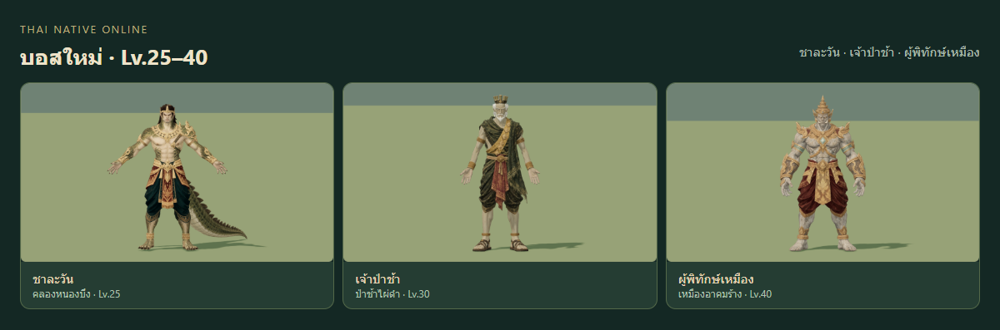

# Boss models and skill effects — review

## Summary and scope

Three new Meshy image-to-3D humanoid bosses replace their existing fallback bodies:
Chalawan Lv25, graveyard keeper Lv30 and sealed mine guardian Lv40. Chalawan is a
human/crocodile hybrid with two arms, two legs and a continuous tail. This is a
fantasy interpretation of his human/crocodile transformations, not a claim that
Thai literature describes a permanent hybrid.

All twelve primary map bosses receive terrain-following Thai-inspired warning
ornament and impact effects. Preserve buffalo/Takian/Pu Som's approved models.
The six higher-level missing bodies remain pending Meshy generation. Paid scope:
three successful tasks, 105 credits; 30 credits remained after generation.

## Changed files

- `src/combat/MonsterModels.js`: three GLB profiles, correct standing pivot beneath
  Chalawan's body, textured .35 fill to retain colour in night lighting.
- `src/combat/BossSkillVFX.js`, `BossTelegraphs.js`: twelve themed effects, exact
  existing warning footprints and safe ring centres, authoritative timing only.
- `src/combat/CombatResources.js`, `CombatView.js`, `src/world/MapManager.js`:
  release owned geometry/materials, instance buffers and skeleton textures;
  preserve cached GLB geometry and textures for neighbouring live clones.
- `src/combat/MonsterFeedback.js`: strong untextured hit/status feedback, restoring
  the original emissive colour, intensity and texture exactly afterwards.
- `server/data/collision.json`: regenerated source fingerprint required by the
  MapManager edit. All baked collision geometry is identical to the base commit.
- `public/models/monsters/{chalawan,bamboo_grave_3,sealed_mine_3}.glb` and the
  corresponding `tools/monster-models/meshy` sources, references, provenance,
  explicit weight recipes, calibration, rig reports and export tooling.
- `tools/monster-models/meshy/scenes/map-bosses.blend`: packed editable scene with
  all three measured rigs and independent foot controls; reopened successfully.
- `tools/boss-review.html`, `boss-review.js`: local interactive model/VFX review.
- `tests/boss-art.test.js`, `boss-rig-weights.test.js`, `monster-feedback.test.js`:
  geometry boundaries, cancellation/resources and shared-cache ownership,
  explicit weights, motion math, export recovery and feedback restoration.

## Assets

| Boss | Runtime bytes | Triangles | Bones | Materials/draws | Independent clips |
|---|---:|---:|---:|---:|---|
| Chalawan | 1,530,416 | 12,410 | 19 | 1 | idle, walk, attack, hurt, die |
| Graveyard keeper | 1,410,124 | 12,312 | 16 | 1 | idle, walk, attack, hurt, die |
| Mine guardian | 1,460,000 | 12,495 | 16 | 1 | idle, walk, attack, hurt, die |

Static source anatomy review passed: two arms/two legs, five visible digits per
hand, coherent palms/thumbs, forward feet, balanced faces and tail continuity.
The actual source surfaces were retained. Explicit <=4 normalized influences,
cloth/armor ownership and source-finger poses replace automatic weights. No
individual finger rotation, transferred class skeleton or procedural new body.

The native GLB audit caught and corrected a tail rotation that dipped under the
floor, robe weights inherited from an arm, and collar weights inherited from the
head/arm. Final exported clips pass the same unrelaxed edge/foot/limb/floor gates.
Chalawan's tail rotates around measured vertical axes; his long bounding box no
longer shifts the standing body away from its target/collision root.
The final defeated poses bow the torso and head. The keeper keeps straight
planted legs to avoid stretching hanging cloth; the mine guardian crouches
slightly. Chalawan's small root drop preserves his tail attachment. Deeper trial
crouches failed the native edge gate and were replaced, without relaxing it.

## Validation

- `npm test`: **443 passed, 0 failed**. `npm run build`: **232 modules**, successful;
  the existing >500 kB bundle warning remains.
- Focused resource/rig/feedback checks: 14 passed before the final full run.
- Native shipped GLBs: all five clips sampled at every exported key plus 24 Hz;
  no nonfinite vertices, invalid weights, limb-length violations, idle foot drift,
  floor violations or stretched edge/sample failures. An edge fails when its
  source length >=5mm, ratio >2 AND extension >1cm. Tiny area contractions are
  recorded without treating them as proof of visual anatomy acceptance.
- 123 review states: 75 posed model/view captures and 48 production VFX states;
  zero page errors and horizontal overflow. Two additional effect draws maximum,
  no new lights. Ring/cone/circle boundary tests sample actual transformed meshes.
- Six real local-server captures: desktop and touch/mobile viewport for each boss,
  observed `mlist`/`mspawn`, live server IDs, remote authority and loaded GLB bodies.
  Only the camera follows the natural boss; player/monster/clock state is unedited.
- L3 snapshot-isolated GLB/BLEND exports verified by bytes/hash. A Windows status
  file race was recovered by querying the same job identities; no paid task was
  repeated. Export query/slot acknowledgment now uses registered transactions.
- Packed final Blender source reopened in a separate read-only session with all
  three armatures. See `export-receipts.json`, `source-reopen.json`, `runtime-qa.json`,
  `capture.json`, `static-capture.json`, `actual-game-capture.json` for evidence.

## Art and technical review

Independent static-source review scores all three models 8/10 for Thai style and
anatomy. Final sampled pose readability scores 7.5/10 Chalawan, 7.5/10 keeper and
8/10 mine guardian; actual touch captures score 7, 7 and 7.5 respectively. No
gross limb, hand or tail break was observed. Death bows are visibly distinct
from idle. These are bounded visual judgments, not precise scientific metrics.
Six additional keeper cast witnesses at .35, .50 and .65 seconds from front/side
show intact forearm width, plausible elbows and open palms. The earlier needle
silhouette was not reproduced; the cast remains modest and close to idle.
See `cast-capture.json`; unsampled moments are not visually certified.
The .35 fill improves painted-colour visibility, while existing fog and canopy
occlusion still limit details. No claim of a night readability score >=8.

Technical review found and repaired shared-geometry disposal and weak hit/status
feedback. Ownership and restoration regression checks pass. All native clips
pass the unchanged numeric gates. Actual server captures prove loading and
authority, not every online animation state or physical-device GPU performance.

## Screenshots

[Chalawan game](chalawan-actual-game-mobile.png),
[graveyard keeper game](bamboo_grave_3-actual-game-mobile.png),
[mine guardian game](sealed_mine_3-actual-game-mobile.png).

[Chalawan wave](chalawan-1-impact.png),
[graveyard ritual](bamboo_grave_3-1-impact.png),
[mine stone collapse](sealed_mine_3-1-impact.png).

## Limits

This is three new bodies and twelve VFX profiles, not nine completed new bodies.
Higher-level model generation needs a separately funded Meshy batch. Existing
night fog, vegetation occlusion and transient game toasts can obscure details;
the textured body fill does not replace an environment-lighting/art pass. Captures
use headless Edge/SwiftShader, including touch emulation; physical mobile GPU/FPS
has not been measured. The five clips are modest stylized motions, without ragdoll
or individual finger animation. Tail continuity is visually reviewed; welded
manifold topology is not asserted.
