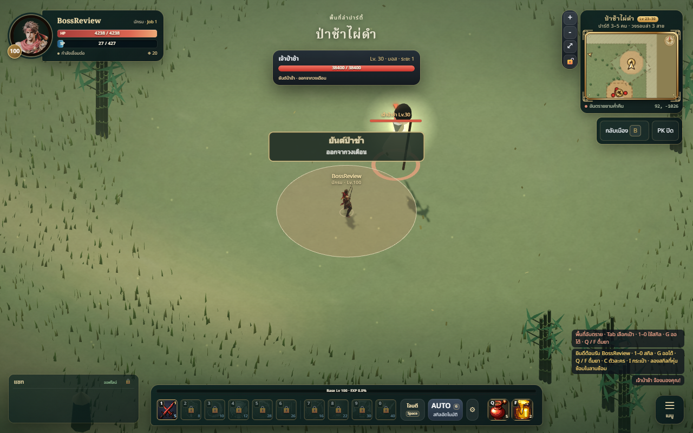
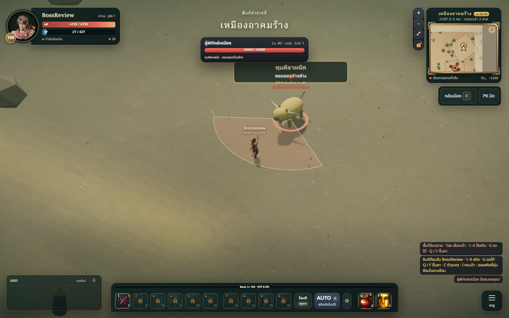
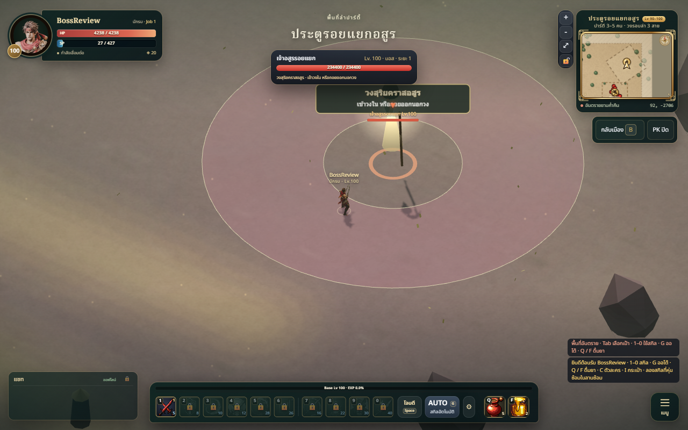
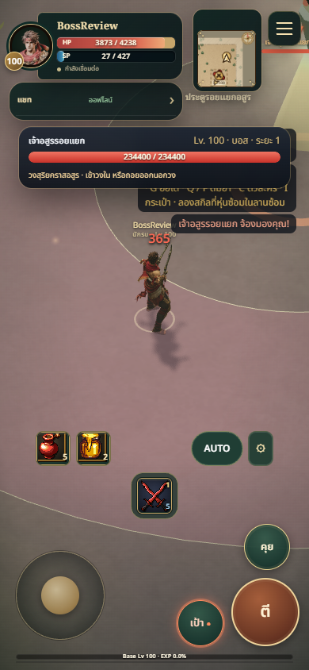
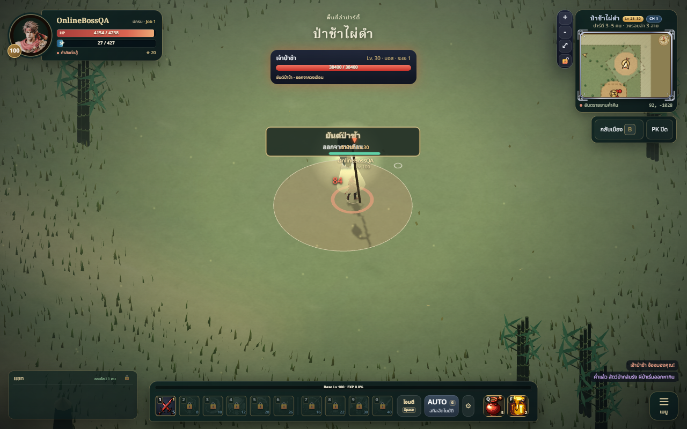

# Boss skills — review

Added two telegraphed attacks to every primary map boss (12 hunting maps), plus
the existing pop/krasue/tani encounters. This extends existing boss sites rather
than placing bosses in all 136 ordinary hunting pockets.

## Changed files

- Attack data / shared rules: `src/combat/data/boss-skills.js`,
  `src/combat/bossSkills.js`.
- Authority: `server/monsters.js`, `server/index.js`, `server/combatants.js`.
- Offline / networking: `src/combat/Combat.js`, `src/net/NetCombat.js`.
- Presentation: `src/combat/BossTelegraphs.js`, `src/combat/CombatView.js`,
  `src/combat/ui/CombatHUD.js`, `src/combat/ui/combat.css`, `src/ui/mobile-hud.css`.
- Tests: `tests/boss-skills.test.js`.
- Design / protocol / verification: `docs/technical/BOSS_ENCOUNTERS.md` and this
  folder; world progression and verification references.

## Validation

334 tests pass, build passes (existing bundle-size warning). Verified online
warning/impact/damage and late-join state using real local sockets. A real
networked browser also rendered its server warning. Offline shots exercise the
shared skill logic in the running game; they are not concept illustrations.

Self-reviewed against ART_BIBLE: muted warm hazard fill, precise terrain-following
geometry, clear safe inner ring, Thai attack names and dodge hints. Touch target
frame moved away from skill/attack buttons. No independent art rating or physical
device performance measurement was obtained.

## Screenshots

## Limitations

Not merged or deployed. Depends on PR #28. Existing boss meshes/attack poses are
reused; unique sculpted bosses, bespoke animations and sound are not part of this
change. The two skills per boss share three geometry families with different
names, ranges, timings and palette. No new status debuff or persistent hazard is
implied by an attack's name. Live party balance and mobile FPS remain unverified.
