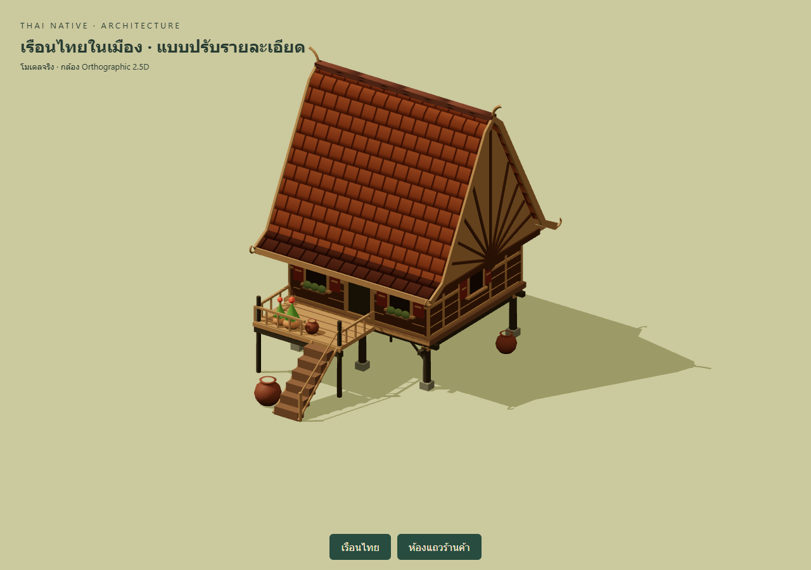
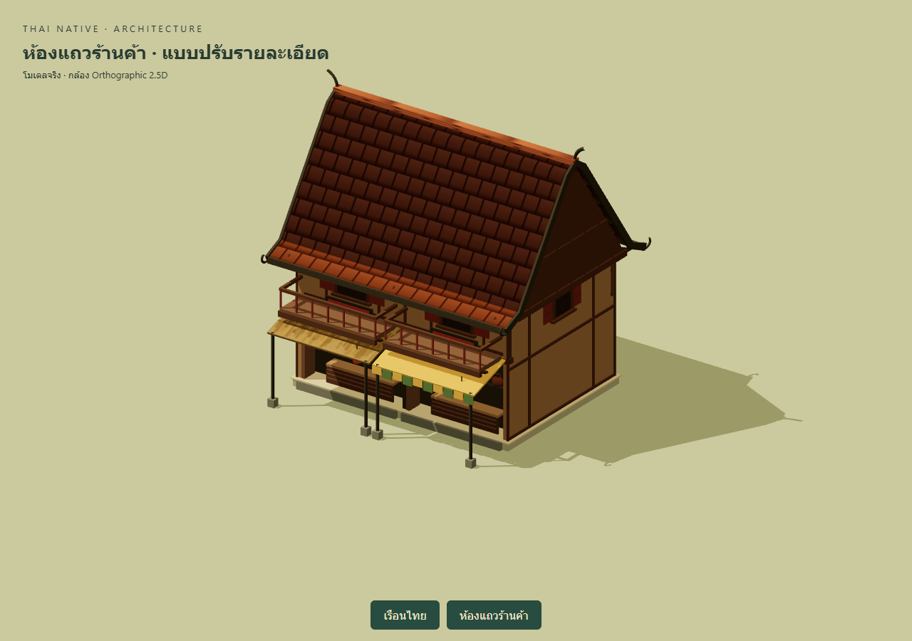
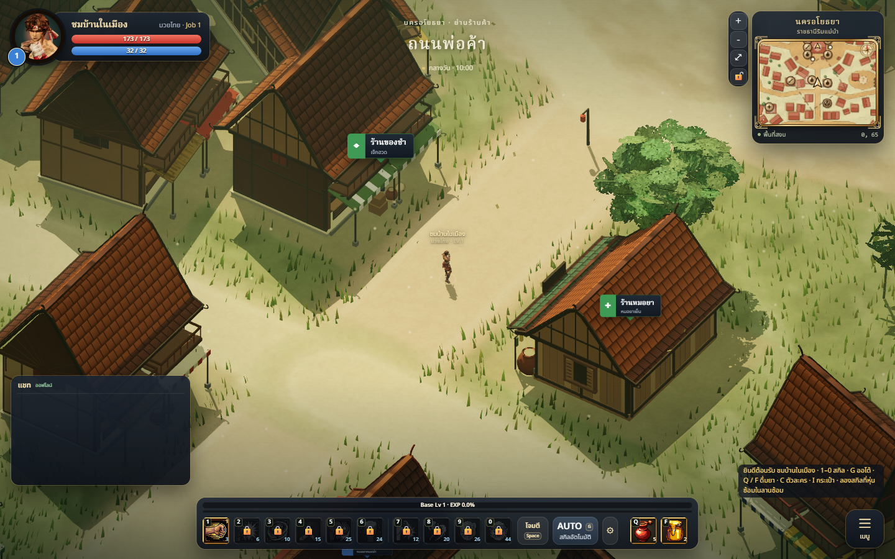

# City residences and shophouses

The city building style now extends to raised Thai residences and shophouse rows,
including general stores. Residences gain masonry post shoes, timber collars,
under-floor braces, broad board seams, window planters and warm tiled roofs.
Shophouses gain shallow upper galleries with rails, supports, post shoes,
thresholds and panel seams. These are procedural game meshes in the existing
stylized palette, rather than new Blender assets or playable interiors.

## Changed files

- `src/world/Architecture.js`: optional residence detail and shared shophouse detail.
- `src/world/districts/Fill.js`: enables residence detail only for city house zones;
  rural raised houses keep their existing appearance.
- `tools/housing-review.html`: development-only 2.5D review for both building types.
- This report and its three screenshots.

## Validation

275 tests and `npm run build` pass. Eighty comparisons across twenty seeds,
variable widths, roof choices and row lengths preserve RNG state and metadata
for footprints, colliders, decks, NPC anchors and props. The city loads without
browser page exceptions; herbalist, occult shop and forge approach points remain
walkable. Added cosmetic geometry does not change collision boundaries.

| Isolated review scene | Before triangles | After triangles | Render calls before / after |
|---|---:|---:|---:|
| Raised residence | 7,350 | 10,286 | 58 / 74 |
| Two shophouses | 8,470 | 9,606 | 71 / 75 |

These counters include props, ground and shadows under the same review camera.
The existing StaticBatcher combines geometry by material in the game. Local
baseline captures and comparison scripts are in ignored `artifacts/city-housing/`.

## Limitations

Mobile frame rate and night lighting still require device/playtesting. Added
balconies are cosmetic; interiors are not accessible. City houses previously
using thatch now use tile when detailed. Existing large-bundle build warning
remains. This expands the previous three-shop example set; specialized civic
buildings have not all been redesigned. No formal art-director score is claimed.
Deployment remains delegated to Claude; Codex has not deployed this branch.
