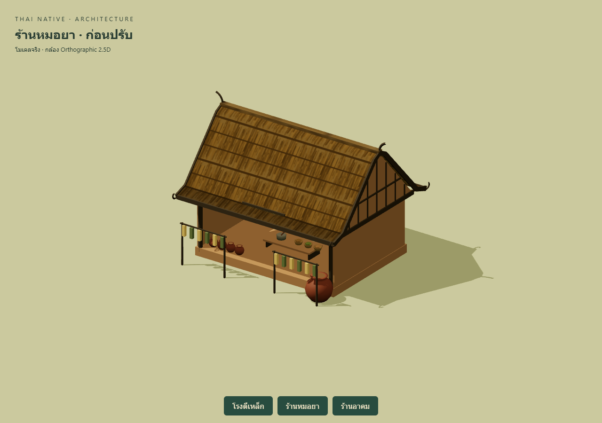
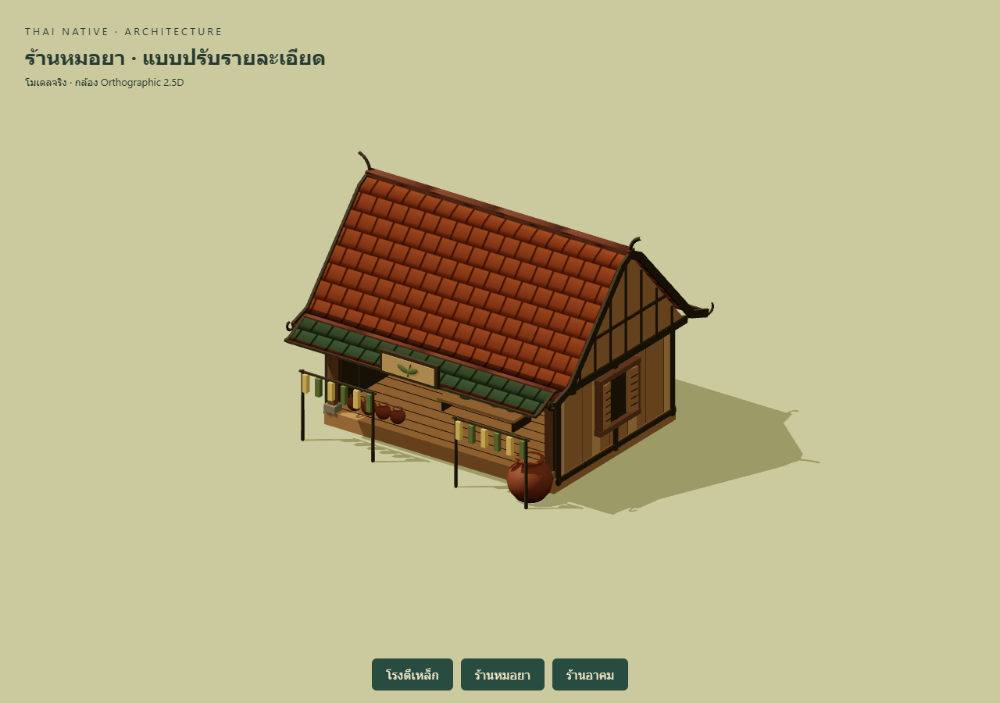
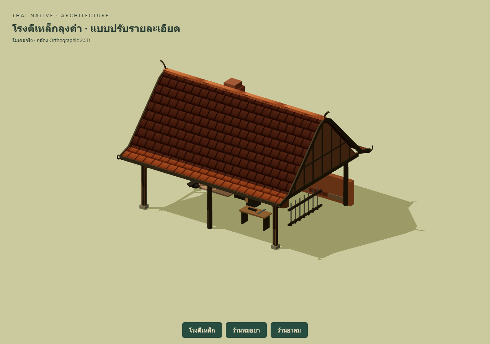
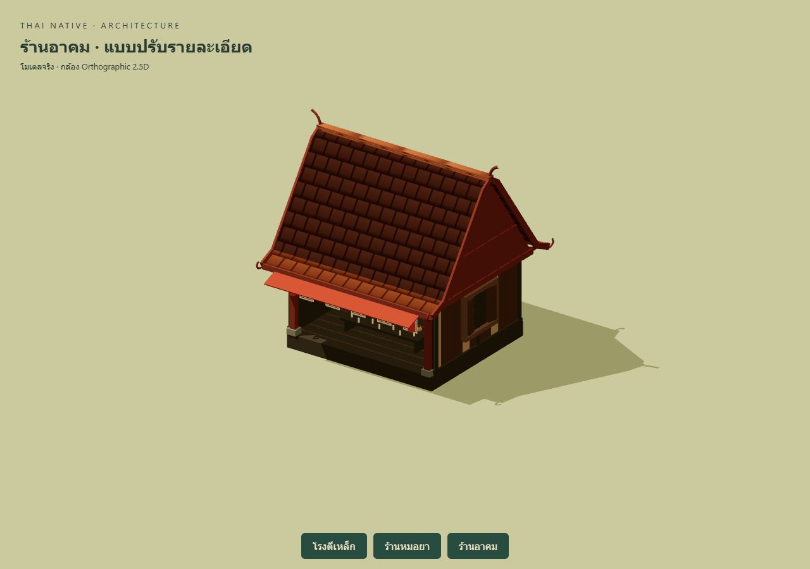
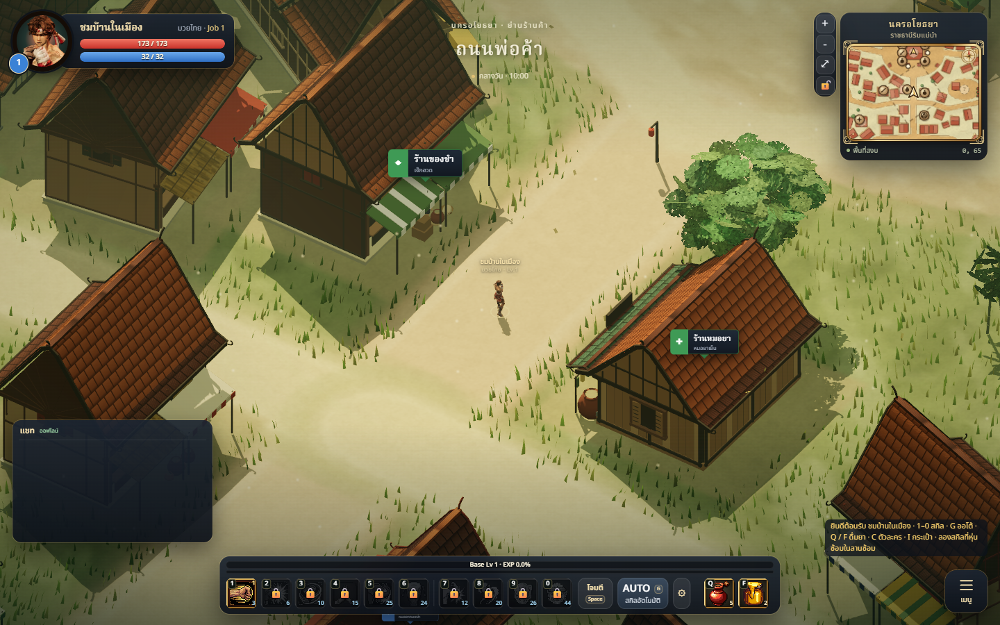

# NPC shop detail examples

Three city shops now have more believable timber construction, readable wall
panels and material separation, following the stylized Thai-fantasy art bible.
The herbalist uses a terracotta roof and jade canopy, louvered shutters, plank
seams, braced porch posts and a leaf plaque. The forge uses a dark tile roof,
structural braces, hearth apron, furnace surround and a hammer plaque. The
occult shop gains framed teak walls, shutters, porch brackets and floor seams.

## Example: herbalist

Before:

After:

## Other examples

## In the city

## Files and validation

- `src/world/districts/ShopDetails.js`: reusable cosmetic wall, window, porch,
  canopy and plaque modules using the existing material palette.
- `src/world/districts/Shops.js`: applies the modules to the three NPC shops.
- `tools/shop-review.html`: development-only orthographic review; excludes
  production build and accepts `?type=forge`, `herbShop` or `charmShop`.

275 tests and production build pass. Browser comparisons confirm identical
NPC anchors, colliders and decks before/after for each shop. The actual city
loads without page exceptions; all three customer approach coordinates are
walkable. The existing StaticBatcher merges the added geometry by material.

| Isolated review scene | Before triangles | After triangles | Before/after render calls |
|---|---:|---:|---:|
| Forge | 2,774 | 3,622 | 41 / 57 |
| Herbalist | 11,926 | 15,838 | 47 / 67 |
| Occult shop | 4,926 | 7,630 | 51 / 75 |

Figures use the same review camera/lighting, props, ground and shadow settings;
they are scene renderer counters, not model-only budgets or mobile benchmarks.
Local baseline capture and diagnostics are in `artifacts/npc-buildings/`.

## Limits

This is the first three-shop example set; general stores, residences and other
NPC buildings keep their current designs. Details are procedural game geometry,
not new Blender assets. Windows are recessed visual panels rather than playable
interiors. Mobile performance and night lighting still need device/playtesting;
the build retains the existing large-bundle warning. No formal art-director
score is claimed. Codex has not deployed this branch; deployment is delegated
to Claude at the user's request.
