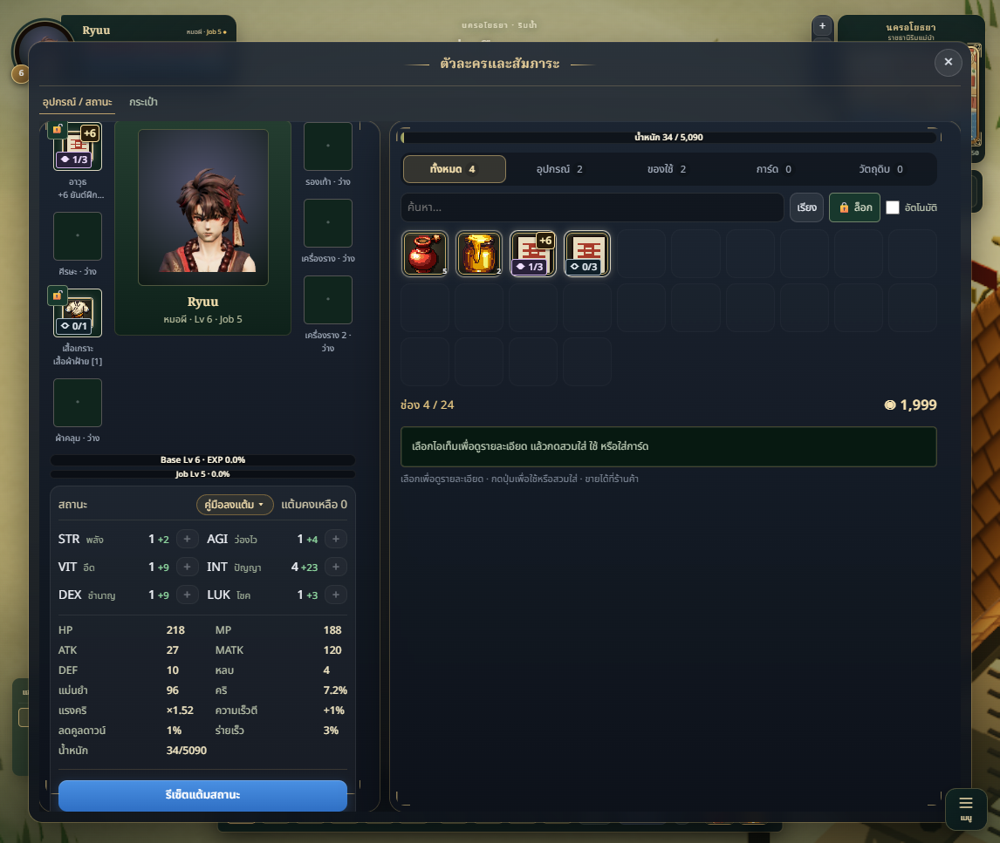
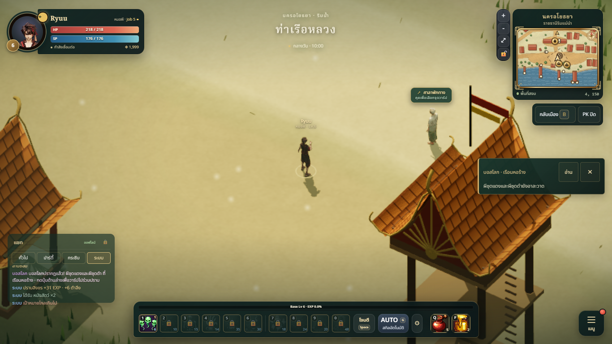
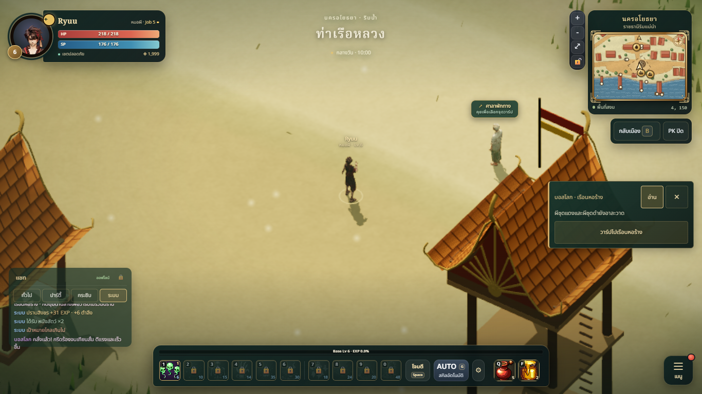

# Inventory controls and gameplay notifications

The status reset button now belongs to the status card footer. Its border-box height accommodates its label and padding when enabled, disabled, and rendered with either skin. Narrow desktop resizing cancels ancestor HUD scaling for the inventory window.

Equipment card-slot markers use contrasting empty/filled badges and explicit occupied/total counts (0/2, 1/2), with accessible Thai labels. They occupy the lower-left corner, separate from upper-right refinement and upper-left locks.

World boss news uses a restrained jade/brass peripheral card with expand, dismiss and explicit join. Inventory, skills, shop, map, AUTO, loadout and other major windows suppress the notice visually. Standing events and chat history remain active. Arrival reminders do not reopen dismissed notices; new events can notify again. Join rechecks eligibility and retains the existing wbjoin server contract.

Gameplay EXP, drops, currency and target notices go to the local System chat history. Startup notices migrate once; repeated-message throttling and category colours remain. No duplicate floating stack is rendered, and gameplay text is never sent as a player chat message. Level-up centre banners retain their existing behaviour.

## Changed files

- src/character/ui/CharacterUI.js
- src/character/ui/character.css
- src/character/ui/inventory-workspace.css
- src/character/ui/Feed.js
- src/net/Multiplayer.js
- src/net/chat-tabs.css
- src/ui/WorldBossBanner.js
- src/ui/worldBoss.css
- tests/feed-chat.test.js
- tests/world-boss-banner.test.js

## Validation

- npm test after integrating main 677bab8: 789 passed, 0 failed, 0 skipped.
- npm run build: passed. Existing bundle-size warning remains.
- Actual game in one sequential headless Edge page: classic and modern skins at 1146×967, 1366×768, 1920×1080 and 390×844; reset/card badge containment, boss suppression and restoration, 150% HUD scale, reset returning allocated points without changing level/gold/items, local System history, explicit join, disclosure and dismissal. 13 recorded checks, 9 captures, no page errors; see qa-receipt.json.
- Specialist implementation and independent Art/Tech review approved: style, readability, technical usability and state/integration each 8/10; AUTO selector corrected to the actual .auto-panel root.

## Screenshots

## Limits

Browser QA uses an isolated guest fixture with representative equipment/cards. The join send is intercepted locally; no live account, boss encounter or production server was mutated. The narrow viewport check is desktop resizing, not a physical touch-device playtest. System chat retains its existing 30-message per-channel limit. No deployment is included in this change.
