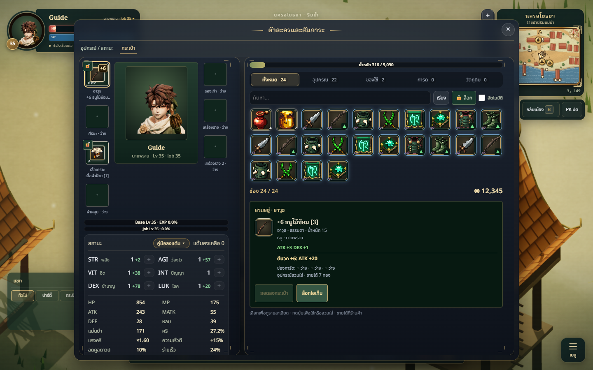
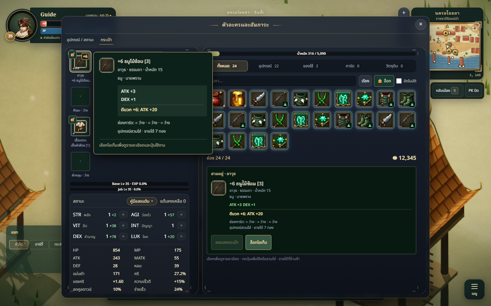
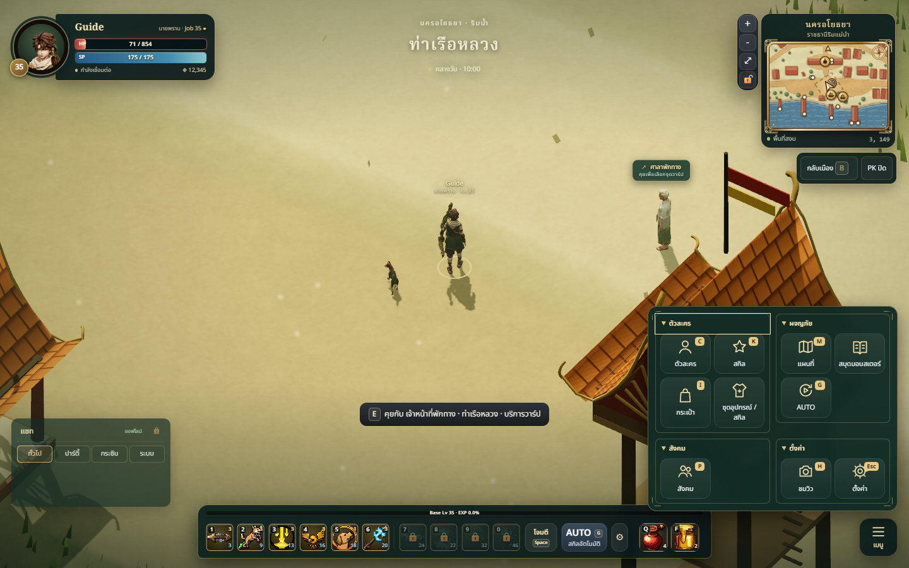

# HUD usability refresh — PC first

## Intent and scope

Adapt the interaction ideas in the user's RO screenshots to ThaiNativeOnline's actual systems and jade/brass art direction. No RO assets or unsupported menus were copied. The latest user steering prioritizes PC, readable item bonuses/refinement, and subdued lock controls.

## Changes

- Equipment and inventory share a wider desktop workspace. Their columns scroll independently. Selecting worn gear puts its explicit actions in the inventory detail area without moving the character column. Mobile keeps two tabs.
- Seven real equipment slots, category counts, search, sorting, locks, and explicit use/equip/unequip/socket actions. Selecting an item does not consume or equip it. Charm comparisons follow the actual replacement slot.
- Styled item hover/focus cards separate base bonuses, refinement, card slots, class eligibility, weight and resale information. Refinement badges use high contrast 12px text; lock buttons use subdued jade backgrounds.
- General, party, whisper and system chat tabs, unread counts, recipient input, explicit Send, and offline draft retention. Desktop chat sits above the combat bar.
- Grouped main menu: character, adventure, social and settings. Desktop shows groups in two columns, initially expanded. Keyboard activation stays within the menu; key releases still clean up movement input.
- Mobile thumb layout preserves original skill indices and shows four learned skills per page. Short target taps cycle once; long holds release without first cycling. Controls hide during UI interaction.

## Files

- `src/character/ui/CharacterUI.js`, `InventoryWorkspace.js`, `inventory-workspace.css`
- `src/net/Multiplayer.js`, `ChatBox.js`, `chat-tabs.css`
- `src/ui/MainMenu.js`, `menu-groups.css`, `ActionBar.js`, `TouchControls.js`, `thumb-combat.css`
- `src/main.js`
- `tests/inventory-workspace.test.js`, `tests/inventory-workspace.browser.mjs`, `tests/skill-pager.test.js`

## Validation

- `npm test`: 771 passed, 0 failed, 0 skipped.
- `npm run build`: passed. The existing large-chunk advisory remains.
- `git diff --check`: passed.
- Actual-game browser QA: 12 grouped checks passed, 0 runtime errors, 0 failures; 14 screenshots. Portrait 390×844 and 320×640; landscape 844×390 and 640×360; PC 1440×900, 1366×768 and 1920×1080.
- Checked learned skill paging, non-overlapping touch groups including collapsed chat, short/held targeting, menu keyboard isolation and W/Shift release cleanup, seven equipment slots, non-mutating selection, explicit potion consumption, mobile tabs, desktop side-by-side panes and worn actions, actual styled hover visibility, native item tooltip removal, readable +6 badge, party unread/read transitions, party/whisper command routing, and safe text rendering.
- One headless Edge page with isolated local guest data and blocked WebSocket connections; browser closed in `finally`. No live account inventories or messages were modified.
- PC bounds also pass with HUD size set to 150% (including the existing scale cap); viewport-sized inventory cancels inherited HUD zoom without changing the other HUD controls. Resize waits include scale updates before assertions and captures.
- Receipt: [qa-receipt.json](qa-receipt.json); all capture filenames in the receipt are in [screenshots/](screenshots/).
- Independent Art/Tech review approved the final code and all 14 captures: style match 8.5/10, readability 8.5/10, technical usability 8.5/10. No outstanding actionable findings.

## Limitations

- The character preview uses existing class portrait art, not another live 3D renderer.
- Comparison arrows score base item bonuses; refinement and card effects remain separately visible. They are not a complete build simulator.
- Whisper recipients retain the existing server command parser's single-token name restriction.
- Equipment aura rendering is absent. `Character` refinement caps at +10. Separate rules data defines enhancement aura tiers (+7 blue, +10 purple, +13 gold, +16 red, +20 rainbow), but no renderer consumes those tiers. This task does not add an aura renderer or change refinement rules.
- This review uses local guest mode. Online operation compatibility is checked through the existing network operation contract tests; no live multiplayer session was used.
- Deployment is outside this task's latest authorization. Changes are prepared on `codex/hud-usability-refresh` for a PR.
