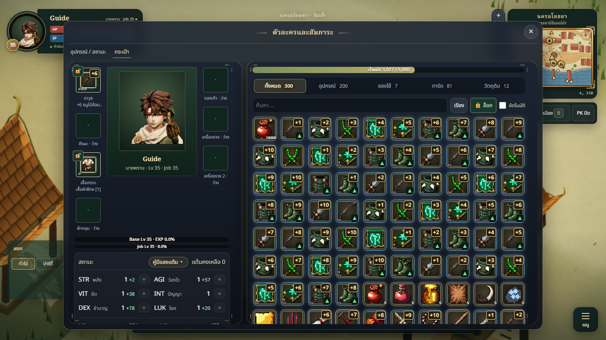
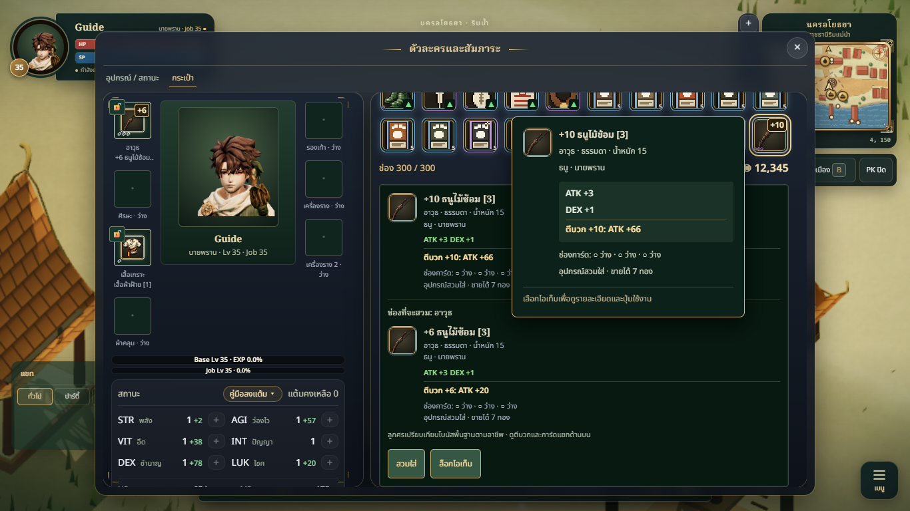

# Large inventory HUD verification

Tested 100 and 300 occupied slots at 1366×768 and 1920×1080 using the actual game UI in an isolated local guest browser context. The fixture uses valid item definitions, mixed equipment/card/material/consumable instances, refinement through +10, and a 10,000-item consumable stack.

All four cases passed five grouped checks each (20 grouped checks total). No runtime errors or failed assertions. `npm run build` passed with the existing bundle-size advisory. This follow-up changes documentation only; production code and the normal 24-slot capacity are unchanged. No live account or server inventory was modified. One headless browser/page was reused and closed in `finally`.

Verified:

- Every slot renders; occupancy and large stack counts are correct; workspace fits both desktop sizes.
- Last-slot selection does not mutate the character, leaves the equipment column scroll unchanged, and displays the correct item and explicit actions.
- Last-slot hover cards remain visible and within the viewport.
- Search preserves original inventory indices; empty results and equipment categories match the data.
- Sorting and stack merging preserve quantities for every item ID.

## Usability finding

The entire inventory column scrolls, including category and search controls. At the bottom of 300 items those controls are offscreen, and selecting an item scrolls to the detail panel below the grid. Functionality passes, but this is less convenient for large bags. Before enabling expanded capacity, keep search/categories visible and give the item grid and details their own bounded regions. No pagination or virtual rendering is currently implemented.

This verifies the local HUD with expanded synthetic arrays, not server capacity, account migration, or multiplayer synchronization for 100–300 slots. Timing samples in the receipt are diagnostic only, not a cross-device performance benchmark. The full unit suite was not repeated because no production code changed; the preceding implementation passed 771 tests.

Files added: this report, `qa-receipt.json`, and the two actual-game screenshots below. Other cases are recorded in the receipt.

[Detailed receipt](qa-receipt.json)

