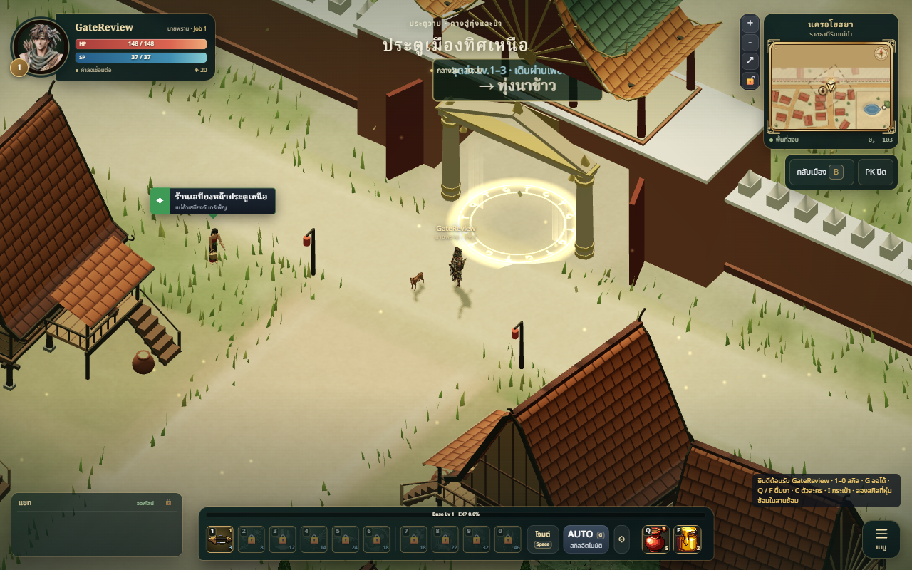
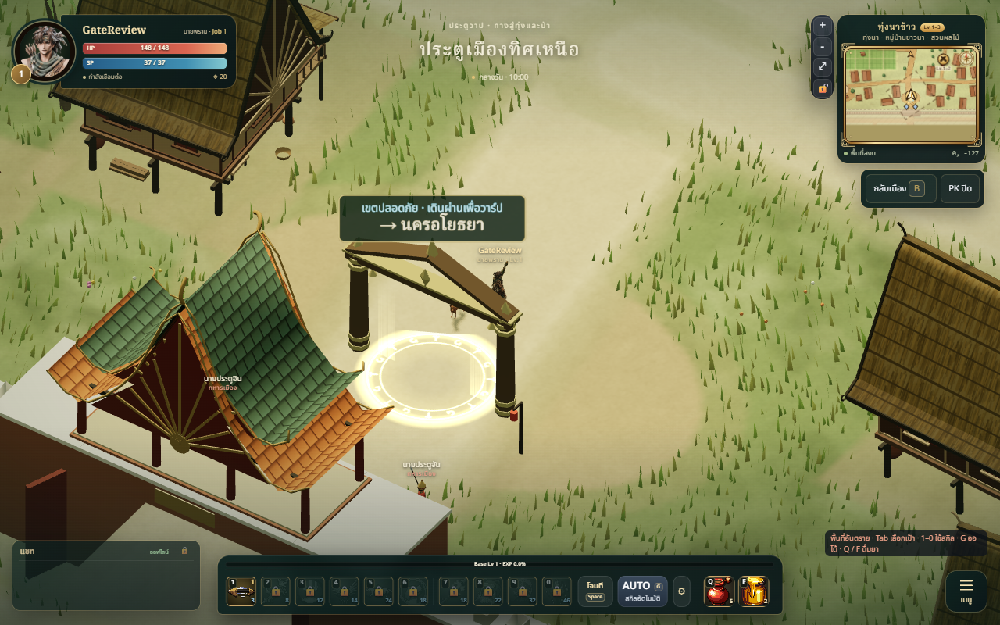
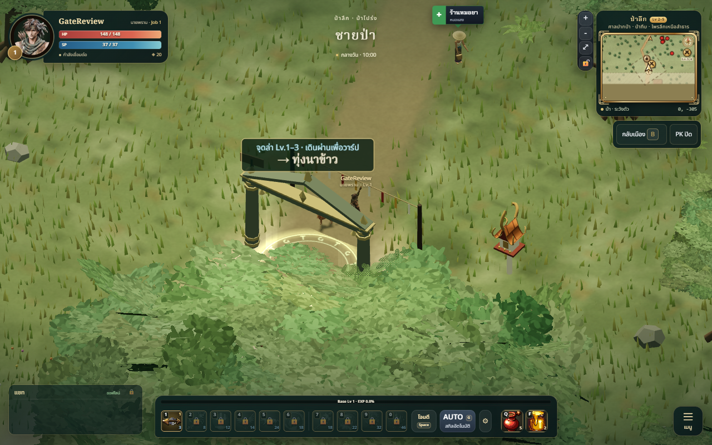
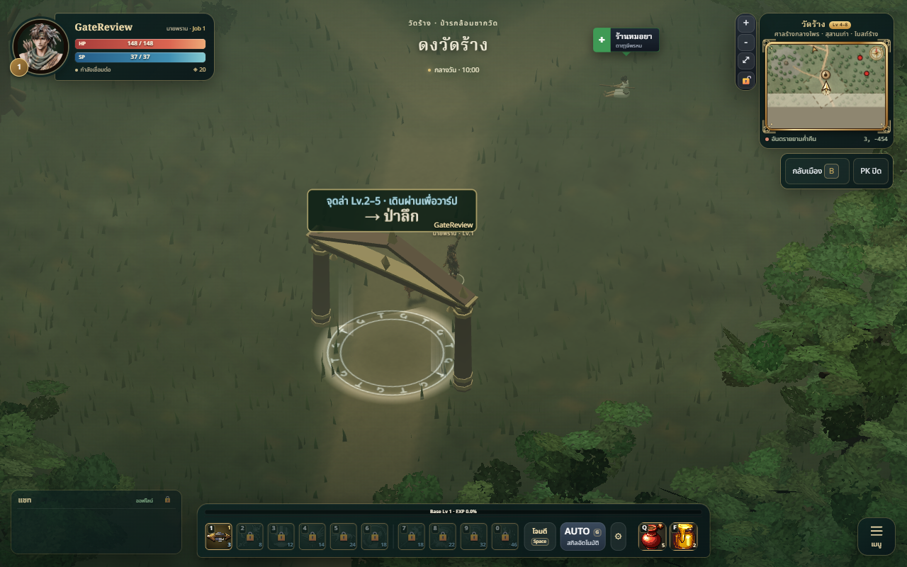
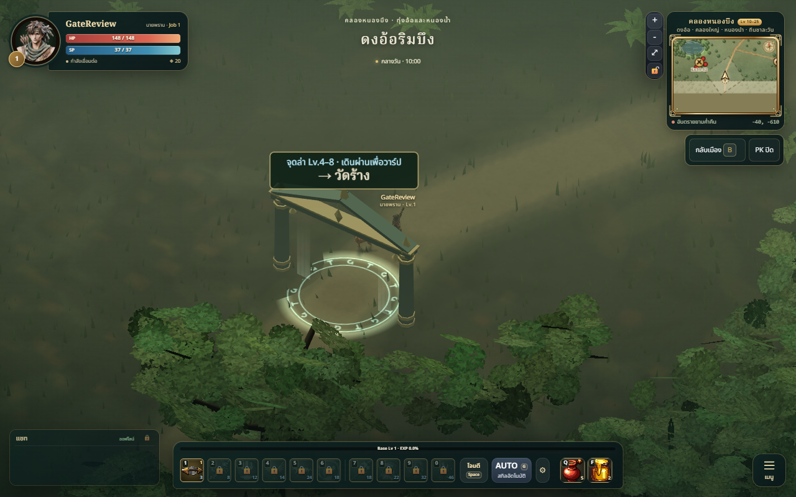
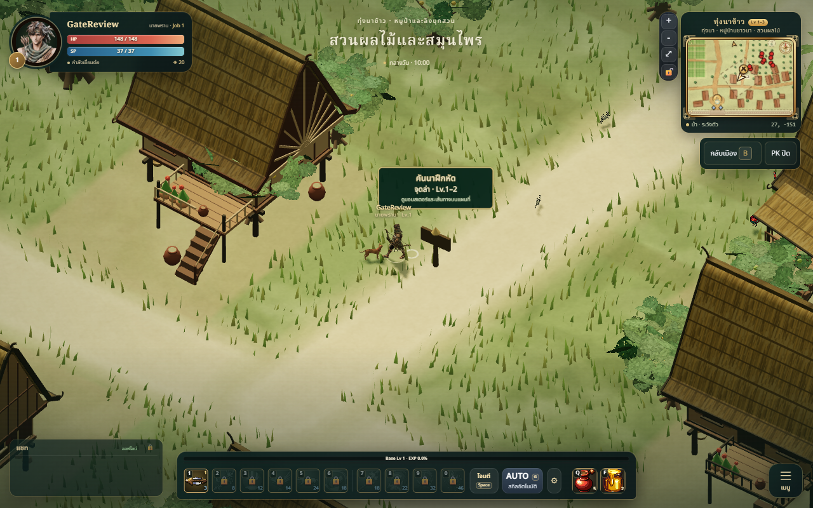
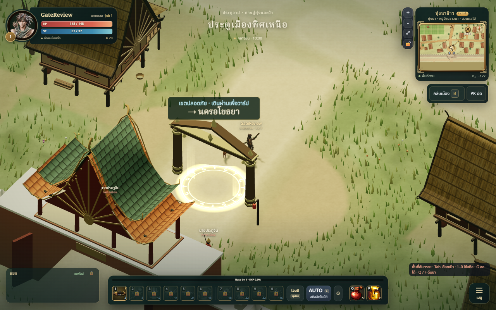

# Hunting pockets and gateways — review / QA

Implemented on `codex/leveling-portals`, based on main `87386c1`.

## Result

Eight hunting pockets across the four outdoor maps, with names, monster-level
bands, nearby signposts, gold crossed-sword map badges and click-to-walk to an
approach point. Shared monster rosters add up to 32 ordinary monster slots.
All eight existing connections have open Thai fantasy gateway frames, map-specific
materials, ground inscriptions, soft side wisps and nearby destination labels.

## Changed files

- `src/data/hunting.js`, `src/data/spawns.js`: camp definitions and shared rosters.
- `src/world/HuntingGrounds.js`, `src/world/Portals.js`: signs and gateways.
- `src/world/portal-layout.js`, `src/world/World.js`: shared pillar anchors,
  vegetation clearance, pillar and sign collision.
- `src/world/MapManager.js`: map lifecycle and label updates; fix repeated map
  loading by updating the status paragraph instead of replacing its parent.
- `src/ui/Minimap.js`, `src/ui/minimap/glyphs.js`,
  `src/ui/minimap/mapStyle.js`: camp badges, levels, legend and walking targets.
- `tools/collision-source-hash.js`, `server/data/collision.json`: hunting data
  included in collision freshness and all five map collision exports rebuilt.
- `tests/hunting-portals.test.js`: route, collision, roster, day/night server tests.
- `docs/world/WORLD_MAP.md`, `docs/world/LEVEL_PROGRESSION.md`: implemented content.
- This report and PNG captures in this folder.

## Art / technical review

Self-reviewed against ART_BIBLE: simplified Thai gables, brass trim, muted
map palettes, readable open silhouettes and restrained unlit effects. No new
monster meshes, dynamic lights or post-processing. Labels only show nearby.
Rendering and server collision share the same pillar anchors. Gateway vegetation
clearance preserves the procedural RNG sequence; unrelated layouts are retained.
Portal IDs, destinations, arrival coordinates and path classifications remain intact.
No independent Art Director rating was performed.

## Validation

- Full Node suite: 316 passed, zero failures.
- `npm run build`: passed; existing large-chunk warning remains (~1.71 MB JS).
- Baked all five collision maps and checked freshness through the suite.
- Eight camp approaches and eight gate centres reachable from their map spawns.
  Pillars and signposts block server navigation; gate centres remain open.
- Server MonsterWorld spawns all expected extra monsters on standable positions
  during both day and night; portal arrivals retain their aggro safety margin.
- Headless Edge, local guest: loaded all five maps, inspected 1/2/2/2/1 gates
  and 0/2/2/2/2 signs, clicked the paddy camp marker (goal 27,-151), and
  triggered four consecutive return warps klong → wat → forest → paddy → city.
  No page errors in the final run. Repeated transitions preserve the loading UI.

## Screenshots

Actual game captures at 1280×800, low quality with software rendering:

Additional narrow viewport capture: [390×844](gateway-mobile.png).
This uses desktop input (`touch=0`), so it is not a physical phone control test.

## Limitations

Not deployed. Live multiplayer travel and physical-device FPS have not been
measured. Existing monster XP/drop balance remains unchanged and needs playtesting
with the added density. Very tall foreground foliage can still partially overlap
some gates from the fixed camera angle. Map level ranges describe existing map
content; pocket labels give the narrower monster bands.
