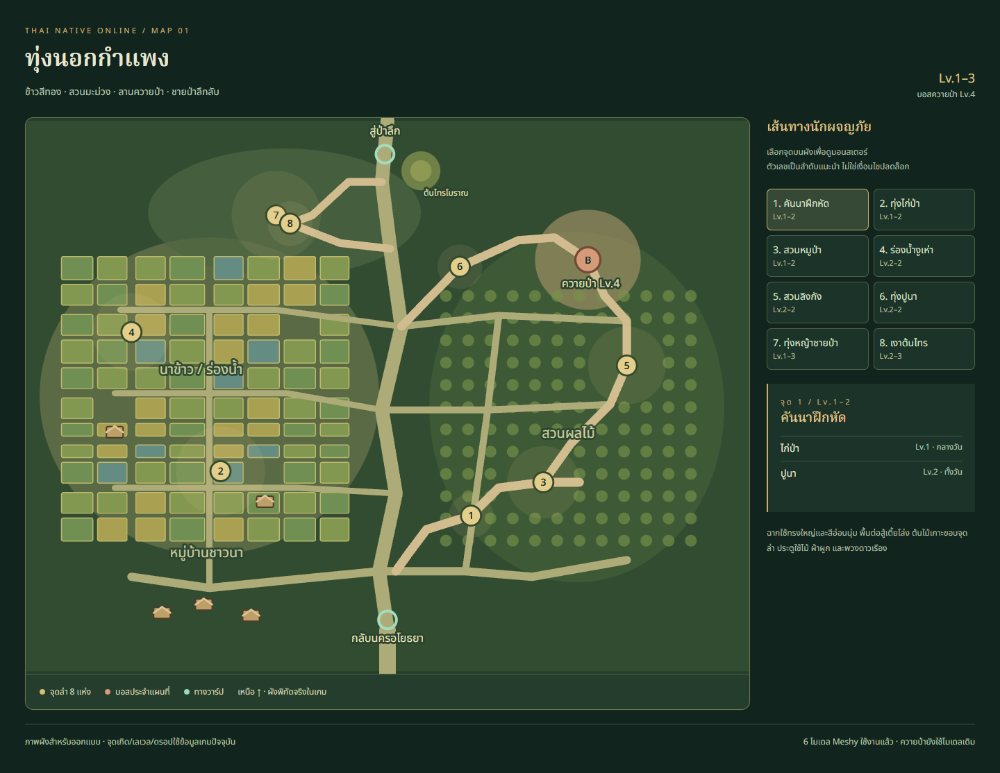
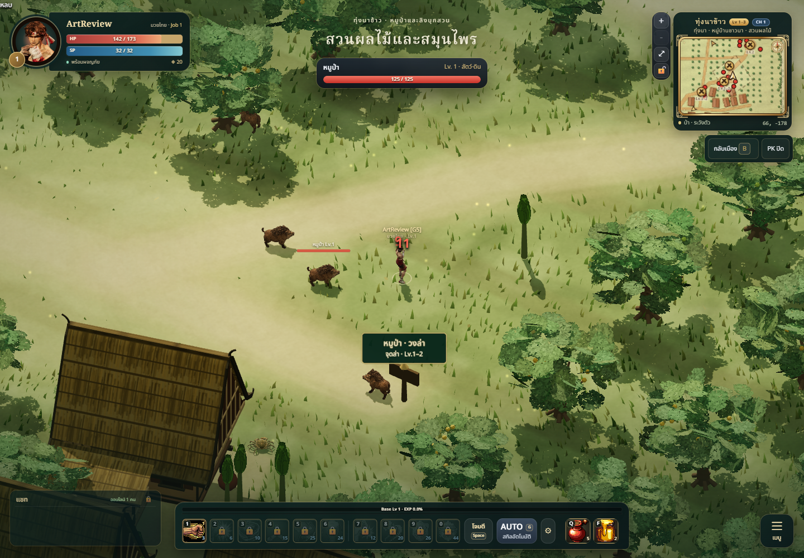
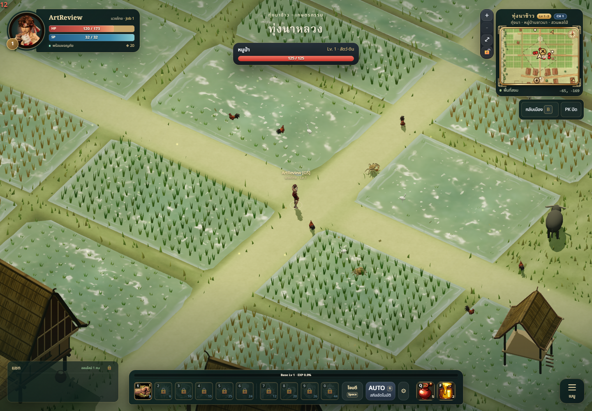
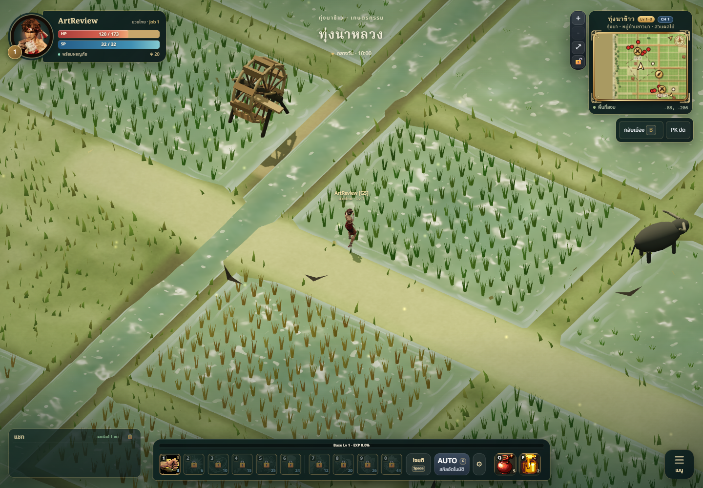
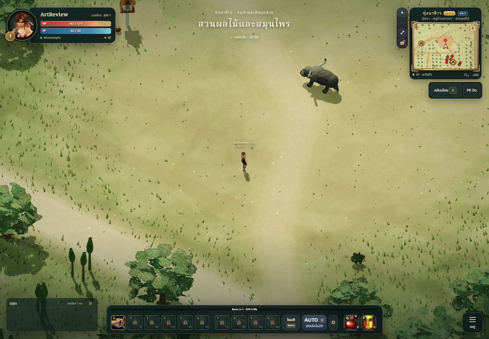
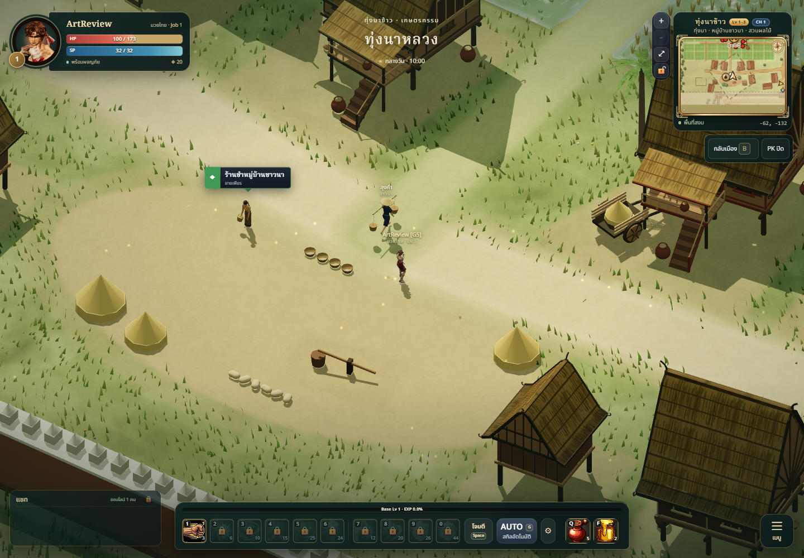
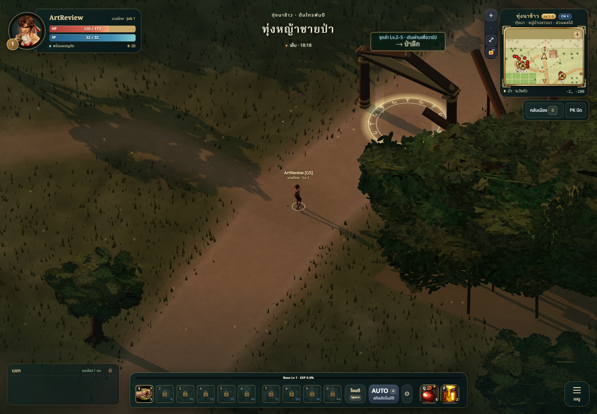
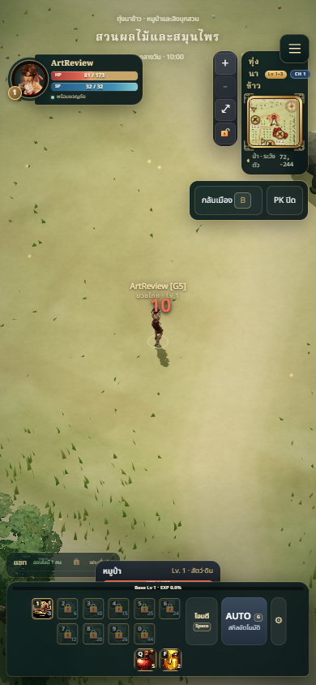

# Map 01 — Paddy / ทุ่งนอกกำแพง

## Result

First environment pass for the user's new **map-by-map production workflow**.
Treat each map as a set: environment, actual creature roster, primary boss,
portals, anatomy/animation review and gameplay-camera QA. Complete the missing
paddy buffalo art next, before advancing to deep forest. This pass does not
claim that all maps or the new buffalo model are finished.

The paddy preserves eight hunting pockets and its existing seven identities:
boar/fowl Lv.1, cobra/crab/monkey Lv.2, phibpa Lv.3, buffalo boss Lv.4.
Six already use the reviewed animated Meshy models. Buffalo retains its existing
animated GLB and two boss skills. Dhole belongs to deep forest, not this map.
No Meshy calls or generation credits were used for this environment pass.

## Layout and visual direction

- Warm, stylized Thai farmland: existing rice plots, irrigation, clustered mango
  trees, farmers' village, palm silhouettes and an ancient banyan. Follow
  `ART_BIBLE.md`, `ENVIRONMENT_GUIDE.md` and `CAMERA_GUIDE.md`.
- Four soft dirt links connect the beginner pocket, orchard circuit, meadow and
  banyan approach. The first route bends around two existing houses discovered
  during collision QA; buildings were not removed to make the drawing fit.
- Reject whole plants inside fight clearings and along those links, including
  their colliders. Rejected plants still consume their original random draws,
  preserving later layout. No clipped cards or floating crowns.
- Shorter, sparser grass inside the paddy; very short grass on encounter floors.
  Grass alpha stores blade height, separately from the existing terrain-height
  channel. All other map bands retain the previous density/height values.
- Buffalo meadow keeps a clear 14-metre-radius dodge floor: existing spawn
  radius 10 plus four metres for the largest special. Cloth fence remnants and
  a small offering shrine frame its rim; no enclosing arena or new boss spawn.
- Harvest cart, baskets and a static wooden water-lift supply local landmarks.
  Solid props use the normal baked collision pipeline. The water-lift is scenery,
  not a new irrigation mechanic or simulation.
- Paddy portals gain field-gate cloth and marigolds above head clearance. Gate
  pillars, triggers, arrival points and destinations retain their coordinates.
  Paddy hunt signs show two larger text lines within 13 metres, with smaller
  world labels than before. Other maps retain their current sign/portal design.

The interactive plan at `/tools/paddy-map-review.html` uses the actual plot,
road, hunting and portal coordinates. Its numbered route is a recommendation,
not an unlock condition. Clicking a camp shows the current monster roster.
This development page is excluded from the production entry bundle.

## Changed files and ownership hooks

| Files | Purpose |
| --- | --- |
| `src/world/paddy-layout.js` | Pure paddy art layout and plant/grass queries |
| `src/world/districts/PaddyDetails.js` | Batched local prop kit and private-seed palm details |
| `src/world/World.js` | Environment-owner hooks for paddy placement and dressing |
| `src/world/Vegetation.js` | Optional whole-plant filter; consumes original RNG and removes rejected colliders |
| `src/world/Terrain.js` | Ground-paint hook and grass-mask blade-height channel |
| `src/world/HuntingGrounds.js`, `src/world/Portals.js` | Paddy-only label/ornament profiles; shared coordinates preserved |
| `server/data/collision.json` | All 13 maps re-exported from final scene sources |
| `tools/paddy-map-review.html` | Responsive, selectable map plan |
| `tools/monster-models/meshy/map-queue.mjs`, `map-queue.json`, `README.md` | Map-first authoring queue derived from runtime membership |
| `tests/paddy-layout.test.js` | Dodge floor, traversable links, band isolation and roster regression checks |
| `docs/art/maps/paddy/*` | Review, screenshots and QA evidence |

No combat, class, loot, EXP, spawn-count, save or account systems were rewritten.
The small environment/world-designer hooks above are the complete scope.

## Art / technical review

Single-agent review from the actual `(15,23,22)` orthographic gameplay camera,
not an independent Art Director sign-off. Clearings read as terrain rather
than luminous combat circles. Paths remain the lightest large shapes; crowns
stay along their edges, and the shrine/cloth silhouette marks the meadow.
Village, paddy, orchard and forest threshold remain distinct. Existing monsters
were reused; no new anatomy or rig changes are claimed.

The new kit uses shared architecture materials and static batching. Plants remain
instanced. No new dependency, dynamic light, physics system or particle emitter.
Retired offline monster views were allowed to finish fading before final
captures, avoiding a misleading duplicate-boss image during server handover.

## Validation — 9 October 2026

- **371 tests pass, 0 fail**, including four map-layout regressions and the
  existing real HTTP/WebSocket, boss-skill, collision, save and model checks.
- **`npm run build` passes**, 229 modules. Existing large-bundle warning remains.
- Final collision export: 756 paddy shapes (previously 784). Every collision
  shape outside the paddy band compares identically with the pre-change export
  across all 13 maps. Random layout outside this art pass was preserved.
- **2,745 grid samples**, client/server `canStand` parity: **0 mismatches**.
  Both incoming arrivals and all four painted route centrelines pass on client
  and server with a 0.4-metre body pad. See `navigation.json`.
- Actual guest walking through both portal round trips on a local real server:
  paddy → city → paddy; paddy → deep forest → paddy. All arrivals standable,
  network combat active, no page errors. See `warps.json`.
- Edge/SwiftShader: six actual game views at 1440×1000, mobile layout at 390×844,
  no page/renderer/asset errors, exactly one authoritative buffalo combatant.
  Camera placement and lighting hours were staged for environment review;
  monster models and the networked game are real. See `browser.json`.
- Interactive plan: eight camp controls, roster changes on selection, no
  horizontal overflow at 390px. Desktop layout capture below.
- Final render counters in these views: 188–364 calls, 591,673–750,230 triangles.
  These are renderer counters, not physical-device FPS measurements.

The first route's failed collision probe and early screenshot-harness timing
errors were corrected before these final results. No failing checks were skipped.

## Screenshots

## Known limits / next map gate

This is environment pass 1. The buffalo still needs its bespoke Meshy concept,
species-specific rig, anatomy/contact review and clip validation. Existing buffalo
stats, charge, two specials, respawn and CH1 restriction remain in force.
Do not regenerate the six approved paddy creatures.

Physical Android/iPhone performance, party playtesting and independent art review
remain pending. Existing town/forest backdrop geometry can appear at the paddy
edges as before; this pass is not a global asset replacement. Water-lift motion,
quest additions and new progression/balance changes are outside this pass.
