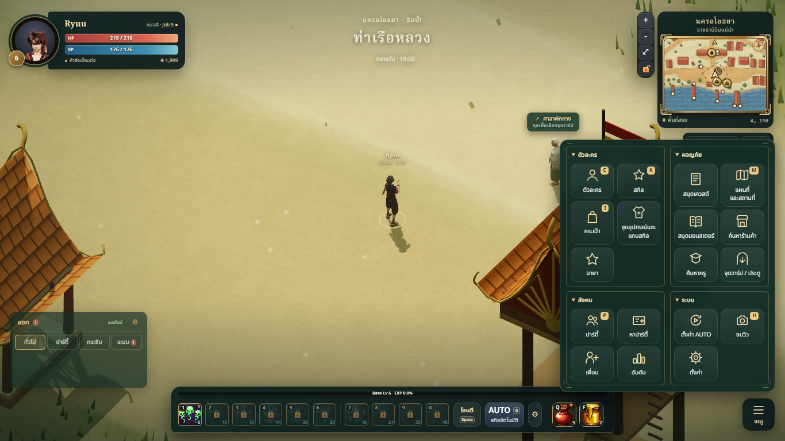
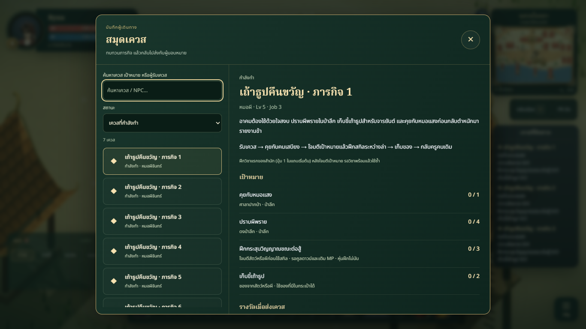
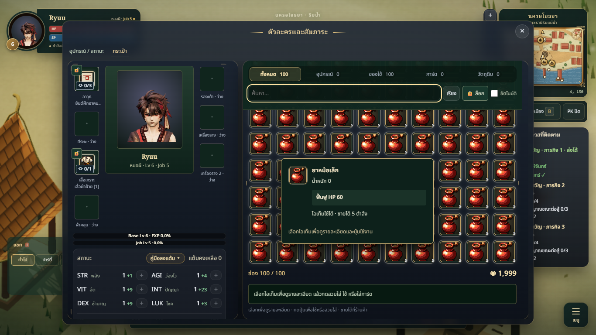

# Menu navigation and quest journal

Date: 2026-10-10. Branch: `codex/menu-navigation-fixes`. Implements the actionable PC menu audit using the current game systems and restrained Thai fantasy presentation.

## Summary

- Four groups: Character, Adventure, Social, System. Direct links expose Party, Recruitment, Friends, Titles and Ranking. Titles are under Character. P consistently opens Party.
- AUTO configuration and Settings launch tiles no longer advertise incorrect G/Esc shortcuts. G remains the actual automation toggle. Presets explicitly describe equipment and hotbar ordering; empty guidance consistently refers to Skills.
- Map/shop/teacher/travel entries open the existing directory with the appropriate filter. They do not buy, refine, store, warp or start walking remotely. Future shops already remain outside the active shop category.
- New read-only Quest Journal lists every accepted quest and completed history, with search, ready filter, objectives, rewards, turn-in NPC and a map link. Progress refresh preserves search/selection/scroll. Accept/hand-in still require NPC dialogue and existing quest authority.
- Window navigation owns Escape before input guards, selects the foremost stacking context/DOM paint order, closes one window, and restores focus. Inventory tooltip dismisses first. Tab stays inside the foremost window; text editing and native control events continue before gameplay key suppression.
- Inventory filters/search stay visible while scrolling large inventories. Future second-class availability is now a secondary text note in Skills.

## Changed files

| Files | Purpose |
|---|---|
| `index.html`, `src/ui/MainMenu.js`, `src/ui/menu-groups.css` | Menu destinations, grouping, labels, initial focus and secondary class-note styling |
| `src/ui/windowNavigation.js`, `src/core/Game.js`, `src/net/Social.js` | Foreground keyboard/focus routing, existing service integration and Party shortcut |
| `src/ui/QuestJournal.js`, `src/ui/quest-journal.css` | Quest review window |
| `src/character/ui/CharacterUI.js`, `SkillPanel.js`, `InventoryWorkspace.js`, `inventory-workspace.css` | Accurate guidance, future-content hierarchy and sticky bag controls |
| `tests/quest-journal.test.js`, `tools/menu-navigation-qa.mjs` | Quest safety/refresh tests and reproducible browser QA |
| `docs/art/menu-navigation/*` | Review, screenshots and runtime receipt |

## Art / technical review

Game Vision and Art Bible retain authority: protect the playfield; use subdued jade panels, brass borders and existing Thai typography/icons. New entries remain behind the menu rather than adding permanent combat HUD clusters. The journal reuses the Bestiary visual language and scrolls its list/detail independently.

An independent specialist implemented the bounded journal; a separate read-only reviewer checked navigation/integration. Review findings about equal-z paint order, tooltip-first dismissal and focus restoration were addressed and covered by targeted browser checks.

The navigation owner resolves lazily mounted character/social windows rather than introducing gameplay state or persistence. The journal reads existing quest definitions and state and escapes dynamic text. Its map link shows the current NPC location when available, the next portal for another map, or an explicit name search when location is unavailable; it never completes quests.

## Validation

- `npm run build`: passed on final code. Existing advisory: main bundle exceeds 500 kB.
- Full `npm test`: 834 passed, 0 failed, 2 skipped (836 total). After navigation review refinements, the six journal tests and build passed again; browser checks exercise the final keyboard changes.
- Browser: one isolated headless Edge page, local guest only; account API and all websockets (including dev reload) disabled. Browser closes in `finally`.
- Menu actions/labels, direct social tabs and P; focus from menu opening; Tab containment; Esc from friend-name, bag search, loadout name, AUTO, settings and skill controls.
- Foreground Bestiary/inventory and equal-z Journal/Bestiary close one window at a time; tooltip dismisses before inventory. Close-button recovery returns focus after a focused settings control is hidden.
- Quest fixture deliberately provides seven accepted quests plus one completed clone because the current class has fewer real quests. Verifies full list, ready filter, search empty state, selection after progress updates and turn-in NPC map link.
- Synthetic 100-item inventory verifies sticky search after scrolling and no movement from typing WASD.
- Screenshots at 1366×768 default HUD, 1920×1080 HUD 1.3, 1366×768 Classic HUD 1.3, and 390×844 Modern portrait. Journal panel stays within viewport. Receipt: `qa.json`.

Run browser checks with the existing development server: `GAME_QA_URL` selects its address (default `http://127.0.0.1:5192`), `PLAYWRIGHT_MODULE` optionally supplies Playwright. Then `node tools/menu-navigation-qa.mjs`. The seed is intercepted in the isolated test page, with no required untracked fixture file.

## Screenshots

These show the implemented UI; quest titles repeated with numbered suffixes are QA clones, not added game content.

Additional captures: `menu-1920-modern.png`, `journal-1920-modern.png`, `menu-1366-classic.png`, `journal-1366-classic.png`, `menu-390-modern.png`, `journal-390-modern.png`.

## Known limitations

No live account/party/trade/storage/refinement transactions were exercised. Escape trade cancellation keeps existing server acknowledgement semantics. Quest NPCs can move after their map location snapshot; unavailable locations fall back to a name search. Portrait testing is a viewport smoke test, not physical touch-device testing. A HUD editor, new card album and unrestricted shortcut rebinding remain separate features. No deployment is included in this task.
