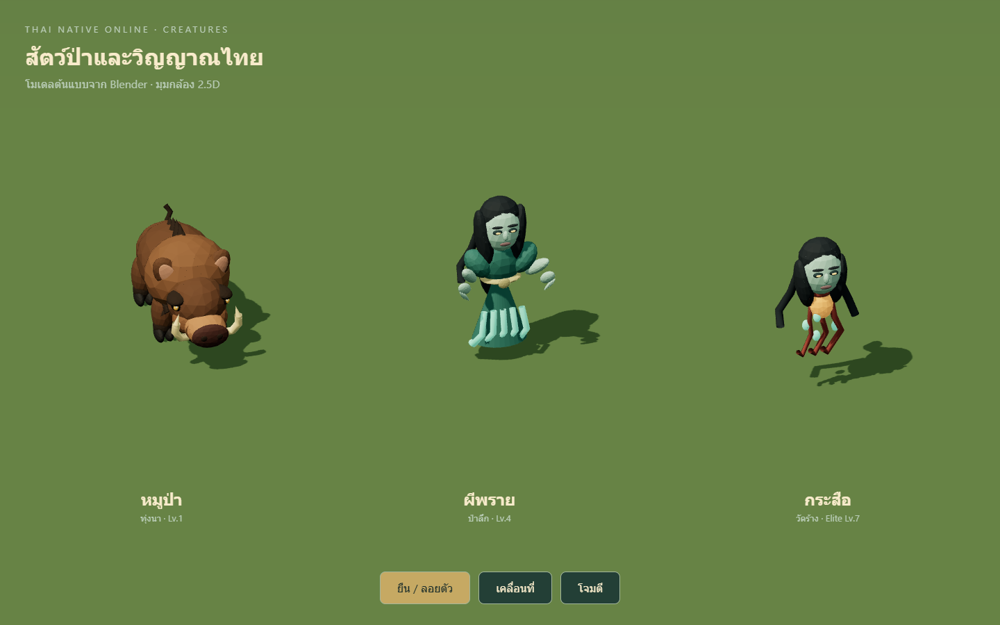
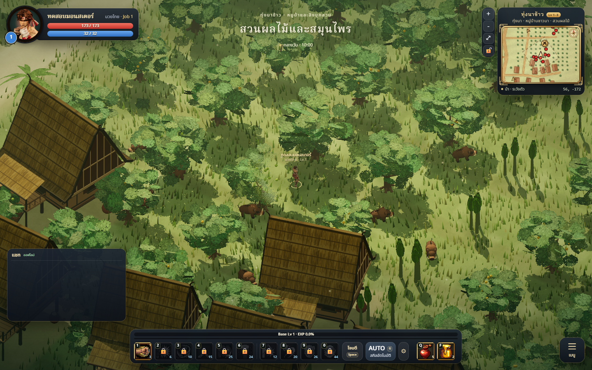

# Monster set 01 — Blender prototypes

## Direction

Original stylized Thai-fantasy creatures for the existing near-orthographic 2.5D
camera. Large color blocks and readable silhouettes follow ART_BIBLE.md. These
are prototypes for art review, not a claim of final art approval.

| Creature | Game ID | Silhouette / palette | Triangles | Material draws | GLB bytes |
|---|---|---|---:|---:|---:|
| หมูป่า | boar | Heavy shoulders, swept mane, cloven hooves, ivory tusks; warm earth tones | 11,246 | 11 | 1,411,284 |
| ผีพราย | pray | Long dark hair, jade dress, pale face, trailing hem; cool green | 7,068 | 8 | 902,084 |
| กระสือ | krasue | Floating head, swept hair, stylized hanging spirit cords and embers | 4,476 | 8 | 576,872 |

## Runtime

`src/combat/MonsterModels.js` caches one GLB load per type and creates an independent
skinned clone, mixer and material set for each monster. It normalizes height and
sets floating offsets without modifying stats, spawn tables or hit rules. The old
mesh remains visible during loading and if loading fails. Every replacement mesh
retains the monster ID for picking; the existing invisible pick cylinder is kept.
Idle, walk, attack, hurt and death clips are connected to the existing view state.
Other creature types retain their current meshes.

## Validation

- 255 tests pass, including GLB structure, skin weights, finite animation samples,
  seamless idle/walk endpoints and bounded animated vertices for the three assets.
- Production build passes; the existing large-bundle warning remains.
- Fresh isolated Blender imports of all three final GLBs succeed; no degenerate
  faces found in the imported monster meshes. Import-created Icosphere bone display
  helpers are excluded from asset triangle totals.
- Browser review loads all three models, plays idle/walk/attack, and produces no
  page exceptions. Independent skeletons/materials and per-instance picking IDs
  are verified. Actual paddy gameplay loads the new models with HTTP 200, accepts
  clicking a new boar as a combat target, and produces no page exceptions.
  Screenshots are captured from the current local branch.
- The saved review Blender project reopens in a separate read-only session with
  no missing external assets.

## Limits

The faceted faces, hair, fingers and spirit cords still need art refinement before
calling the set finished production art. Weights are rigid by section; walk uses
FK and has not passed a planted-foot IK acceptance check. The models are composed
of intersecting solids with some open curve ends. No performance claim is made
for mobile devices; many simultaneous skinned monsters need profiling. Multiplayer
combat and every ghost spawn/time-of-day combination have not been replayed.
The first three assets were deployed to UAT and their live file hashes verified.
The paddy expansion is documented in `PADDY_SET.md`.

Editable source files: `tools/monster-models/source/*.blend`. Blender milestone
previews, receipts and SHA-256 records are retained locally under
`artifacts/monster-boar/` and `artifacts/monster-validation/`.
