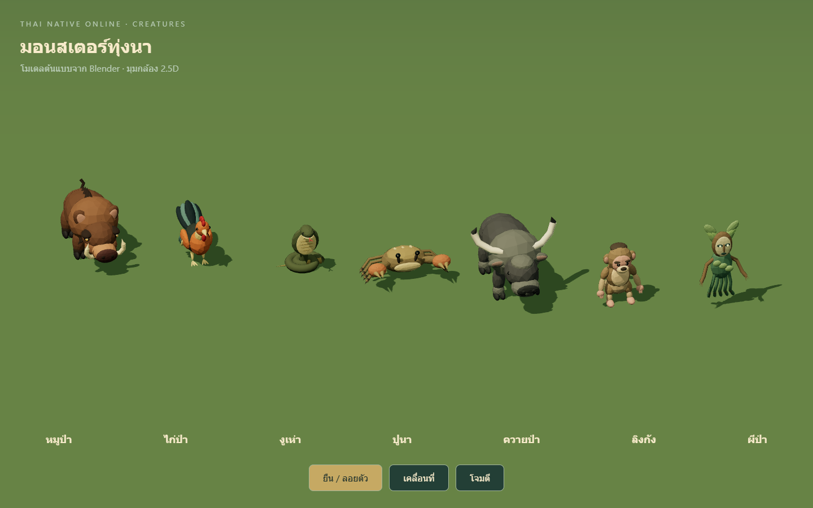

# Paddy creature expansion

Six original Blender models replace the remaining paddy fallback meshes:
fowl, cobra, crab, buffalo, monkey and phibpa. Together with boar, the paddy
roster now has seven authored models. Existing stats, spawn rules and combat
logic are unchanged. The forest spirit uses a wooden mask, leaves and hanging
roots; each animal has a distinct silhouette and natural earth-tone palette.

## Files and budgets

| Model | Triangles | Draw calls | GLB bytes |
|---|---:|---:|---:|
| Fowl | 5,910 | 7 | 827,324 |
| Cobra | 3,578 | 6 | 456,964 |
| Crab | 3,688 | 6 | 506,608 |
| Buffalo | 6,068 | 6 | 794,264 |
| Monkey | 6,240 | 6 | 855,484 |
| Phibpa | 4,374 | 7 | 564,568 |

Game assets live in `public/models/monsters/`; editable sources are in
`tools/monster-models/source/`. The generator and Harness client are retained
alongside the preparation tool. `src/combat/MonsterModels.js` registers sizes
and floating offsets. `tests/monster-model-assets.test.js` validates every
registered asset rather than a fixed three-model list. Hashes are in `manifest.json`.

## Validation

All 261 tests and the production build pass. Asset checks cover five named clips,
skin weights, seamless idle/walk endpoints and bounded animated vertices.
The game-loader gallery loads all seven paddy models and plays idle/walk/attack
without page exceptions. Independent skeletons, materials and picking IDs are
checked. Actual paddy gameplay loads all nine registered models with HTTP 200
and accepts selecting a boar as a combat target, with no page exceptions.
Local receipts and diagnostics are retained under `artifacts/paddy-monsters/`.

## Limits

These are first-pass faceted assets with rigid section weights and FK animation.
Overlapping solids and open curve ends are intentional; they are not watertight
meshes. Final art review, planted-foot IK, mobile performance profiling and
all monster-specific combat/time-of-day scenarios remain outstanding.
The production build retains the existing large JavaScript bundle warning.
