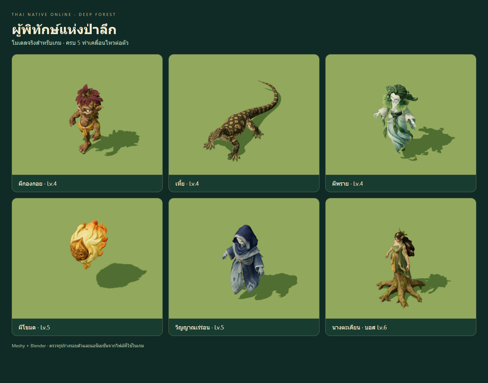
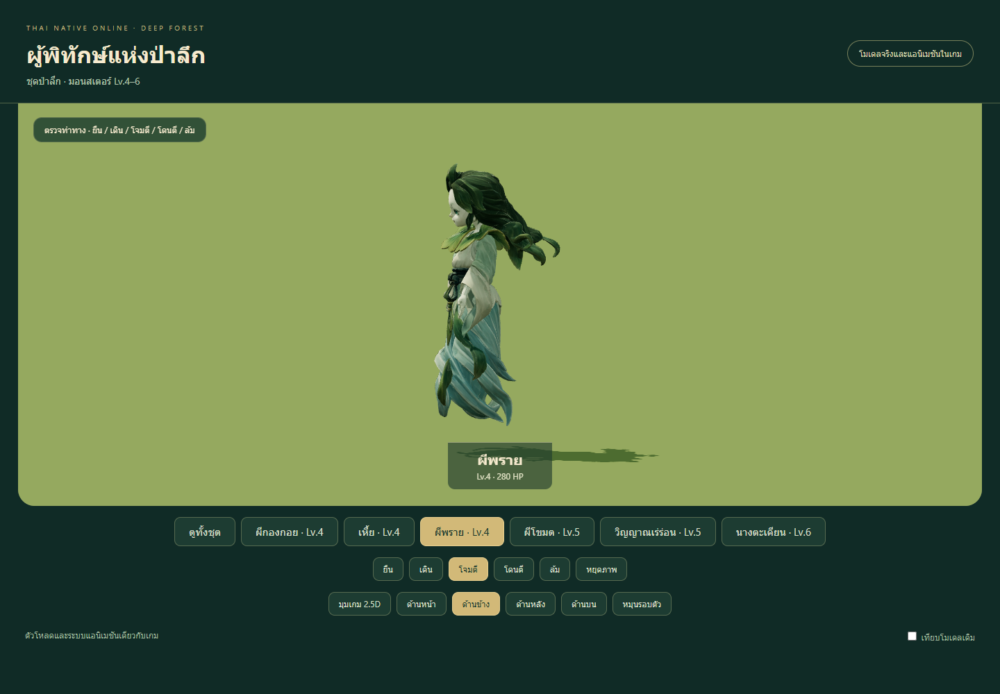
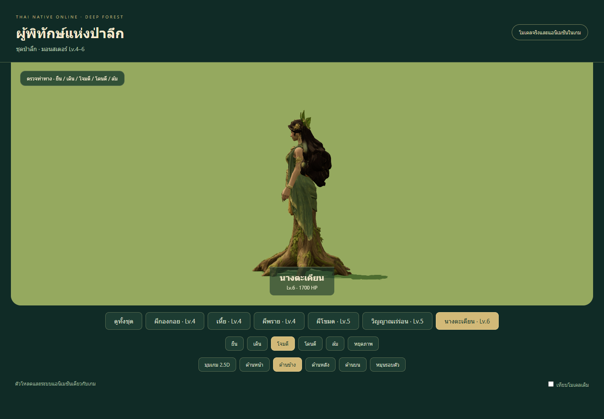
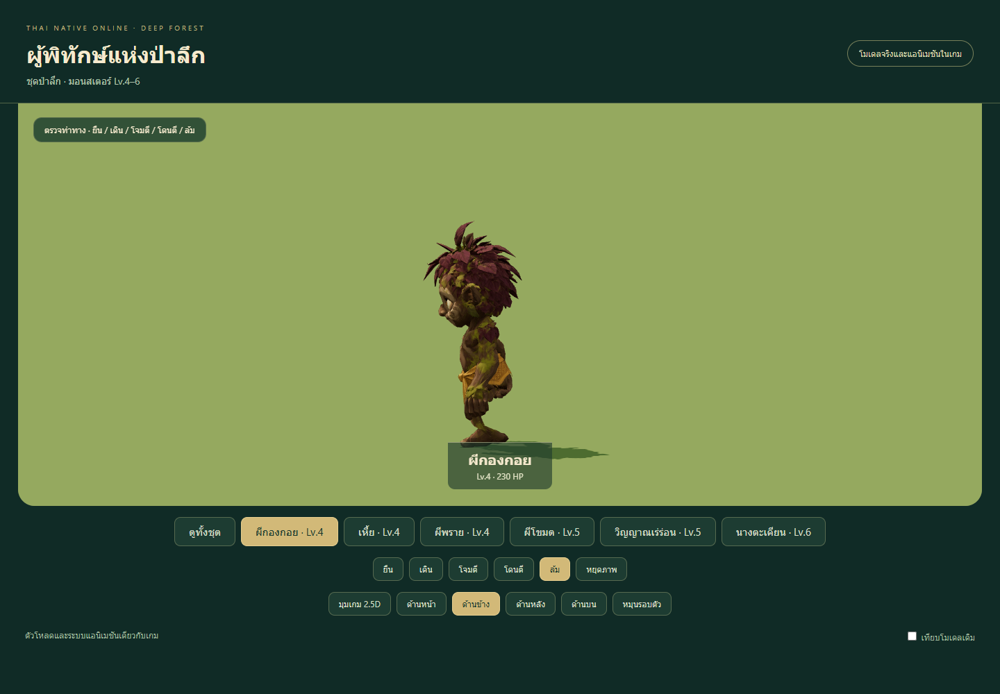
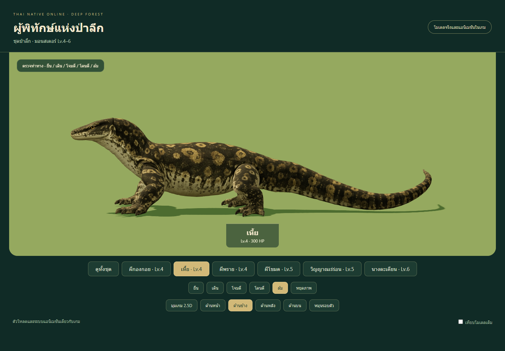
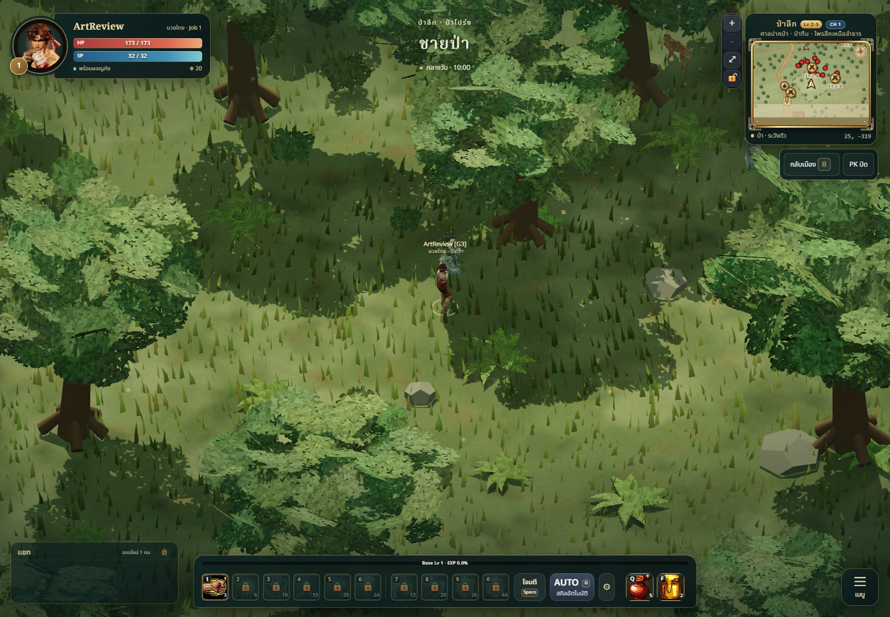
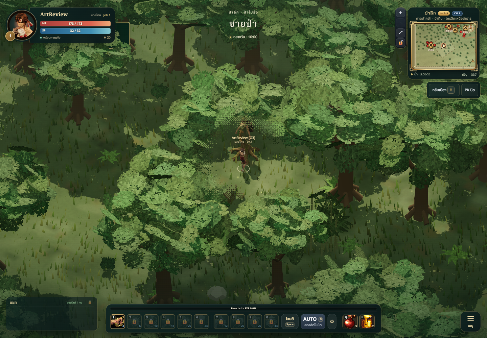
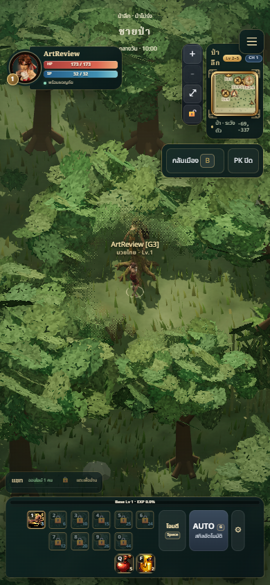

# Deep Forest — six animated Meshy monsters

## Result and scope

Deep Forest now has models for all **nine existing runtime monster identities**.
This pass adds Kongkoi, water monitor, Pray, Khamot, Winyan and the Takian boss;
macaque, dhole and forest spirit reuse their approved shared models. The legacy
tiger entry is filtered out of the actual combat roster. The map's environment
art pass remains queued; this is completion of its monster set.

All six use the game's existing 3D monster loader, with separate idle, walk,
attack, hurt and die clips. Existing sizes/lifts are preserved or follow the
forest roster brief. Khamot additionally dims to 30% base colour when dying,
without affecting neighbours, and restores its colour when alive. This applies
to 3D monster mode. Spawns, stats, collision, loot, progression and boss skill
logic are unchanged.

## Director brief and production

Authority: `GAME_VISION`, actual map spawns, `ART_BIBLE`, material guide and
performance budget. References use broad stylized forms and restrained Thai
details: violet bark goblin, olive reptile, jade water spirit, golden flame,
indigo wanderer and a green teak guardian with a rooted lower body. The previous
procedural models are retained under `tools/monster-models/meshy/baseline/` for
interactive comparison.

Exact concepts/prompts and reference images are committed in `prompts-deep-forest.json`
and `references/`. Seven successful Meshy 7.1 Image-to-3D tasks used **245 credits**;
the final checked balance is **520**. Parameters and task/reference/source hashes
are in each provenance file, without credentials or signed download URLs. The
pipeline follows Meshy's [official Image-to-3D contract](https://docs.meshy.ai/en/api/image-to-3d).

Both raw Kongkoi reconstructions had two legs and were rejected in that state.
The selected second reconstruction was repaired locally: remove the rear leg,
cap only its new cut boundary, center the retained leg and preserve original
cloth hems. The one-legged silhouette is intentional folklore design.

| Model | Level | Triangles | Bones | Runtime bytes |
| --- | ---: | ---: | ---: | ---: |
| Kongkoi | 4 | 11,548 | 12 | 1,469,344 |
| Water monitor | 4 | 12,521 | 19 | 1,257,936 |
| Pray | 4 | 12,483 | 12 | 1,363,060 |
| Khamot | 5 | 12,368 | 4 | 1,116,524 |
| Winyan | 5 | 11,977 | 12 | 1,319,596 |
| Takian boss | 6 | 12,447 | 9 | 1,392,948 |

Each model has one material draw, 1024px JPEG colour and 512px PNG normal,
four or fewer skin influences, nonmetal materials and broad roughness.

## Anatomy, skin and animation

Front/side/back/top and gameplay views cover each neutral model. Kongkoi has
one planted leg and two arms; the monitor has four sprawled limb chains and a
segmented tail. Pray/Winyan have two arms and continuous floating cloth hems;
Takian has two arms and a stationary root base. Khamot is a solid flame form.
No human lower-body retargeting or separate finger bending is used.

The editable rigs use explicit normalized weights. Planted feet have calibrated
IK pole angles/distal rotations; Kongkoi hops with its one contact, then crouches
when defeated. The monitor lowers its torso and neck in death while its feet
remain planted. Ghosts glide and settle; Takian bows from its rooted base.

An independent review initially rejected torn sleeves/hands despite passing
bone-length tests. Surface-geodesic labels, diffusion, anatomical eligibility
and conserved weight transfers replace abrupt capsule assignments. The final
compressed GLBs pass the added surface regression across all five clips, their
keys and a 24Hz grid: no checked edge extends by both over 100% and over 1cm.
Tests keep UV seam copies separate during deformation checks.

Every animated vertex is sampled for flat-ground contact. The lowest final
vertex is approximately **-9.0mm**, within the 10mm forest limit; idle foot-joint
drift is below **0.38mm**, and limb-length changes remain below **0.034mm**.
Each clip has measurable motion. Exact per-model/clip values and file hashes
are in [validation.json](validation.json).

Delivery uses registered **L3 snapshot-bound background exports**. Ninety-six
fresh Blender previews retain snapshot/revision/image hashes. The packed
37.5MB editable scene was independently copied, reopened and inspected: all six
final rigs/surfaces/actions are present. Hidden earlier authoring iterations
remain in that source. `asset.dependencies` is unavailable under this bridge's
read-only review policy; it was not bypassed. Runtime browser decoding confirms
all six embedded colour textures load at 1024px.

## QA and evidence

- `npm test`: **394/394 pass**, including four skin-surface regressions.
- `npm run build`: passes, 229 modules; existing large-chunk warning remains.
- Browser: all six models load, no page errors, shared geometry/textures with
  independent materials/skeletons/monster IDs; 390×844 review has no overflow.
- Khamot death colour isolation/restoration passes a runtime controller check.
- Six real [motion recordings](kongkoi-motion.webm) decode successfully; walk,
  attack and death frames were sampled at 1.2, 2.9 and 5.8 seconds.
- Local authoritative-server map: all six model identities load at the actual
  existing spawns, including one boss; no browser errors.

The local-server screenshots retain its roster. The camera/player were moved
locally for inspection and incoming player damage was paused in that headless
review page. This verifies network-fed model presentation, not sustained combat
or multiplayer acceptance. Actual skin-to-terrain minima range down to **-3.15cm**
for the monitor and **-1.27cm** for Takian on uneven ground. Hovering spirits
remain above terrain. This differs from the flat-ground animation test.

Interactive review: `/tools/monster-models/meshy/motion.html?set=5`.
Map/level queues now identify 14 integrated models across the game and 51 planned
identities; Deep Forest's nine-model set is complete.

## Changed files

| Paths | Purpose |
| --- | --- |
| `public/models/monsters/{kongkoi,monitor,pray,khamot,winyan,takian}.glb` | Final five-clip runtime models |
| `src/combat/MonsterModels.js` | Model specifications and isolated Khamot death dimming |
| `tools/monster-models/meshy/{rig_forest.py,surface_weights.py,poles_forest.mjs,pole-angles-forest.json,collect_forest.py,extract_batch.mjs}` | Editable rigs, skin repair, calibrated contacts and verified export collection |
| `tools/monster-models/meshy/{correct_kongkoi.mjs,forest-roster.json,rigs/*,references/*,*-provenance.json,*-prepared.json,*-animated.json,*.glb}` | Design brief, reproducible source candidates, correction and provenance |
| `tools/monster-models/meshy/{generate.py,prepare.mjs,unpack.mjs,publish.mjs,queue.*,map-queue.*,motion.js,review.js,README.md,baseline/*}` | Generation/packing, map manifest, review and rebuild workflow |
| `tests/meshy-{forest-skin,monster-motion,monsters}.test.js` | Surface continuity, anatomy/contact, budgets and integrity |
| `docs/art/monsters/meshy-deep-forest/*` | Final images, recordings and measured evidence |

## Known limitations

No slope-aware foot IK, world-speed matching, ragdolls, individual finger/jaw
or facial animation. Walking and attacks are restrained five-clip sets rather
than separate animations for every existing boss skill. Hidden/rear details
are inferred from single-view concepts. Dense existing canopy can obscure
models; clearing paths/canopy belongs to the queued environment art pass.
Physical-phone crowd/FPS profiling and prolonged multiplayer combat remain
separate checks. Current scene draw counts include terrain, foliage and shadow
passes; they are not per-monster material costs.

Rebuild instructions are in `tools/monster-models/meshy/README.md`. Raw downloads,
editable scene snapshots and export receipts remain locally under ignored
`artifacts/`; recipes, static candidates, validation and screenshots are tracked.

## Independent final review

Independent specialist verdict: **PASS for all six final monster assets**.
The previous skin-stretching blocker is closed; no remaining shipping-blocking
anatomy, rig or material defect was observed. Scores assess unobstructed 2.5D
asset views, not unrestricted forest scene visibility.

| Asset | Style | Readability | Technical |
| --- | ---: | ---: | ---: |
| Kongkoi v3 | 8.5 | 8.5 | 8.5 |
| Monitor v4 | 8 | 8 | 8 |
| Pray v4 | 8.5 | 8.5 | 8.5 |
| Khamot v1 | 9 | 9 | 9 |
| Winyan v4 | 8.5 | 8 | 8.5 |
| Takian v4 | 8 | 8.5 | 8.5 |

The reviewer independently reran 18/18 motion/surface tests and verified all
96 Blender PNG hashes and 45 published evidence hashes. Actual gameplay
captures were inspected. Monitor slope contact and canopy visibility remain
P2 integration follow-ups. Continuous video playback, active combat, physical
phone performance and Blender dependency closure were not independently
verified. The implementing agent separately decoded/sampled the recordings.
