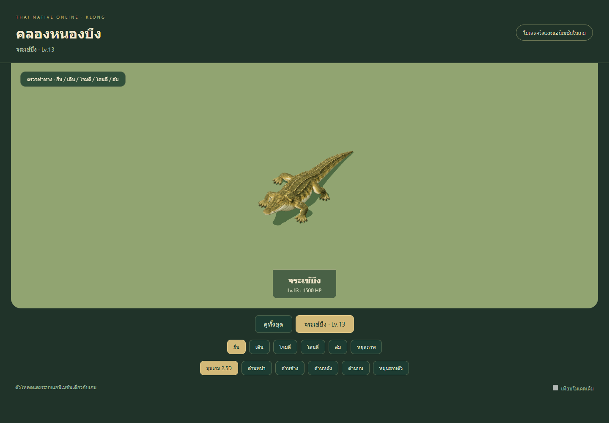
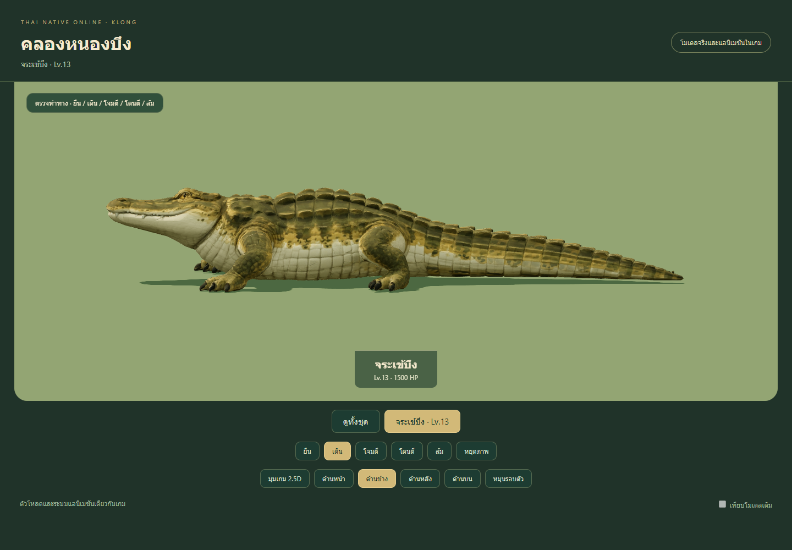
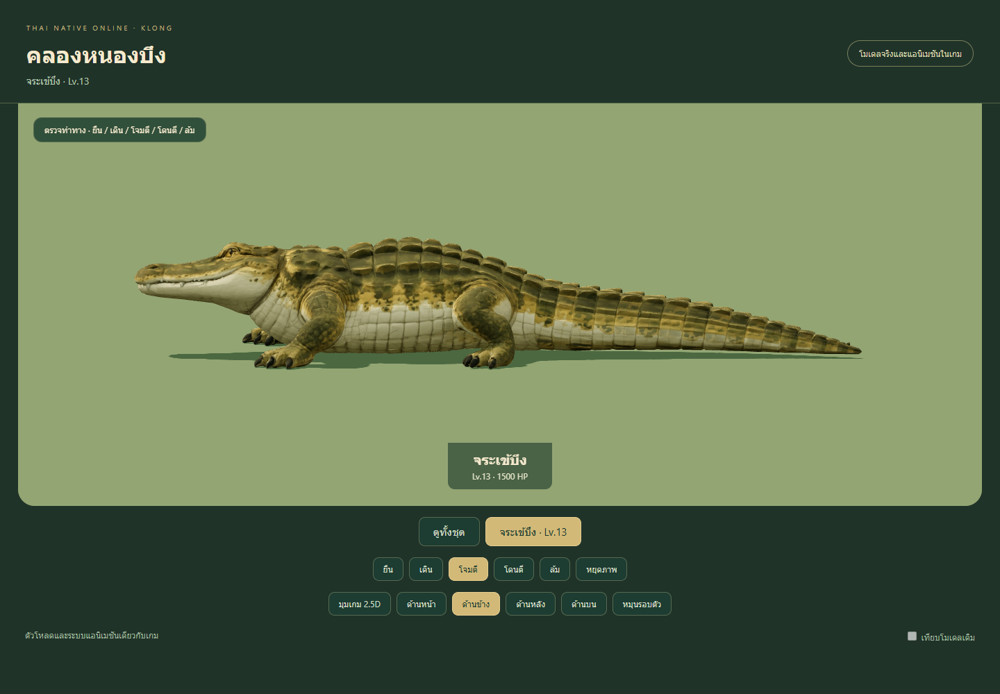
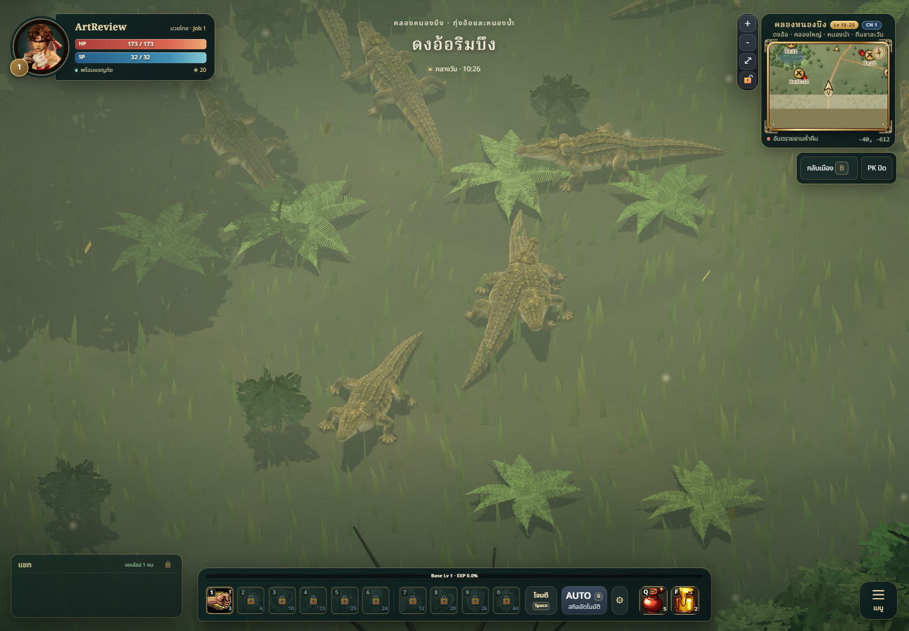
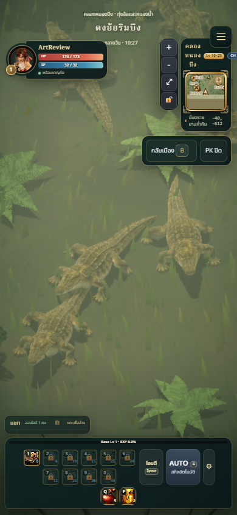
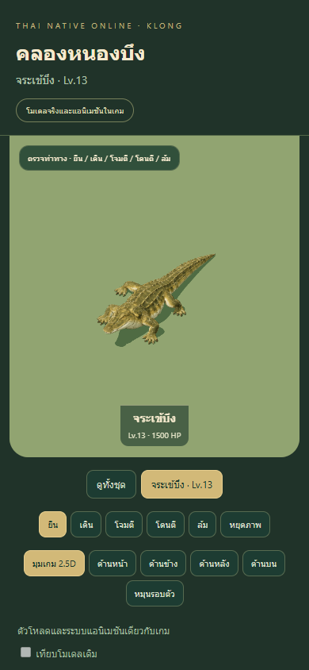

# Klong — Croc delivery, 2026-10-09

## Summary

Replaces the procedural level 13 **จระเข้บึง (`croc`)** with a textured Meshy
model and species-specific Blender motion. This is **1 of 10 Klong identities**;
the other nine models and map environment remain queued. The Director roster
and Thai marsh direction are in [BRIEF.md](BRIEF.md).

The selected creature has four complete, unbranched legs, a broad freshwater
crocodile snout, complete jaws, rounded dorsal scutes and one continuous tail.
Olive/ochre upper surfaces and a cream underside distinguish it from the forest
monitor. No decorative prop, human skeleton or map geometry is baked into it.

The native loader uses five clips: `idle`, `walk`, `attack`, `hurt`, `die`.
Art height is 0.60m after the existing 1.30 outer scale, about 3.67m long.
Stats, attack range, picking/collision, spawn counts/phases, drops and Chalawan's
existing `croc` summons are unchanged. Integration uses the shared model loader;
server gameplay does not change.

## Production and anatomy

Two successful Meshy Image-to-3D tasks cost **70 credits**. The first task
`01a11f4e-0eb8-7079-964a-a3f7bafa16a8` generated six foot ends despite its
four-leg reference. It was rejected before binding/publication. A clearer
high three-quarter reference produced the selected second task
`01a11f57-d665-7529-b3ed-3094968d80e2`, charged 35 credits. Exact parameters,
prompts, reference/source hashes and rejected-task identity are committed
beside the static model. Live postgeneration balance was **135 credits**.
No paid rigging/animation or credit purchase was used.

| Final asset | Value |
| --- | --- |
| Runtime | `public/models/monsters/croc.glb` |
| SHA-256 | `8d62143762aba4fab3b718f9cde2cbee6f03f02726de5b0845c1252879df5f55` |
| Bytes / triangles / material draws | 1,385,112 / 12,567 / 1 |
| Bones / maximum influences | 20 / 4 |
| Embedded colour / normal | 1024×1024 / 512×512 |
| Selected static SHA-256 | `df2e5ff171afeb2e7b42c53eb7bae2daffd2ac2bb02763e340a687d60c127b00` |

Each leg has fitted Upper/Lower/Foot bones, an IK target and a rest-basis pole.
Complete distal rotations preserve the source's naturally asymmetric sprawled
stance. Geodesic weights merge UV seam copies and retain normalized influences.
Local torso and sole ownership repairs keep the belly with Body and the whole
heel/toe sole with Foot. Idle feet are planted; diagonal walk steps retain
limb length. Neck/head/jaw and a three-segment tail remain separate. The jaw's
opening sign is calibrated from the actual exported basis. Chest settling and
tail countertranslation prevent the death clip sinking into the flat floor.

Earlier exports are retained as failed evidence. Initial death skin sank
13.95mm in source units because central belly weights belonged to four upper
legs. A later heel still sank 14.69mm after 0.90m runtime normalization. Both
were repaired locally. The final v3 surface passed the unchanged 1cm native
floor limit **at 0.90m before the art-scale reduction**: worst walk clearance
−5.51mm. The old scale also failed independent pack readability, 6.5/10,
because 5.5m animals overlapped. Final 0.60m scaling addresses pack readability;
it does not substitute for the source/heel repair.

## Validation

- `npm test`: **425/425 pass**, no skipped/cancelled tests.
- `npm run build`: **passes**, 229 modules. Existing large-bundle warning remains.
- Exact-hash browser audit: five exported clips, actual decoded textures,
  finite normalized weights, four leg chains and all exported keys plus a 24Hz
  sampling grid. Every indexed source edge initially at least 5mm retains the
  unchanged combined 2× extension / 1cm limit. No edge failures.
- Source neutral surface error 0.425mm; idle foot-origin drift 0; maximum tested
  source limb-length error below 0.014mm. Source walk clearance −1.87mm.
- Native 0.60m flat-floor worst clearance: walk −3.68mm, die −0.805mm;
  idle/attack/hurt remain above the floor. Flat-floor tolerance remains 1cm.
- **120** viewport/view/clip/phase framing checks pass and **40** screenshots
  cover desktop 1440×1000 and mobile 390×844. No viewport overflow, clipped
  silhouette, page errors or failed asset requests. Report:
  [qa-browser.json](qa-browser.json).
- [Five-clip video](croc-motion.webm): 240 original canvas frames exported at
  constant 24fps, 10.00 seconds. Independent FFmpeg decoding confirms all 240
  frames and extracts the first plus five measured projected-envelope witness
  frames at their exact encoded indices. [Video report](qa-video.json).
  Earlier realtime recordings failed wall-clock/stream-timestamp alignment and
  the original deterministic export's browser-seek check failed. Those failures
  remain preserved; the accepted video uses original unedited canvas frames
  and complete independent decode, with no guessed time stretching/clamping.
- Eight fresh registered L3 Blender views show idle and attack from four
  directions; their immutable paths/hashes are recorded in
  [source-preview-manifest.json](source-preview-manifest.json).
- Packed GLB and BLEND exports have verified byte/hash receipts. The final
  packed source `artifacts/meshy-rig-05/klong/croc-final-v3.blend` was copied,
  hash-verified and reopened in a separate review-only managed session.
  Croc rig/surface, eight controls and five actions are present. Reopen report:
  [qa-source-reopen.json](qa-source-reopen.json). `rig.inspect` is denied by that
  review-only policy; it was not bypassed. Bone/skin validation uses the actual
  exported GLB and the original registered rig receipt.

Independent Art/Tech review: **Style 8/10, Anatomy 8/10, desktop/mobile
Readability 8/10, Technical Usability 8/10** for this exact hash at 0.60m.
No P1 or blocking P2 remains. The 0.90m pack-size finding is closed. The lowest
walk triangle-area ratio, 0.05694 at triangle 5671/time 0.433333s, is localized
underside tail-root creasing rather than visible ankle collapse. Attack
triangle 5057/time 0.633333s shows no gross snout/jaw collapse. Compression was
reviewed visually independently of the unchanged extension test.

Actual authoritative CH1 evidence identifies Croc SID171 and the exact loaded
runtime bytes. Desktop and same-ID mobile captures completed in 23.934 seconds,
with no page/asset errors or capture failures. Five natural neighbours retain
separate picking identities, skeleton bones and materials, while sharing
geometry/textures. Current-pose terrain clearance is −5.66mm on desktop and
−1.78mm on mobile; these samples do not constitute a multi-clip slope audit.
The [capture report](qa-game-capture.json) explicitly retains unobserved natural
player-adjacent combat and comprehensive terrain checks. Its scope is capture
evidence, not all-game acceptance. The earlier hard 2-second mobile frame-wait
failure remains preserved locally; the corrected helper uses the remaining
original 30-second budget, without changing anatomy/terrain tolerances.

## Changed files

- `src/combat/MonsterModels.js`, `public/models/monsters/croc.glb`: runtime model
  registration and asset.
- `tools/monster-models/meshy/`: Croc references/provenance/static/animated
  metadata, anatomical recipe, weights, rigging, rest calibration, extraction,
  publication, review/motion set 7 and rebuild instructions.
- Three existing Meshy model/motion/skin test files: extend geometry, anatomy,
  ground/contact and surface-edge checks to the Croc candidate.
- `docs/art/monsters/meshy-klong/`: brief, this report and immutable visual/QA
  evidence. Level/map backlog scripts and manifests record Croc reviewed and
  Klong in progress, with the other nine identities planned.

## Known limitations

This is a stylized game animal rather than zoological reconstruction. Generated
toes retain their source shape without individually articulated toe bones.
Idle bone-origin contact plus measured surface clearance does not establish
terrain-following feet. Walk is an in-place clip and is not synchronized to
authoritative world speed; no slope IK, swimming, ragdoll or per-skill clips
are supplied. Rare live summons and online bite/impact timing are unobserved.
Mobile captures establish framing, not physical-phone performance or crowd
capacity. Independent art acceptance applies to this bounded Croc asset; it
does not approve the remaining Klong roster or all live gameplay. Editable
BLEND, full source previews and failed intermediate outputs
are preserved locally; no session descriptors, credentials or signed download
URLs are committed.
