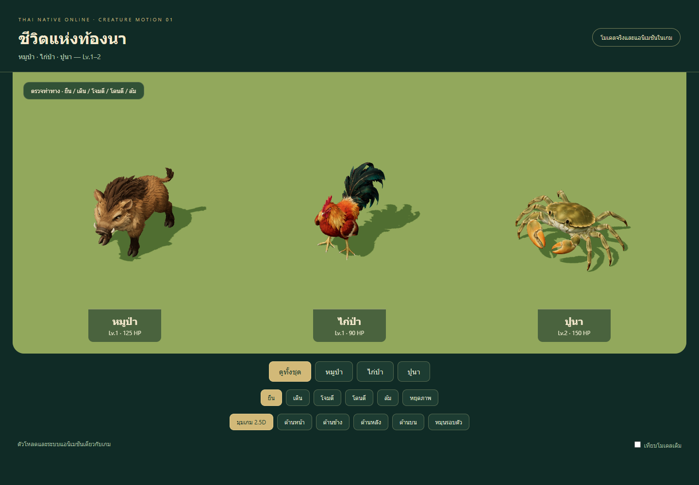
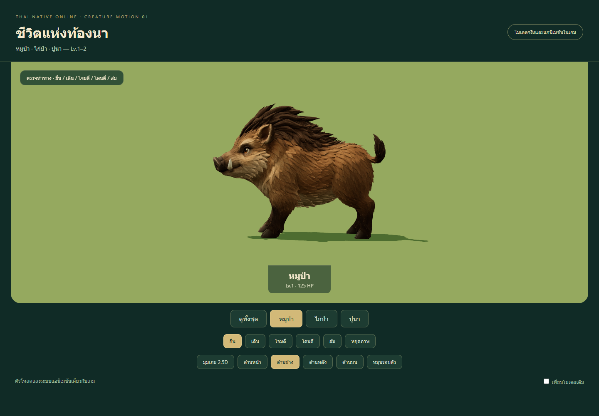
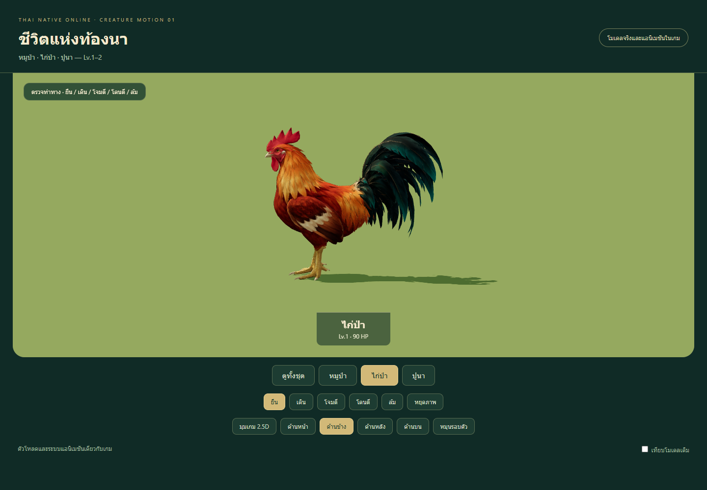
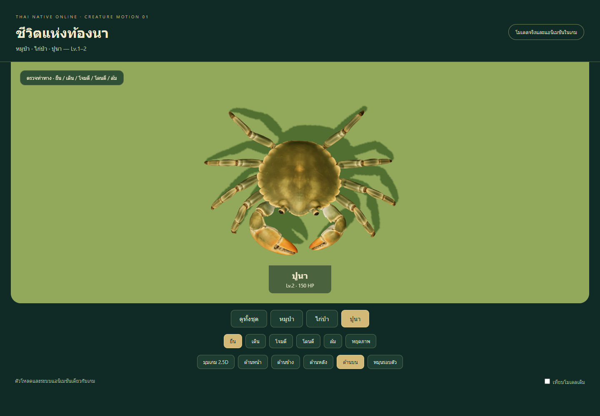
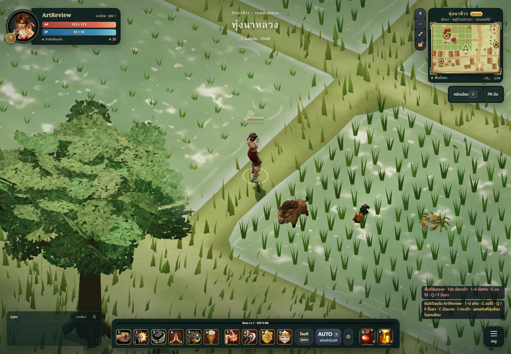
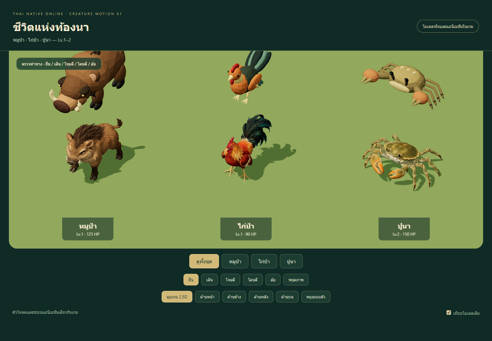
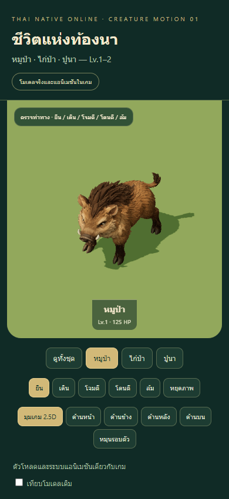

# Rice-field creatures — animated integration 01

## Result

Boar and junglefowl (Lv.1), then rice-field crab (Lv.2), now replace the three
prototype GLBs in the game's **3D monster mode**. Each has idle, walk, attack,
hurt and die clips. Existing monster scale, spawn rules, stats, drops and server
behaviour are preserved. Pixel monster mode retains its existing appearance.
This work is on `codex/meshy-monsters-low-level` for PR review; it is not deployed.

## Director brief and art/technical self-review

Follow `GAME_VISION.md`, the world monster/progression/map documents, and the
art bible, material/camera guides and technical performance budget. Preserve the
soft stylized Thai-fantasy direction and readable silhouettes at the 2.5D camera.
The original Meshy generation, selected references and provenance are retained
in [study 01](../meshy-set-01/REVIEW.md); no further Meshy task or credits were used
for this animation milestone.

Species-specific editable rigs were authored through registered Blender Harness
commands. Explicit smooth skin influences replace human auto-rigging. Stable IK
rest poses and signed pole angles preserve knee/hock bend direction. Foot targets
keep idle contact fixed; baked animation is packaged into independent runtime
clips, with controls and studio objects excluded from the shipped GLBs.

| Creature | Triangles | Material draws | Bones | Runtime bytes | Height |
| --- | ---: | ---: | ---: | ---: | ---: |
| หมูป่า / boar | 12,505 | 1 | 16 | 1,462,528 | 1.25m |
| ไก่ป่า / junglefowl | 12,231 | 1 | 13 | 1,497,328 | 1.20m |
| ปูนา / rice-field crab | 12,551 | 1 | 32 | 1,226,568 | 0.65m |

All five loops/actions retain the same runtime facing convention. Boar attacks
with a head/tusk thrust; junglefowl attacks with a peck and small wing response;
crab attacks with raised, inward-moving claw arms. Hurt has a brief recoil, and
death lowers into a stable crouch/settle. Idle uses restrained breathing and
head/tail/claw movement. Walk is a looping gait authored in place.

Implementing-agent assessment: style match **8/10**, gameplay readability **8/10**,
technical usability **8/10** for this reviewed batch. These are self-review scores,
not an independent Art Director approval or physical-device performance result.
Textures remain richer than the surrounding prototype terrain; small fur and
feather details disappear at normal play distance, while body colour/silhouette
remain readable. Mobile crowd cost needs measurement before broader rollout.

## Anatomy and deformation acceptance

- **Boar:** four independent leg chains and cloven hoof regions; shoulder, hip,
  knee and ankle bends stay coherent. Explicit fore/hind contact regions avoid
  leaving low hoof vertices attached to the torso. The generated asymmetric
  hind-foot placement is preserved rather than forced into a new bind pose.
- **Junglefowl:** two leg chains with the visible backward hock, two folded wings,
  one tail group. Foot and low-leg weights are separated from long feathers.
  Toes stay together with each foot; no independently articulated toe rig is
  claimed. Small neck/head and wing movements preserve the source silhouette.
- **Crab:** eight independently controlled walking legs, two claw arms/palms and
  two eye stalks. Limb lengths stay constant through motion. Original open claw
  gaps are retained; there is no fabricated movable pincer finger.

Front, side, back, top, gameplay-angle, walk/attack/hurt/death images are saved
for every creature. After Meshopt packing, tests inspect **every skinned vertex
at every authored frame** across all five clips. Acceptance thresholds: neutral
deformation below 4mm, idle foot-joint drift below 1.5mm, and animated skin no
more than 15mm below the normalized ground. All three pass. Blender limb-length
checks pass a 0.5% tolerance and idle foot targets have zero measured drift.

These checks catch gross rigging/bind/ground errors; they do not certify every
surface as anatomically perfect or prove contact on arbitrary terrain slopes.

## Finished motion and game placement

Actual canvas recordings show approximately three seconds walking, followed by
repeated attacks. Each is approximately 6.3 seconds, 1388×580, captured at a
requested 30fps. Playback and representative walking/attack frames were checked.

- [Boar walking and attack](boar-motion.webm)
- [Junglefowl walking and attack](fowl-motion.webm)
- [Crab walking and attack](crab-motion.webm)

The game capture uses a controlled local guest scene at 10:00 with the actual
terrain, camera, UI and combat view. Three test creatures are placed together
for inspection; this is not a new spawn arrangement or online combat session.

The development viewer `/tools/monster-models/meshy/motion.html` uses
`makeMonsterModel` directly. It supports all five clips, five camera views,
turntable, pause, individual selection and a preserved prototype comparison.
It is excluded from the production entry point.

## Validation

- `npm test`: **358/358 pass**. The original asset checks still cover every
  registered monster. New tests verify final hashes/budgets, bone/foot counts,
  neutral deformation, idle drift and ground contact across all frames.
- `npm run build`: passes, 227 modules; existing JavaScript bundle-size warning
  remains. Creature GLBs are separately loaded assets.
- Browser: all embedded textures decode, all three runtime models load, all views
  and actions render, no page errors. A 390×844 touch viewport has no horizontal
  overflow. This is desktop browser emulation, not a physical phone benchmark.
- Two boar instances share geometry/textures but have independent materials,
  skeletons and monster IDs. Exact runtime hashes are in `*-animated.json`.
- Editable Blender `.blend` snapshots and export receipts were saved locally;
  portable recipes, bone/control metadata and static candidates are tracked.

## Changed files

| Path | Purpose |
| --- | --- |
| `public/models/monsters/{boar,fowl,crab}.glb` | Three animated runtime replacements |
| `tools/monster-models/meshy/{unpack.mjs,rig.py,pole-angles.json,publish.mjs}` | Rebuildable animal rig and packaging workflow |
| `tools/monster-models/prepare.mjs` | Preserve Blender texture transforms; report consolidated mesh correctly |
| `tools/monster-models/meshy/rigs/*.json`, `*-animated.json` | Bones, contact checks, source snapshots and runtime hashes |
| `tools/monster-models/meshy/{motion.html,motion.js,baseline/*}` | Actual-controller review and preserved old-model comparison |
| `tools/monster-models/meshy/{review.html,review.js,queue.*,README.md}` | Link the completed milestone and update the generation queue |
| `tests/meshy-monster-motion.test.js` | Full-frame skin/anatomy/ground checks |
| `tests/monster-model-assets.test.js` | Node texture stub for geometry tests; pixels checked in browser |
| `docs/art/monsters/meshy-motion-01/*`, prior study review | Screenshots, recordings, current acceptance and historical cross-link |

## Known limitations and next batch

Walk cycles do not match world movement speed or apply terrain-slope foot IK, so
foot sliding can occur during fast chase or on uneven ground. Death is a grounded
settle rather than a ragdoll. Fur, feather tips, toe details and fixed pincer gaps
retain generated topology and have limited articulation. No LOD has been added.

The three compressed assets total **4,186,424 bytes**, versus 391,980 bytes for
the prototypes. They stay under the chosen 1.8MB/15k-triangle per-creature limits,
but this is a substantial download increase. Shared-loader caching is retained;
real-phone crowd profiling and online combat acceptance remain outstanding.

Next in level order: cobra and monkey at Lv.2, followed by dhole and phibpa at
Lv.3. The queue lists all 65 current identities through Lv.100; these later
Meshy replacements have not been generated or charged.
