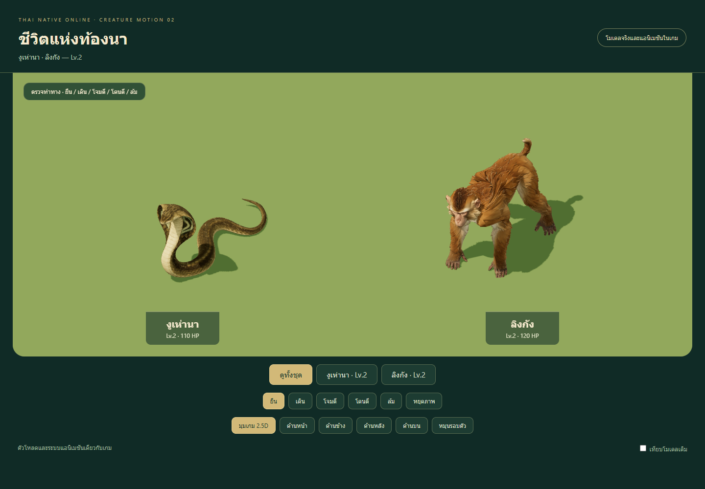
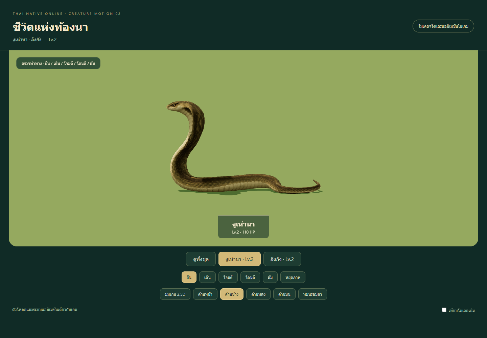
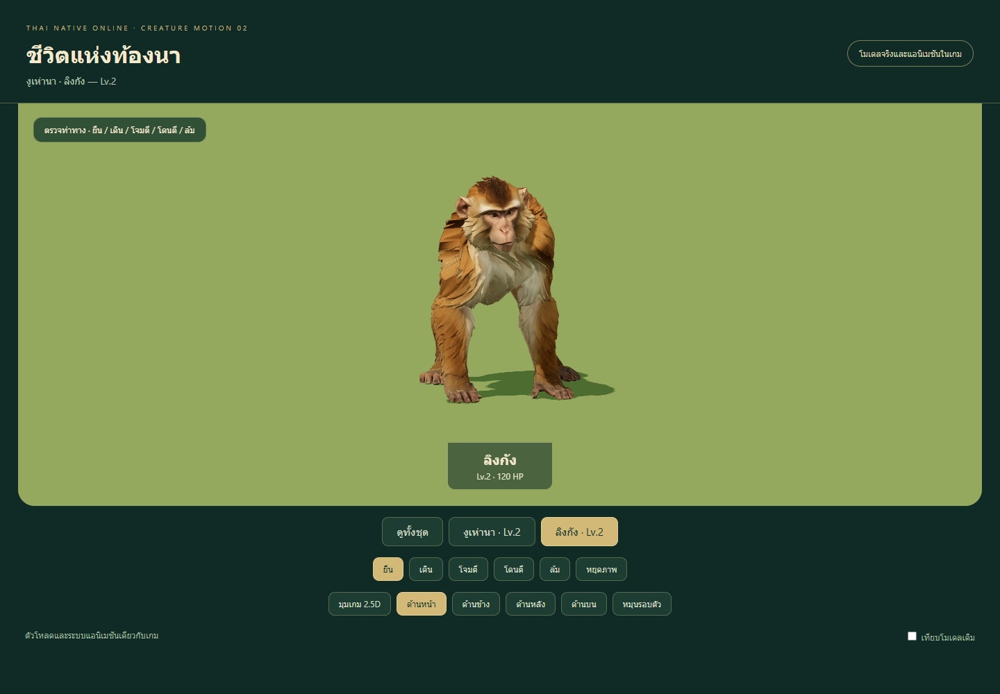
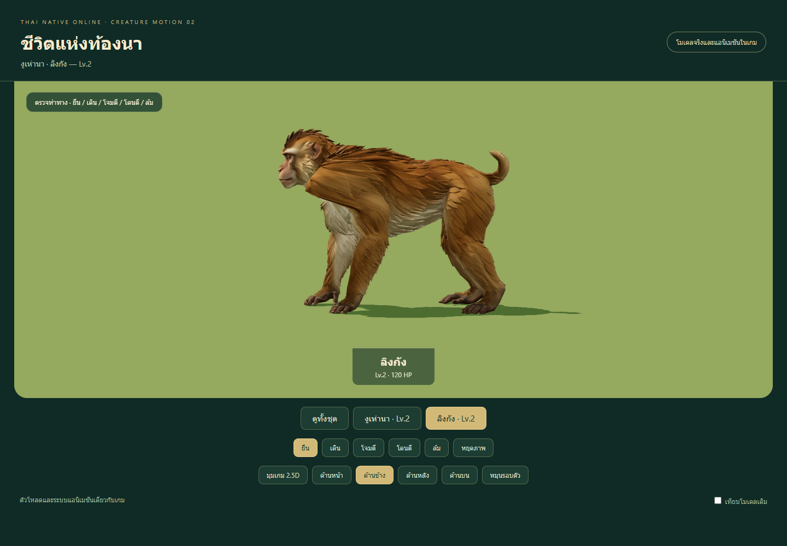
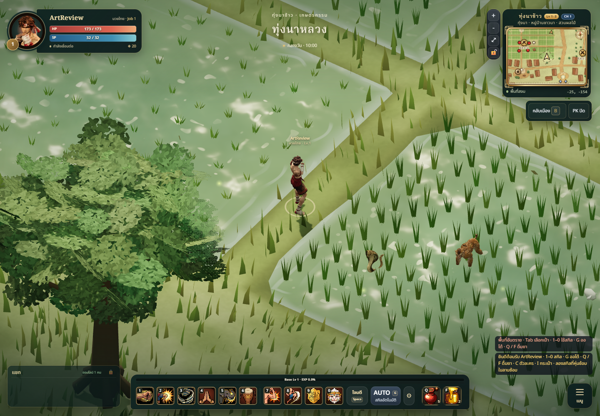
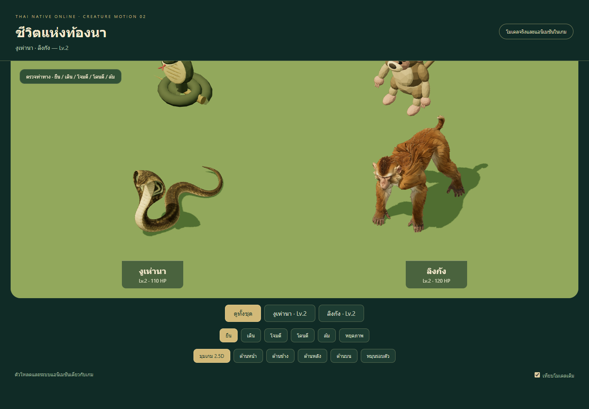
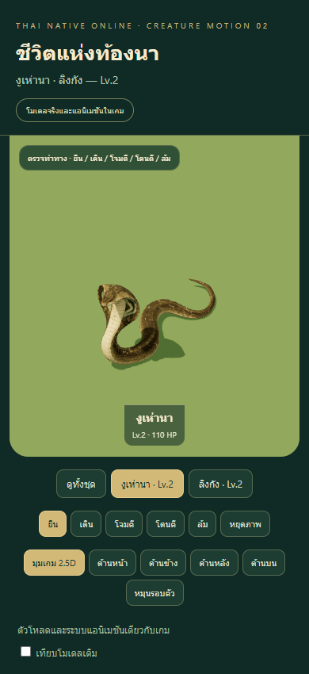

# Rice-field creatures — Lv.2 animated integration

## Result

Cobra and pig-tailed macaque now replace their prototype models in **3D monster
mode**. Each has idle, walk, attack, hurt and die clips. Together with the previous
boar, junglefowl and crab batch, five level-ordered creatures are integrated.
Spawn locations, size settings, stats, drops, poison effects and server behaviour
remain those of the existing game. Pixel mode keeps its existing artwork.

## Director brief and art/technical review

Follow the game vision, world progression and monster documents, art bible,
material/camera guides and performance budget: readable soft stylized Thai fantasy
animals at the orthographic gameplay camera. Warm broad macaque fur clumps and
olive/ochre cobra scales accompany the previous starter creatures.

References were created with built-in imagegen in `stylized-concept` mode. Exact
generation/edit prompts are in `tools/monster-models/meshy/prompts-set-02.json`;
selected image inputs and their hashes are retained. Meshy produced one model per
creature: **35 credits each, 70 total**. No paid regeneration or human autorig was
used. Provenance JSON records task IDs, source hashes and parameters without
credentials or expiring URLs.

| Creature | Triangles | Material draws | Bones | Runtime bytes |
| --- | ---: | ---: | ---: | ---: |
| งูเห่านา / cobra | 12,586 | 1 | 11 | 1,128,688 |
| ลิงกัง / pig-tailed macaque | 12,459 | 1 | 17 | 1,472,928 |

Implementing-agent self-review: style **8/10**, gameplay readability **8/10** and
technical usability **8/10**. This is a documented self-review, not an independent
Art Director sign-off or physical-phone performance measurement. Fine fur/scale
detail disappears at play distance; silhouette and colour carry identification.

## Anatomy and deformation checks

The generated macaque torso initially faced a different direction from its head.
Its whole-body facing was normalized, then a temporary Blender neck rig baked a
neutral head correction. The complete face is rigidly weighted through the
correction, with a smooth lower-neck transition: a rejected first weighting left
the muzzle partially rotated and stretched. Front/side/back/top inspection was
repeated after correction. The accepted model keeps four separate weight-bearing
limbs, natural elbow/knee directions, planted hands/feet and one short curved tail.
Digits remain part of each hand/foot rather than individually articulated bones.

The macaque's final rig uses four two-segment IK chains and explicit skin weights.
Pole angles are derived from exported rest matrices to retain the asymmetric
source stance. Idle breathing leaves contact targets fixed; walking alternates
diagonal limb pairs; attack reaches with the right forelimb and a restrained
head/body thrust. Hurt recoils and death settles into a crouch.

The cobra has one continuous body, one head/hood and one tapering tail. Five ground
segments form a planar slither, followed by separate neck, hood and head bones.
Ground segments have a common horizontal rotation plane; a smooth lower-neck
weight transition prevents the raised body from pulling its belly below ground.
Attack produces a neck/head thrust accompanying the existing ranged poison
behaviour. Hurt recoils; death lowers the head while retaining floor contact.

After Meshopt packing, automated checks sample **every skinned vertex at every
frame** across all five clips. They require neutral deformation under 4mm,
idle foot-joint drift under 1.5mm and ground penetration under 15mm. Cobra centre
line segment lengths must remain constant within 1mm. Results:

| Measurement | Cobra | Macaque |
| --- | ---: | ---: |
| Maximum neutral displacement | 0.890mm | 0.658mm |
| Maximum idle foot-joint drift | N/A, no feet | 1.433mm |
| Lowest animated vertex | approximately 0mm | -0.151mm |
| Maximum snake segment-length change | 0.019mm | N/A |

Blender limb-length checks also pass the 0.5% tolerance, and macaque idle contact
targets have zero measured drift before compression. These checks catch gross
bind, stretching and ground errors; they do not certify every generated surface
or provide terrain-slope IK.

## Finished motion and game placement

Actual canvas recordings (1388×580, approximately 6.29 seconds each) show walking
followed by repeated attacks. Both use the
game's `makeMonsterModel` loader/controller and final embedded textures.

- [Cobra walking and attack](cobra-motion.webm)
- [Macaque walking and attack](monkey-motion.webm)

The game image uses an isolated guest and two controlled local spawns for review,
with the existing terrain, camera and UI. It does not change online spawn density.
The development viewer is `/tools/monster-models/meshy/motion.html?set=2`, with
five actions, five views, turntable, pause and preserved prototype comparison.

## Validation

- `npm test`: **362/362 pass**; all nine registered monster assets remain covered.
- `npm run build`: passes, 227 modules; existing bundle-size warning remains.
- Browser: both final models/textures decode, all views/actions render, no page
  errors; 390×844 touch emulation has no horizontal overflow.
- Two macaque instances share geometry/textures but have independent skeletons,
  materials and monster IDs.
- Video files decode and representative walk/attack frames are inspected.
- Editable Blender snapshots and export receipts remain locally under
  `artifacts/meshy-rig-02`; portable recipes and bone metadata are tracked.

## Changed files

| Path | Purpose |
| --- | --- |
| `public/models/monsters/{cobra,monkey}.glb` | Two animated runtime replacements |
| `tools/monster-models/meshy/{cobra,monkey}*`, `references/*`, `prompts-set-02.json` | Candidates, provenance, exact prompts and runtime hashes |
| `tools/monster-models/meshy/{correct_monkey.py,rig_level2.py,poles_level2.mjs,pole-angles-level2.json,rigs/*}` | Rebuildable neck correction and species-specific rigs |
| `tools/monster-models/meshy/{generate.py,prepare.mjs,unpack.mjs,publish.mjs}` | Extend the existing pipeline to this batch |
| `tools/monster-models/meshy/{review.js,motion.js,baseline/*,queue.*,README.md}` | Batch selection, comparisons, queue and rebuild instructions |
| `tests/meshy-{monsters,monster-motion}.test.js` | Hash, budget, skin, ground and snake segment checks |
| `docs/art/monsters/meshy-motion-02/*` | Images, walking/attack recordings and this report |

## Known limitations

Walking is authored in place; it does not match world speed or slopes. Fingers,
toes, jaw and hood expansion are not separately animated. Fur clumps near the
macaque shoulder remain angular in close-up, and the short tail is more furred
than a literal zoological reconstruction. Death uses a settle rather than a
full ragdoll. Physical-phone crowd profiling and extended multiplayer combat
acceptance remain outstanding. The next queued species are dhole and forest
spirit at Lv.3; their new models have not been generated in this batch.
