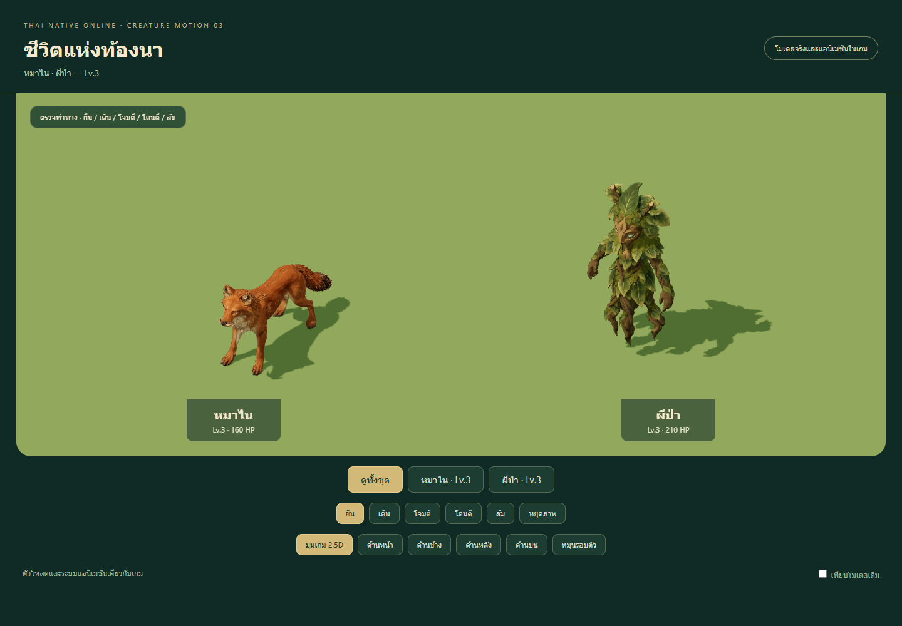
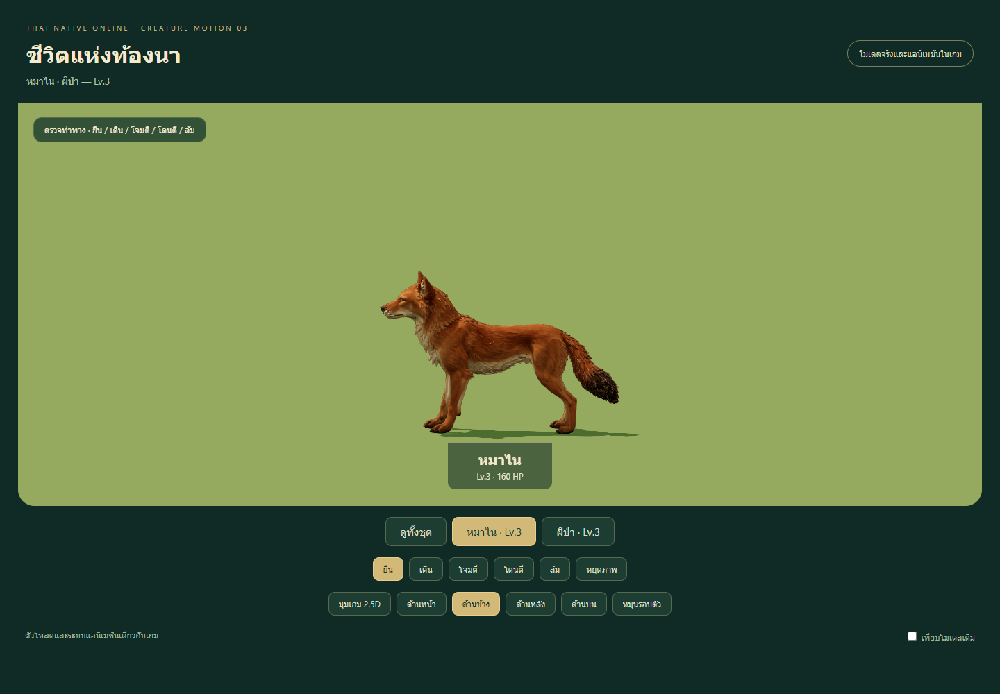
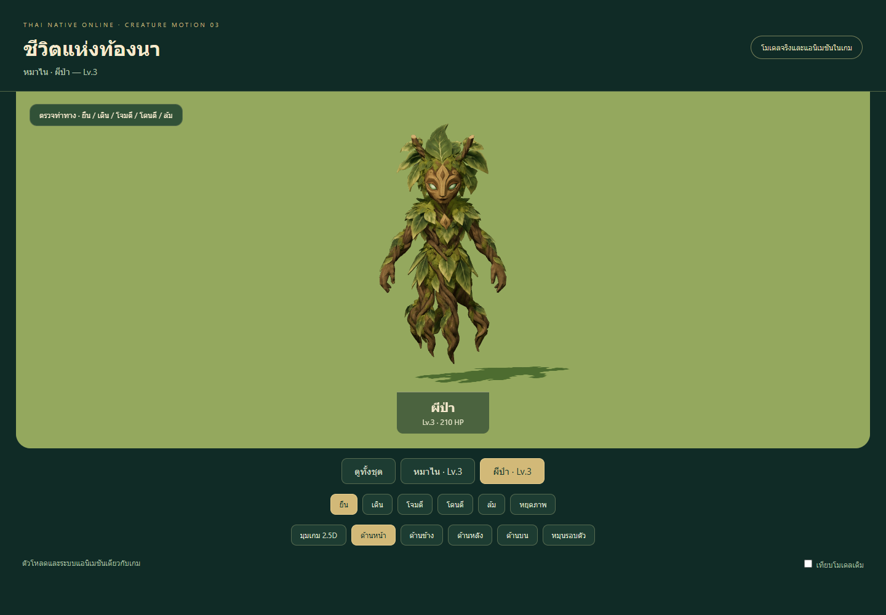
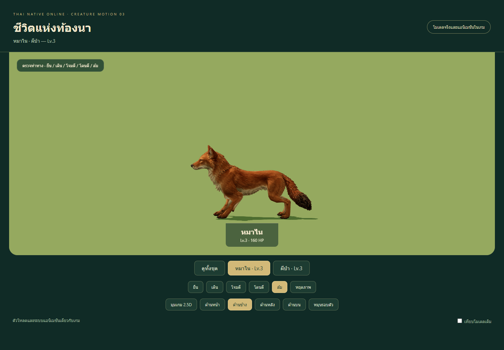
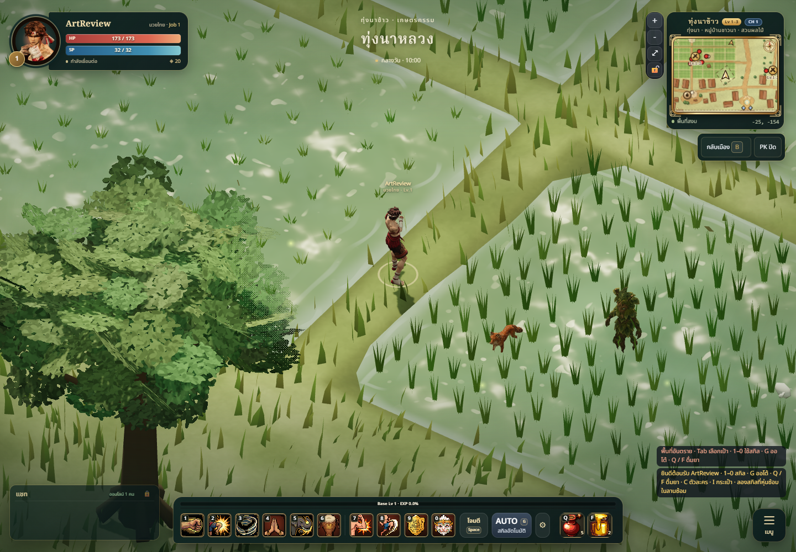
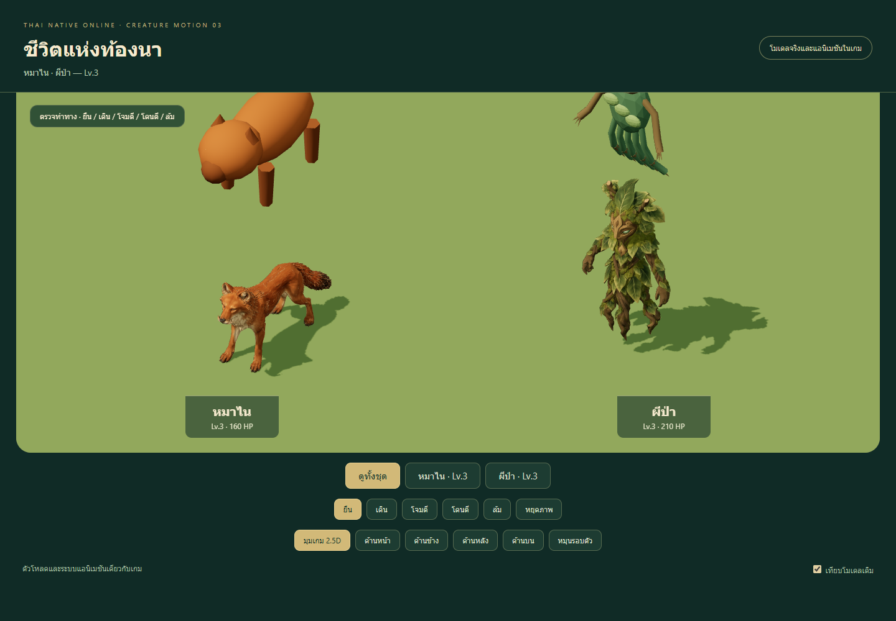
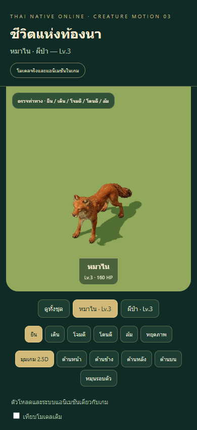

# Rice-field creatures — Lv.3 animated integration

## Result

Dhole (หมาไน) and forest spirit (ผีป่า) now use original textured Meshy models
with five authored clips: idle, walk, attack, hurt and die. The dhole gains its
first registered external model; the spirit replaces its existing prototype GLB.
Seven creatures through Lv.3 are integrated in **3D monster mode**. The remaining
58 identities in the level-100 production queue are still planned.

The dhole keeps the procedural fallback's 1.065m unscaled height and the existing
0.65 monster size. The spirit retains 1.8m height, 0.12m lift and 0.85 size.
Stats, spawns, collision, loot and server rules are unchanged. Pixel mode keeps
its existing artwork.

## Director brief and art/technical review

Follow `GAME_VISION`, the world monster roster, `PADDY_SET`, art bible, material
guide and performance budget. The pair uses the game's soft stylized Thai
fantasy direction: a warm rusty canine silhouette and a wooden-mask spirit with
sage leaves, bark arms and hanging roots. Meshy receives newly generated
`stylized-concept` references; exact prompts and selected inputs are retained in
`tools/monster-models/meshy/prompts-set-03.json` and `references/`.

Two successful Meshy tasks used **35 credits each, 70 total**; the checked balance
after collection was 800. There was no paid regeneration or human autorig.
Provenance records task IDs, parameters, source/reference hashes and original
local paths without credentials or signed URLs. Source originals and editable
Blender snapshots remain locally under ignored `artifacts/` directories.

| Creature | Triangles | Material draws | Bones | Runtime bytes |
| --- | ---: | ---: | ---: | ---: |
| Dhole | 12,515 | 1 | 20 | 1,514,444 |
| Forest spirit | 12,273 | 1 | 12 | 1,443,812 |

Base colour is 1024px JPEG; normals are 512px lossless PNG. Embedded textures,
organic nonmetal materials and Meshopt compression use the existing game loader.
Implementing-agent self-review: style 8/10, readability 8/10, technical usability
8/10. This is a documented self-review, not an independent specialist sign-off.
Fur/leaf surface detail softens at gameplay distance; colour and silhouette carry
identification.

## Anatomy and deformation

The dhole is inspected from front, side, back, top and the orthographic gameplay
angle. It has four separate paws, two forelimbs, two digitigrade hind limbs, one
continuous neck/head and one bushy tail. The hind rig retains a distinct pastern
below each hock. Four two-segment IK chains preserve the source's asymmetric
stance; connected lower-limb bones prevent contact constraints from separating
joints. Rest matrices supply pole angles and complete distal rotations, including
the conversion between Blender and Three Euler conventions.

Idle uses restrained breathing and tail/head motion with planted contacts.
Walking alternates diagonal pairs. Attack is a short body/head thrust; hurt
recoils and death lowers into a crouch while all paw contacts retain their height.
The spine's local vertical direction is accounted for explicitly during death.

The spirit has a wooden face/crown, two bark arms and relaxed open hands; its
lower silhouette is hanging roots rather than human legs. Each arm has upper,
lower and hand bones. Fingers retain their generated open shape without
individual bending. Three root clusters have restrained axial sway, and a
positive vertical root displacement creates hovering. Attack sweeps the arms
forward with a small body bow; death droops the upper body. Head movement is
small, preserving the mask's appearance.

Automated checks sample every skinned vertex at every frame of all five final
compressed clips. Limits: neutral displacement under 4mm, idle foot drift under
1.5mm, ground penetration under 15mm and limb segment-length change under 5mm.
The dhole additionally requires death foot heights to stay within 3mm of idle.

| Measurement | Dhole | Forest spirit |
| --- | ---: | ---: |
| Maximum neutral displacement | 0.332mm | 0.256mm |
| Maximum idle foot-joint drift | 0.970mm | N/A, no feet |
| Lowest animated vertex | -0.406mm | approximately 0mm |
| Maximum limb segment-length change | 0.015mm | 0.010mm |
| Maximum death foot-height change | 0.217mm | N/A |

Blender limb-length checks pass the 0.5% tolerance; uncompressed canine idle
contact drift is below 0.001mm. These measurements catch bind, stretching and
ground errors, but do not certify every generated surface or individual digit.

## Finished motion and placement

Actual canvas recordings show walking followed by repeated attacks, using the
game's final model loader/controller and embedded textures:

- [Dhole motion](dhole-motion.webm)
- [Forest spirit motion](phibpa-motion.webm)

The game image uses an isolated guest, the existing map/camera/UI and two
controlled local spawns for review. It does not change online spawn density.
The development viewer is `/tools/monster-models/meshy/motion.html?set=3`, with
five actions, five views, pause, rotation and prototype comparison. Its framing
includes the spirit's full crown and roots on desktop and narrow viewports.

The dhole baseline is exported from the actual `CombatView` procedural dog
fallback, without its invisible hit mesh or outer monster size. It is not an
earlier external model. The spirit baseline is the exact previous runtime GLB.

## Validation and changed files

- `npm test`: **367/367 pass**, including all ten registered monster assets.
- `npm run build`: passes, 227 modules; existing bundle-size warning remains.
- Browser: both final textures decode, all views/actions render without page
  errors; 390x844 touch emulation has no horizontal overflow.
- Independent dhole instances share geometry/textures but have distinct skins,
  materials and IDs. Video files decode and walk/attack frames are inspected.
- Machine-readable measurements and browser/video results: `validation.json`.

| Path | Purpose |
| --- | --- |
| `public/models/monsters/{dhole,phibpa}.glb` | Two animated runtime models |
| `src/combat/MonsterModels.js` | Register the dhole at its original presentation height |
| `tools/monster-models/meshy/{dhole,phibpa}*`, `references/*`, `prompts-set-03.json` | Candidates, provenance, exact prompts and runtime hashes |
| `tools/monster-models/meshy/{rig_level3.py,poles_level3.mjs,pole-angles-level3.json,rigs/*}` | Rebuildable species rigs and calibration |
| `tools/monster-models/meshy/{generate.py,prepare.mjs,unpack.mjs,publish.mjs}` | Extend the existing pipeline to the two species |
| `tools/monster-models/meshy/{review.js,motion.js,baseline/*,queue.*,README.md}` | Batch viewer, comparisons, production queue and rebuild instructions |
| `tests/meshy-{monsters,monster-motion}.test.js` | Candidate integrity, anatomy, contact and segment checks |
| `docs/art/monsters/meshy-motion-03/*` | Images, motion recordings, measurements and this report |

## Known limitations

Walking is authored in place without world-speed matching or slope-aware foot
IK. Jaw, fingers and toes have no separate articulation. Spirit root strands
move in clusters; leaves have no individual cloth simulation. Death is a brief
crouch/droop rather than a full ragdoll. Physical-phone crowd profiling and
extended multiplayer combat acceptance remain separate checks. Live deployment
verification is recorded locally after the PR merge; the screenshots here are
from the controlled local review.
