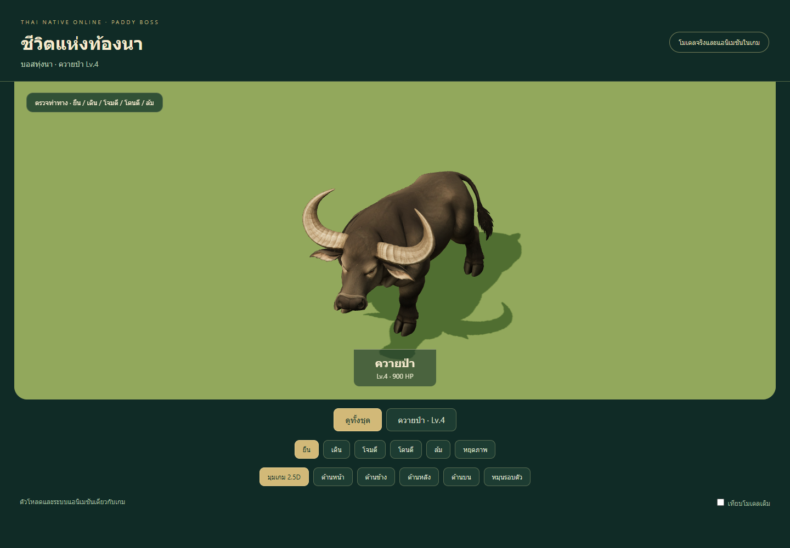
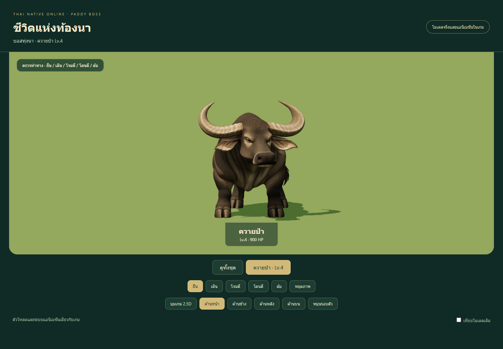
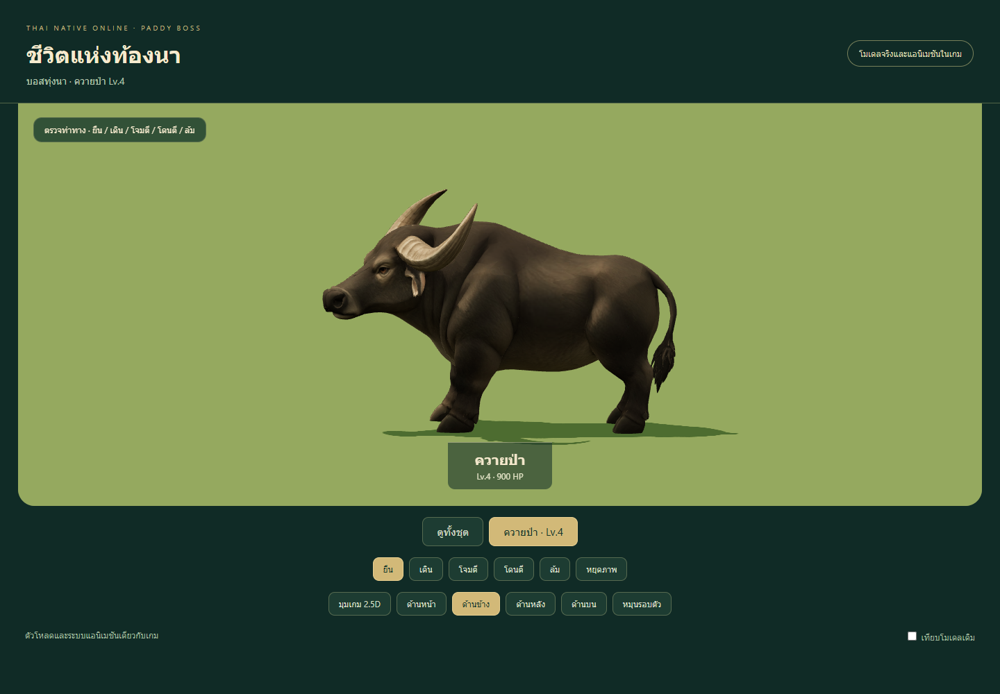
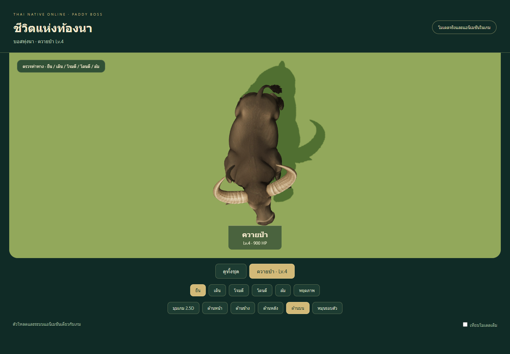
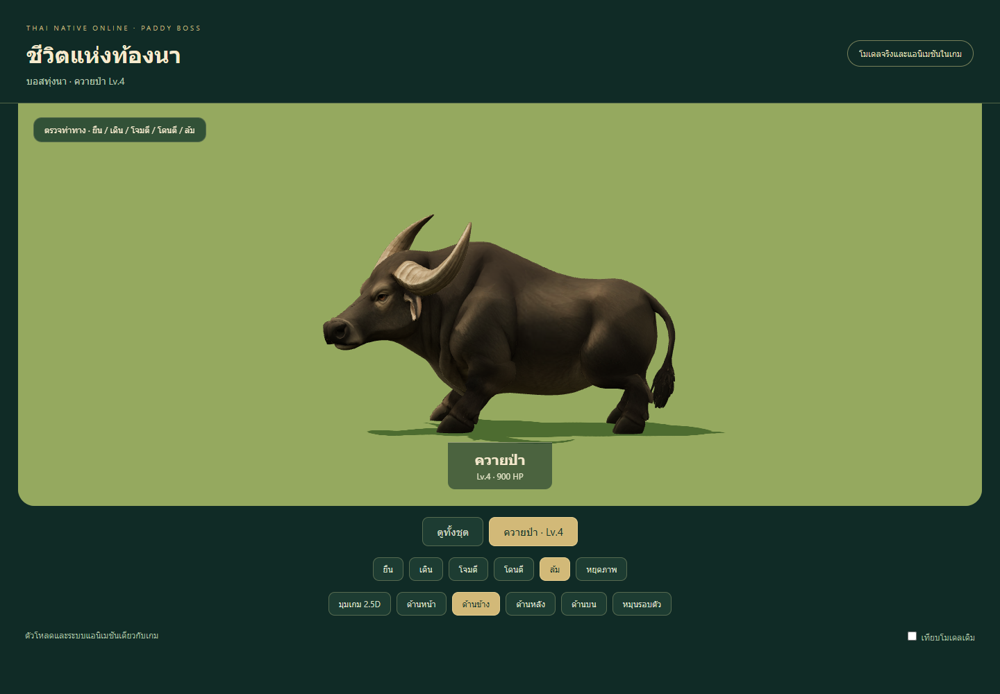
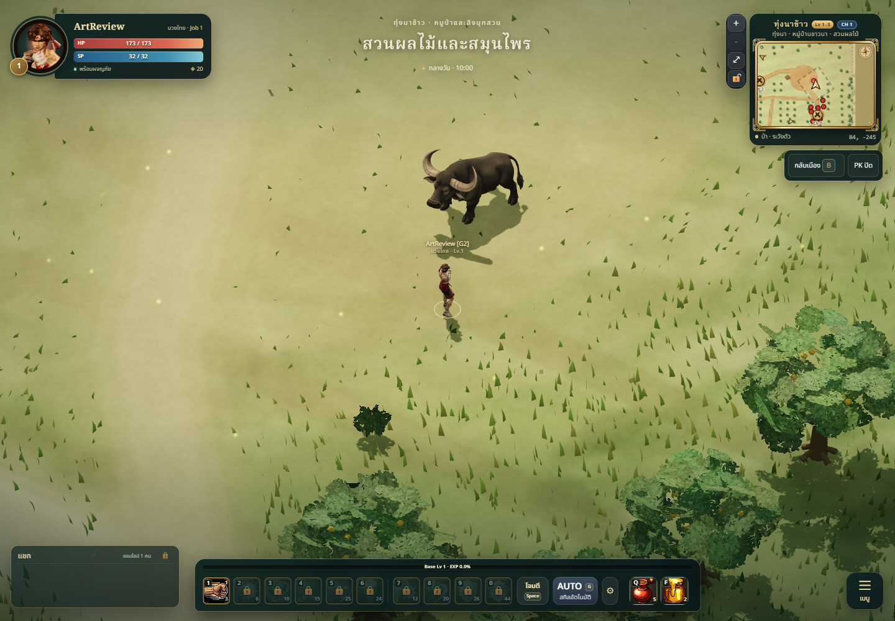
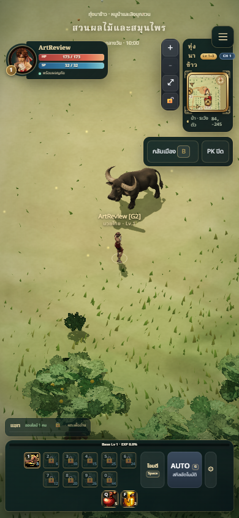

# Paddy map — animated buffalo boss

## Result

Paddy now has animated Meshy models for all seven existing creature identities:
boar, fowl, cobra, crab, macaque, forest spirit and its Lv.4 buffalo boss. This
pass replaces the buffalo prototype with one original textured creature and
five independent clips: idle, walk, attack, hurt and die. There are eight Meshy
identities integrated across the game; the remaining 57 are still planned.



The existing 1.6m presentation height and 1.3 monster size are retained. Spawn
locations/counts, stats, loot, collision and the horn/stomp boss skills are
unchanged. The model is used in **3D monster mode**; pixel mode retains its art.

## Director brief and art/technical review

Finish the current map before advancing to the next. Follow `GAME_VISION`, the
actual Paddy roster, `ART_BIBLE`, material guide and performance budget. The
buffalo uses a broad dark body, pale swept crescent horns, a substantial bovine
muzzle, four separated cloven hooves and one tufted tail. Its broad silhouette
contrasts with the small boar and fowl without adding armor or noisy ornaments.

The built-in imagegen tool produced the reference, with a correction from long
fur/pig-like muzzle to short water-buffalo skin and a broader bovine face. Exact
prompts are retained in `tools/monster-models/meshy/prompts-paddy-boss.json` and
the final image in `references/buffalo.png`.

One successful Meshy Image-to-3D task used **35 credits**; the checked remaining
balance was **765**. Parameters follow the existing Meshy 7.1 pipeline and its
[official Image-to-3D contract](https://docs.meshy.ai/en/api/image-to-3d).
No paid regeneration or humanoid autorig was used. Provenance retains task,
reference/source hashes and parameters without credentials or signed URLs.

| Triangles | Material draws | Bones | Runtime bytes | Colour / normal textures |
| ---: | ---: | ---: | ---: | --- |
| 12,487 | 1 | 20 | 1,027,060 | 1024px JPEG / 512px PNG |

Implementing-agent self-review: style **8/10**, readability **8/10**, technical
usability **8/10**. This is a self-review rather than an independent sign-off.
The broad dark body and light horns read clearly from the gameplay camera.

## Anatomy and motion

Front, side, rear, top and gameplay views confirm one continuous head/neck/body,
two horns, two ears, four separate legs/hooves and a single tail. The source's
reconstructed body axis is rotated into game forward before rigging. Its slight
natural asymmetric stance is retained.

The editable Blender rig has explicit normalized weights, four two-segment IK
chains and separate hind pasterns below the hocks. Rest matrices supply exact
pole angles and distal orientations. Connected leg segments prevent joint
separation. Both horns stay with the head; toes keep their generated split shape.

Idle has small breathing, head and tail motion with planted contacts. Walk uses
a restrained four-beat cycle. Attack lowers and thrusts the heavy head; hurt
recoils; death settles into a grounded crouch. The existing horn/stomp skills
share this attack clip and keep their current gameplay telegraphs.






Automated checks sample every skinned vertex at every frame of all five final
compressed clips. Limits: neutral displacement below 4mm, idle foot drift below
1.5mm, ground penetration below 15mm, limb-length change below 5mm and death foot
height change below 3mm.

| Measurement | Final compressed asset |
| --- | ---: |
| Maximum neutral displacement | 0.340mm |
| Maximum idle foot-joint drift | 1.283mm |
| Lowest animated vertex | -0.260mm |
| Maximum limb segment-length change | 0.025mm |
| Maximum death foot-height change | 0.258mm |

Blender's uncompressed limb-length/contact checks pass. Fresh camera/front/side/
top previews and first/middle/last walk frames are retained locally with their
snapshot, revision and image hashes. The packed `.blend` was copied into an
independent directory and reopened successfully, with its rig present and no
missing assets. Export receipts and independently checked hashes are in
`validation.json`.

## Gameplay and visual QA

- `npm test`: **373/373 pass**.
- `npm run build`: passes, 229 modules; existing bundle-size warning remains.
- Actual local authoritative-server scene: one buffalo boss, final 20-bone
  model and decoded 1024px texture; no browser errors.
- Lowest skin-to-terrain sample in that scene: approximately **-1.6mm**.
- Independent instances share geometry/textures while keeping separate skins,
  materials and monster IDs. Mobile review at 390×844 has no horizontal overflow.
- [Actual walking and attack recording](buffalo-motion.webm) decodes correctly;
  sampled walk/attack frames are inspected.
- [Prototype comparison](comparison.png) preserves the exact previous GLB.




Interactive development review: `/tools/monster-models/meshy/motion.html?set=4`.
The map plan now reports all seven animated models. `map-queue.json` derives
membership from runtime spawns and records Paddy's completed monster set beside
its existing environment pass. Deep forest is next: retain macaque, dhole and
forest spirit; complete kongkoi, monitor, pray, khamot, winyan and takian boss.

## Changed files

| Path | Purpose |
| --- | --- |
| `public/models/monsters/buffalo.glb` | Animated runtime replacement |
| `tools/monster-models/meshy/buffalo*`, `references/buffalo.png`, `prompts-paddy-boss.json` | Static candidate, provenance, prompt history and runtime hash |
| `tools/monster-models/meshy/{rig_buffalo.py,poles_buffalo.mjs,pole-angles-buffalo.json,rigs/buffalo.json}` | Editable species rig and reproducible calibration |
| `tools/monster-models/meshy/{generate.py,prepare.mjs,unpack.mjs,publish.mjs}` | Extend the generation/packing pipeline to buffalo |
| `tools/monster-models/meshy/{queue.*,map-queue.*,motion.js,review.js,README.md,baseline/buffalo.glb}` | Map completion manifest, five-view motion review, preserved prototype and rebuild instructions |
| `tools/paddy-map-review.html` | Completed seven-model roster status |
| `tests/meshy-{monsters,monster-motion}.test.js` | Asset integrity, anatomy, ground/idle/death contacts and hock/segment checks |
| `docs/art/monsters/meshy-paddy-boss/*` | Screenshots, motion, measurements and this report |

## Known limitations

Walking is authored in place, without matching travel speed or slope-aware foot
IK. Horn/stomp skills have no separate bespoke clips. Jaw, ears and individual
toes have no separate animation. Death is a short crouch rather than a ragdoll.
Rear surface details are AI-inferred from one concept view. Physical-phone crowd
profiling and prolonged multiplayer combat remain separate acceptance checks.
Screenshots here are controlled local-server review; deployment verification is
recorded separately after merge.

## Rebuild

Use the approved managed Harness output/asset roots and process environment;
credentials and the private session descriptor remain outside source control.

```powershell
$env:MESHY_RIG_OUTPUT='artifacts/meshy-rig-02/paddy-buffalo'
node tools/monster-models/meshy/prepare.mjs buffalo
node tools/monster-models/meshy/unpack.mjs buffalo
python tools/monster-models/meshy/rig_buffalo.py rest
node tools/monster-models/meshy/poles_buffalo.mjs
python tools/monster-models/meshy/rig_buffalo.py v1
node tools/monster-models/prepare.mjs artifacts/meshy-rig-02/paddy-buffalo/buffalo-rig-v1.glb artifacts/meshy-rig-02/paddy-buffalo/buffalo-animated.glb
node tools/monster-models/meshy/publish.mjs buffalo v1
node tools/monster-models/meshy/queue.mjs
node tools/monster-models/meshy/map-queue.mjs
```

Use fresh version/output filenames when exports already exist; the recipe does
not overwrite committed Blender snapshots. Original Meshy downloads and editable
source snapshots remain locally in ignored `artifacts/` directories.
