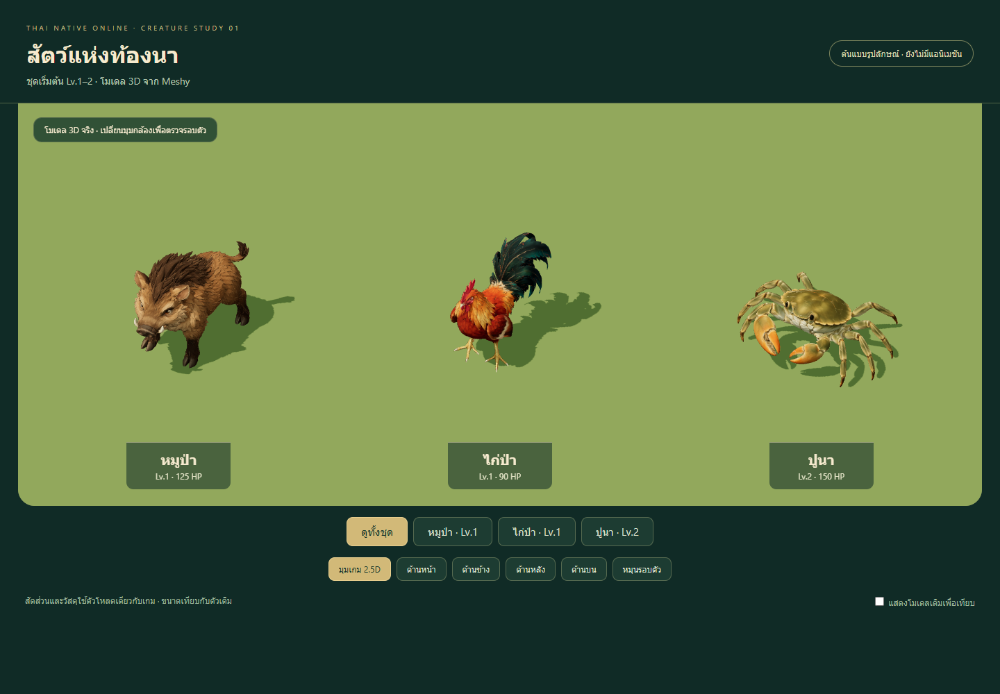
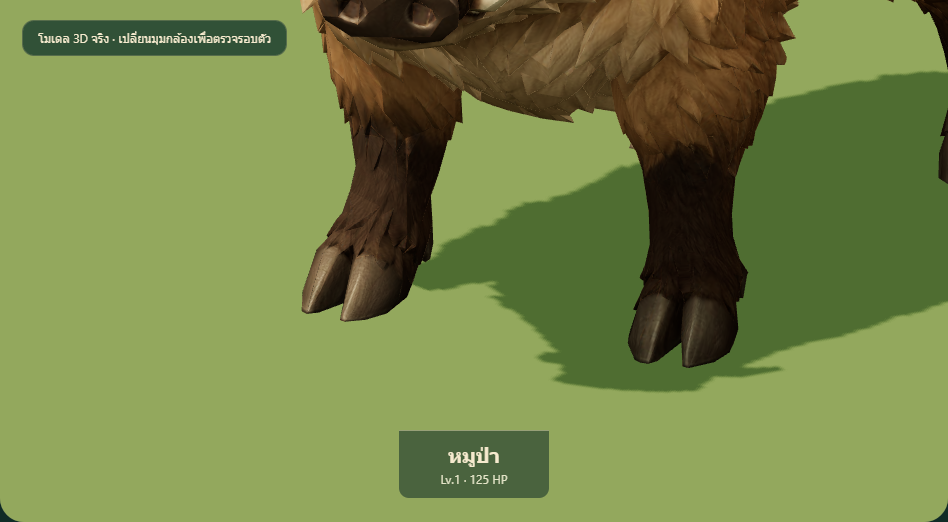
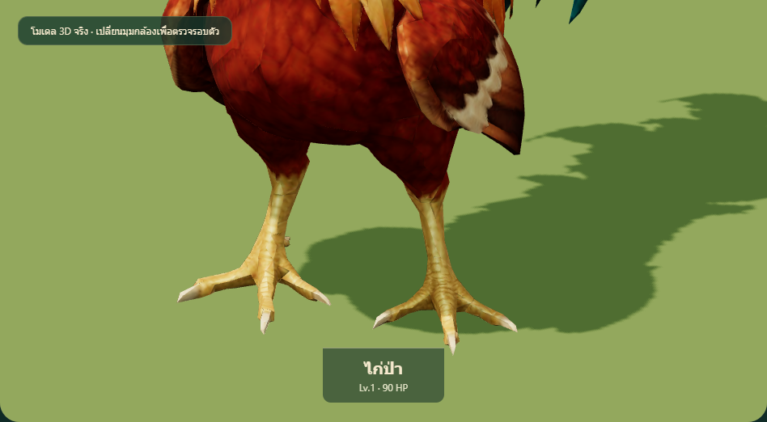
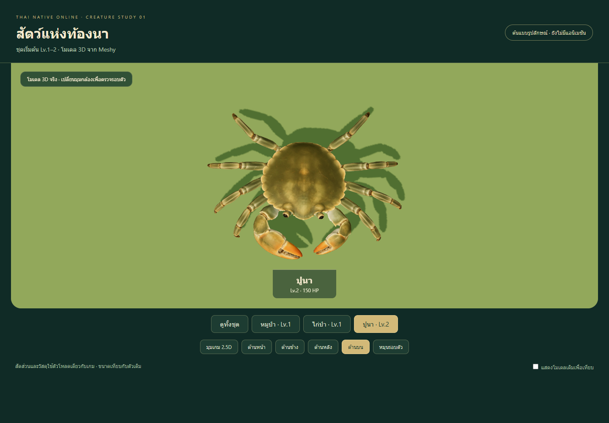
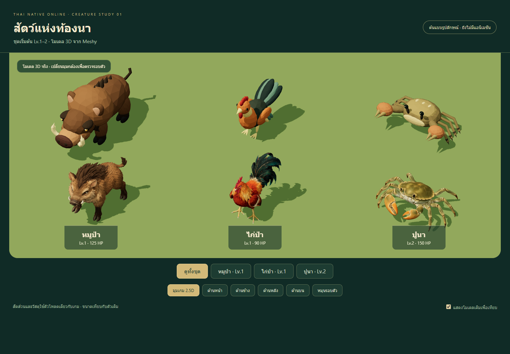
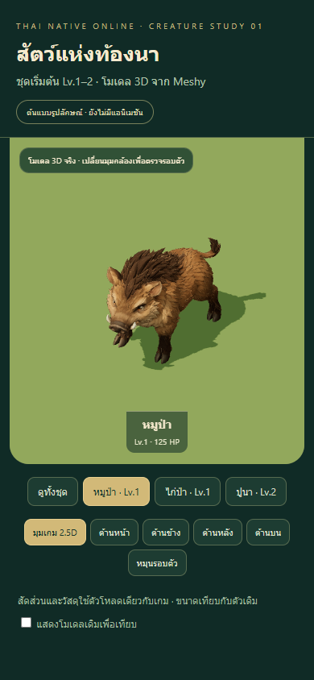

# Meshy monster study 01 — levels 1–2

Historical generation review: the static-candidate statements below describe
the original milestone. These three creatures now have animal rigs and replace
the runtime assets on this branch. See the [motion and integration review](../meshy-motion-01/REVIEW.md)
for current animation QA, in-game captures, clips and remaining limits.

## Summary

Replace the visual direction of faceted prototype creatures with richer,
soft-textured Thai-fantasy animals, starting at the lowest levels. This first
batch delivers three actual GLBs and an interactive review stage. It does not
alter stats, spawn locations, drops, the server or the active model mapping.
The candidates are static geometry, awaiting animal rigs and motion acceptance.

## Director brief and specialist implementation

Read `GAME_VISION.md`, `MONSTERS.md`, `LEVEL_PROGRESSION.md`, `WORLD_MAP.md`,
`ART_BIBLE.md`, `MATERIAL_GUIDE.md`, `CAMERA_GUIDE.md` and `PERFORMANCE_BUDGET.md`.
Retain existing combat roles and scale. The boar is the starter melee beast;
the vivid red/gold/jade junglefowl communicates a quick aggressive enemy; the
wide olive shell and orange pincers communicate the crab's high defence.
Large silhouette differences matter before small surface details.

Separate imagegen built-in concepts feed Meshy 7.1 Image-to-3D. Standard 2k
geometry pass, remeshed target 12,000 triangles, 2k PBR source textures, no image
enhancement. The first crab concept incorrectly showed three walking legs per
side; a targeted image edit corrected it **before** any crab 3D credits were
spent. There was one paid 3D task per creature.

| Creature | Level | Actual triangles | Material draws | Prepared bytes | Credits |
| --- | ---: | ---: | ---: | ---: | ---: |
| หมูป่า / boar | 1 | 12,505 | 1 | 1,396,036 | 35 |
| ไก่ป่า / fowl | 1 | 12,231 | 1 | 1,433,480 | 35 |
| ปูนา / crab | 2 | 12,551 | 1 | 1,142,960 | 35 |

Total **105 Meshy credits**; balance after collection **940**. No auto-rigging,
retexturing or repeat-generation tasks were charged. Full task IDs, original
hashes, selected reference hashes and final hashes are recorded alongside assets.

## Art and anatomy self-review

This is the implementing agent's visual inspection, not an independent artist's
approval. Front, side, back, top and the actual gameplay camera direction were
captured from all three prepared files. Basic static anatomy was reviewed:

- Boar: four limbs with cloven hooves, paired ears and tusks, one tail, coherent
  shoulder/hip silhouette. Minimum hoof-region heights for all four quadrants
  are within 0.001m of the ground in the normalized preview. That checks static
  contact only, not a planted-foot walk.
- Junglefowl: two legs, two folded wings, one attached tail group; each foot has
  three front toes. The rear hallux and ankle spurs need close rigging review
  when separating toe weights. Feather gaps and fine tail tips remain generated
  geometry and should not receive wide deformation without cleanup.
- Crab: eight distinct walking legs (four per side), two separate claw arms,
  two eye stalks, open pinch gaps, consistent broad shell. The top view makes
  limb count explicit. Claw articulation and left/right leg phase are pending.

The silhouettes and broad palettes are readable at the 2.5D camera. Micro fur
and feather texture is denser than the original prototypes; the preparation
step reduces normal strength and removes metallic response. Geometry appearance
is suitable for continued rigging, **not final runtime art approval**. Technical
usability cannot pass the Art Bible's 8/10 production gate until motion is ready.

## Changed files

- `tools/monster-models/meshy/{boar,fowl,crab}.glb`: prepared static candidates.
- `tools/monster-models/meshy/references/*.png`, `prompts.json`: selected concepts
  and generation/edit instructions.
- `tools/monster-models/meshy/*-provenance.json`, `*-prepared.json`, `parameters.json`:
  source identity, cost, settings, budgets and final hashes.
- `tools/monster-models/meshy/generate.py`, `prepare.mjs`, `README.md`: guarded
  generation/recovery and repeatable preparation.
- `tools/monster-models/meshy/queue.mjs`, `queue.json`: level-ordered backlog for
  all 65 current monsters through Lv.100. Next: cobra/monkey Lv.2, dhole/phibpa Lv.3.
- `tools/monster-models/meshy/review.{html,js,css}`: desktop/mobile model viewer,
  camera presets, turntable and comparison with the actual existing assets.
- `tools/monster-models/package.json`, `package-lock.json`: isolated tool-only
  dependencies for sharp and gltfpack. Application dependencies are unaffected.
- `tests/meshy-monsters.test.js`: packed GLB, texture embedding, geometry,
  bounds, static state, budget and provenance/hash checks for each candidate.
- This review and the named per-model screenshots in this directory.

## QA

- `npm test`: **355/355 pass**, including all three new compressed-asset checks.
- `npm run build`: **pass**. The existing approximately 1.748MB main JavaScript
  bundle warning remains. Candidates and their review page are outside the
  production entry point.
- `git diff --check`: pass.
- Real browser QA: all three prepared GLBs and embedded textures load, every
  camera preset and turntable works, no page exceptions, no horizontal overflow
  at 390×844.

Browser review loads all actual textures and compressed meshes, inspects all
vertices for finite values, changes all five camera presets, compares against
existing assets and rotates the turntable. The 390×844 touch viewport has no
horizontal overflow. Browser diagnostic JSON and contact-region measurements
remain in ignored `artifacts/meshy-monsters/`.

## Known limitations

- Static generated meshes: no rig, skin, idle/walk/attack/hurt/die or runtime
  replacement yet. No humanoid rig was applied to animal anatomy.
- Basic visible anatomy is checked; this is not proof of watertight topology,
  production deformation, planted-foot IK or correct contact in every pose.
- Close tail-feather tips, toes, fur sheets and claw interiors may need cleanup
  before skinning. Fine painted shading comes from AI generation.
- Existing monster height targets are used for comparison; wide-body crowd
  overlap and actual combat target readability require runtime review later.
- Source originals (10–13MB each) are retained locally in ignored artifacts,
  rather than Git. Committed prepared GLBs are self-contained and usable without
  access to signed Meshy URLs. Exact rebuild requires the retained originals.
- No physical-phone, crowd FPS, animation, online combat or deployment test was
  claimed for these inactive candidates. Planned queue entries are not generated.
- PR should stay draft until the separate rig/motion/runtime integration is ready.
