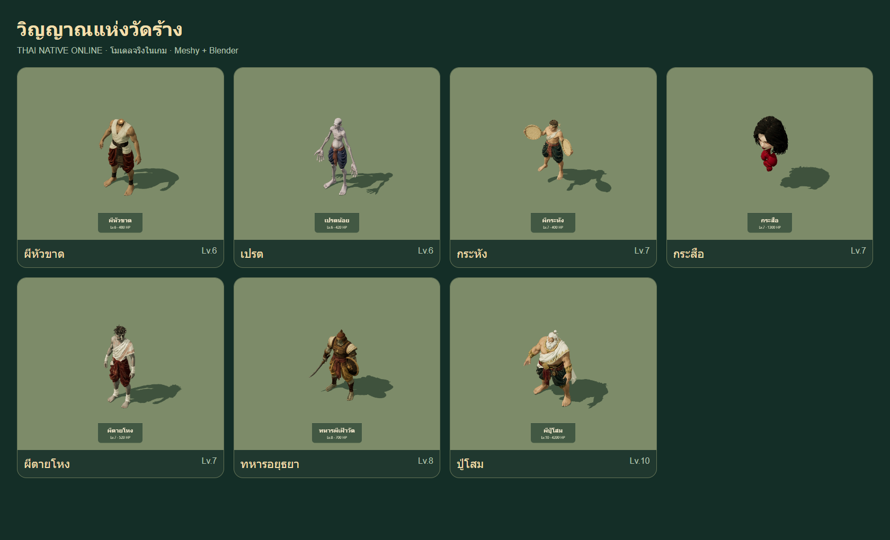
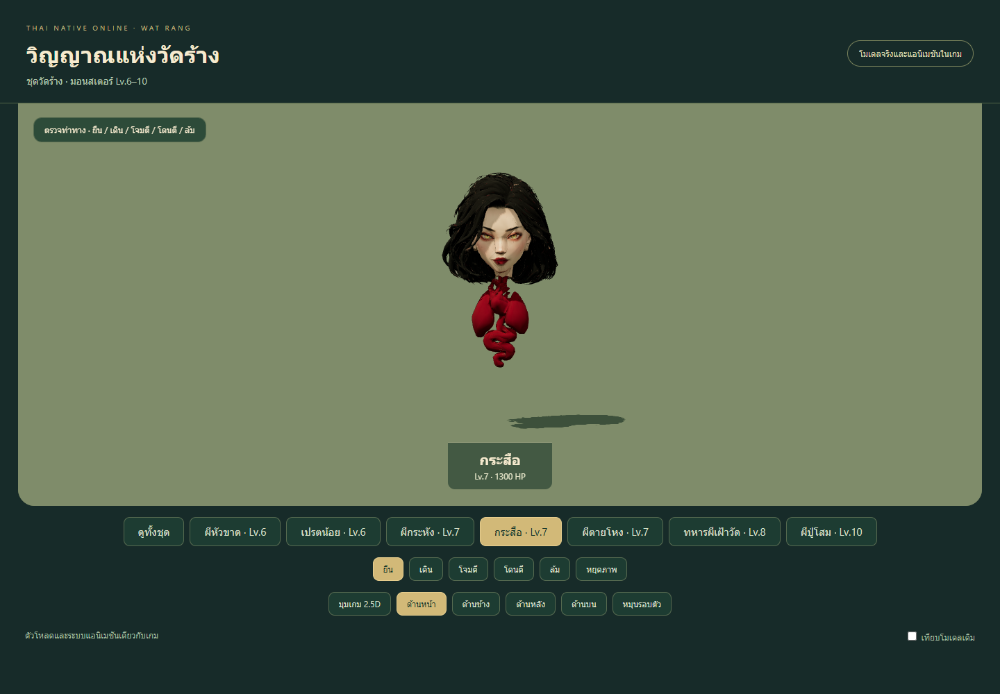
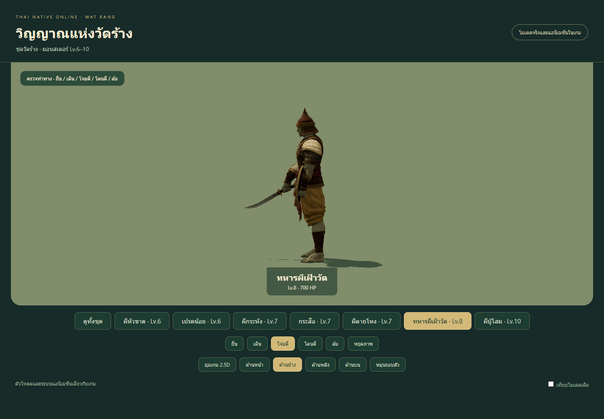
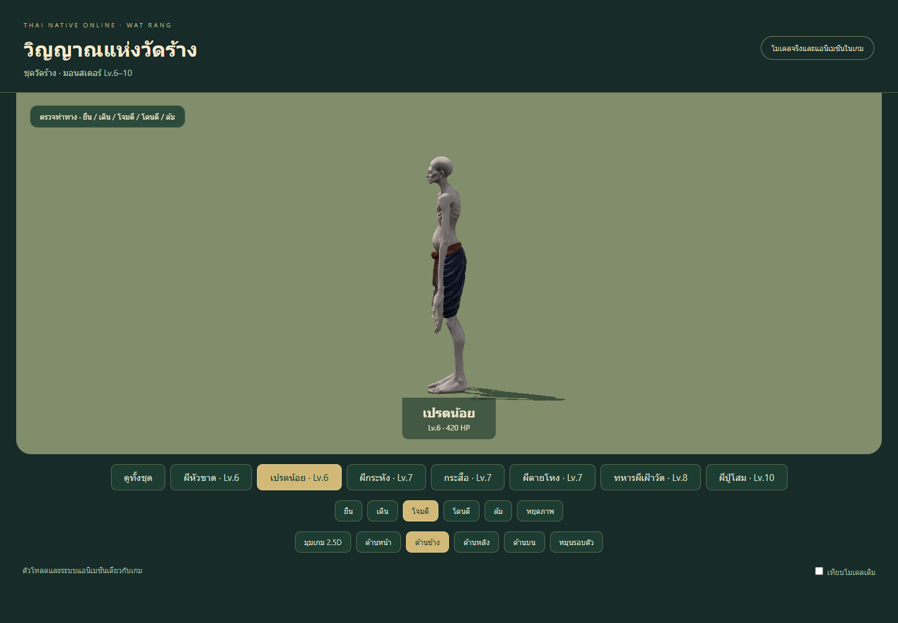
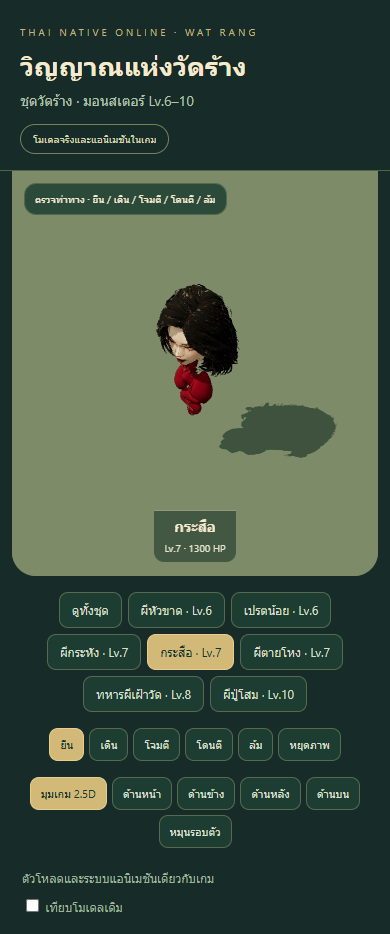
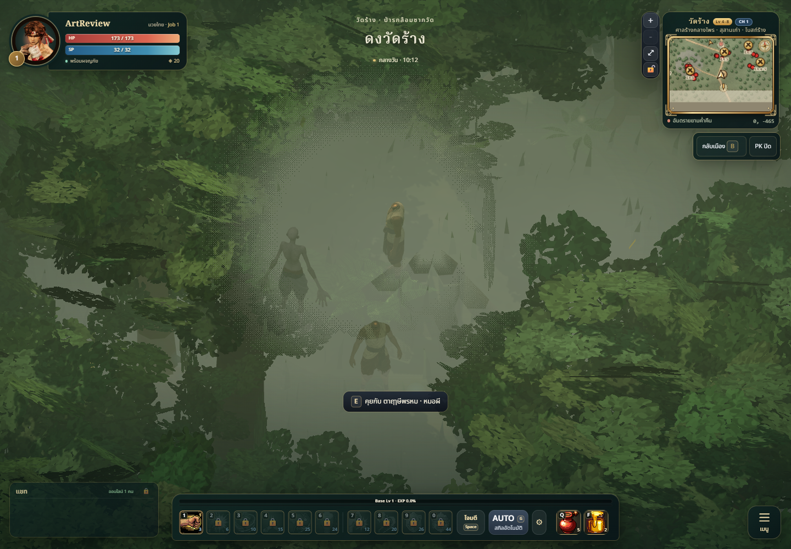

# Wat Rang — seven animated Thai monster models

## Result

Wat Rang now has models for all nine existing identities. This pass adds Headless,
Pret, Krahang, Krasue, Phitaihong, Soldier and the Pusom boss; Pray/Winyan reuse
the reviewed forest models. This completes the monster roster. Environment art
remains queued. The travel band is 4–8; the existing boss is level 10.

The corrected Krasue uses a volumetric woman's head and stylized hanging heart,
paired lungs and curled intestine. The silk-ribbon/crystal interpretation and
flat frontal reconstruction are rejected. The selected skull's depth is over
50% of source height. No torso, arms, legs or finger retargeting are introduced.

All seven use the existing 3D loader and five lowercase clips: idle, walk,
attack, hurt and die. Runtime heights/lifts fit the roster, including hovering
Krahang/Krasue. Combat stats, spawn/rarity/phase rules, collision, loot, quests
and boss skills are unchanged. The previous procedural models remain available
as review baselines.

## Production and budgets

Authority: GAME_VISION, runtime map membership, ART_BIBLE and technical budgets.
The Director brief is [BRIEF.md](BRIEF.md). Original concepts use Thai costume,
mythology, bamboo trays, dha, a round guard and restrained lotus/flame details.
Meshy task/source/reference hashes and exact parameters are committed beside
the static candidates. Nine successful tasks cost 315 credits: seven selected
models 245, two rejected Krasue variants 70. Checked postgeneration balance 205.

| Model | Level | Triangles | Bones | Runtime bytes |
| --- | ---: | ---: | ---: | ---: |
| Headless | 6 | 12,386 | 15 | 1,230,360 |
| Pret | 6 | 12,440 | 16 | 1,241,504 |
| Krahang | 7 | 12,335 | 19 | 1,507,028 |
| Krasue | 7 | 10,898 | 8 | 1,293,400 |
| Phitaihong | 7 | 12,123 | 16 | 1,512,400 |
| Soldier | 8 | 12,427 | 18 | 1,335,264 |
| Pusom | 10 | 12,408 | 16 | 1,469,808 |

Each model has one material draw, embedded 1024 px colour and 512 px normal textures,
four or fewer normalized influences, fewer than 15,000 triangles and under 1.8 MB.
Nonmetal materials and broad roughness follow the game's stylized palette.

## Anatomy and editable source

Species rigs use anatomical chains, geodesic surface diffusion and conserved
weight transfers. Planted feet have calibrated IK; source palms retain their
generated shape. Six topology-pinned sparse patches repair isolated strained
surfaces. Soldier's precompression repair margin is stricter than the delivered
gate; the official 2× / 10 mm surface test is unchanged and passes every clip at
authored keys plus 24 Hz, checking all indexed edges of at least 5 mm.

Registered L3 refinement rounds Krasue's hanging forms and rotates the complete
Soldier guard forward while retaining a round rim. All seven are delivered from
one verified snapshot through L3 background GLB/BLEND jobs. The 13.12 MB packed
editable scene was copied, hash-checked and reopened in a separate review-only
session: all seven rigs, surfaces and actions are present. Fifty-six fresh
Blender views cover idle/attack from four directions: 48 unchanged-model views
plus eight refreshed Pret views. The reviewer verified the initial 56 hashes;
the final manifest records all replacements. Fine inspection uses brighter
runtime captures. Pret's reduced attack arc closes the frontal elbow finding;
the smaller sweep remains readable without further weight/topology changes.
Dependency inspection is unavailable under review-only bridge policy; it was
not bypassed. Runtime decoding confirms the embedded colour textures.

Grip validation uses actual skin surfaces. Initial weight-label-only sampling
missed the Soldier palm/hilt and falsely treated the lower blade as the whole
sword. Independent source geometry/colour patches, unambiguous UV mapping and
disjoint seam copies now identify 48 Shield palm positions and 28 Sword palm plus
4 bronze hilt/guard positions. All blade rigidity samples remain checked.
The 1 cm rigid drift and 8 cm sampled proximity limits remain unchanged. Separate
Sword patch distance is an upper-bound sample measurement, not a claim of an
actual 6.7 cm air gap; detailed contact also receives visual review. Local-relative
Float64 equivalence retains a 1 µm bound. The prior world/GPU-palette discrepancy
is separately recorded against a derived Float32 roundoff bound; no geometry,
pose or acceptance tolerance is changed by that numerical correction.

## QA and known limits

- npm test: 421/421 pass; static recheck 21/21 pass after final derivation.
- npm run build: passes, 229 modules; the existing bundle-size warning remains.
- Browser: seven exact-hash models, five clips each, decoded textures, independent
  materials/skeletons/IDs, death-colour isolation, 175 fresh framing checks and
 390×844 review without overflow. Framing uses visible model bounds rather than
 hidden baseline dimensions. The final v6 run repeats the complete model audits
 after Pret's animation change.
- Seven fresh recordings decode and seek across all five clips at 0.8, 2.4, 4, 5.6,
  and 7.2 seconds. [Krasue motion](krasue-motion.webm).
- Across exact-current-hash witnesses, actual CH1 loads all seven identities.
  The final v6 night observes six; rare Krasue is absent and remains untested
  in that run. Its unchanged file passed the earlier authoritative night run.
  Terrain is sampled at actual placements across every clip. Pusom's two final
  footprint fixtures and Krasue's two earlier unchanged fixtures pass; online
  windup/impact sequences remain untested.

The bounded actual-scene capture records Headless ID126 in native daytime.
Fog limits anatomy readability. Soldier's capture timed out and Pusom was not
captured within the cutoff; these screenshots remain incomplete, with no retry.
See [capture report](qa-game-capture.json). Asset review uses the unobstructed
runtime views above.

**The actual-game report retains a failure against the additional 20 mm terrain
guide:** Pret reaches 28.6 mm below uneven terrain at one placement. Official
source/flat-floor tests pass. No slope-aware foot IK is supplied; this is an
explicit P2 integration follow-up accepted by independent review, rather than
a changed tolerance or a hidden passing result. The full [game report](qa-game.json)
preserves these failed measurements. Earlier placement results differ with the
terrain; no arbitrary global lift was added.

No facial/individual-finger rig, cloth simulation, ragdoll, world-speed matching,
per-skill clips, physical-phone crowd/FPS profile or prolonged multiplayer combat
validation. Single-view rear details are inferred. Attack also serves casting.
Natural phase/rarity rules remain active. Headless review holds only Vite hot
reload notifications; the actual game WebSocket is unaffected. Captures move
the camera and pause only local rendering after observations; player teleport,
incoming-damage suppression and fabricated spawns are not used.

## Independent review

Verdict: accepted with the documented P2 limitations. Scores assess the asset
views and supplied checks; they do not establish terrain IK or live combat.

| Asset | Style | Readability | Technical |
| --- | ---: | ---: | ---: |
| headless | 8 | 8.5 | 8 |
| pret | 8.5 | 8 | 8 |
| krahang | 8.5 | 9 | 8 |
| krasue | 8 | 8 | 8 |
| phitaihong | 8 | 8 | 8 |
| soldier | 8 | 8.5 | 8 |
| pusom | 8.5 | 9 | 8 |

Independent review confirms Pret v6 closes the elbow blocker; the smaller attack remains readable. Current hashes, single primitives, embedded images, budgets, five clips, packed source and all 56 preview hashes were verified. Browser records 35 clip checks and 175 framing checks; tests/build logs were reviewed. Pret's 28.60 mm uneven-terrain penetration remains a nonblocking P2 within the explicit no-terrain-IK scope; both failed game reports are preserved. Latest night Krasue is untested; earlier exact-current-hash night evidence carries forward. Four live boss casts and physical-phone performance remain untested. The reviewer changed no files or Blender content.

## Changed files and reproduction

Runtime: src/combat/MonsterModels.js and public/models/monsters/{headless,pret,
krahang,krasue,phitaihong,soldier,pusom}.glb. Authoring: tools/monster-models/meshy/
references, candidates, provenance, bind inputs, rig recipes/patches, review and
map manifests. Validation: the three Meshy regression files plus this evidence
directory. Full hashes and measurements: [validation.json](validation.json).
Rebuild instructions: tools/monster-models/meshy/README.md. Raw downloads and
verified editable export receipts remain locally under ignored artifacts.
