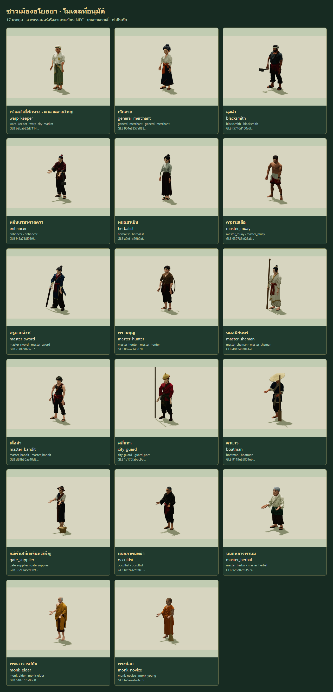

# City NPC model release

17 individually generated Meshy families replace the important procedural NPC
bodies at their existing **34 identities: 32 city NPCs and two paddy gate guards**.
The final Art reviews meet the Art Bible's style/readability/technical gate of
at least 8/10. Selective Thai woven borders decorate inspected garment regions;
monastic robes retain plain tonal treatment.

The provider ledger totals **805 authorized NPC credits**, across 26 previews,
19 refinements and 19 rigs. Selected and rejected lineages are retained in
[GENERATION_PROVENANCE.json](GENERATION_PROVENANCE.json). No additional paid job
was submitted for final posing, textile correction, QA or this release.

## Runtime and visual behavior

Existing identities, service metadata, stock, trainers, warp/storage routing,
navigation and day/night schedules remain owned by the original game systems.
Ambient citizens retain the instanced renderer. Important models use cached
geometry/textures with independent rigs/materials, native idle/walk/run clips,
camera-distance hysteresis and complete procedural fallback on load/pose errors.
Approved final bytes are fetched with their SHA-256 revision and verified before
parsing, so cached old models cannot silently replace an approved model.

Six families use deliberate tool presentation: covered swords/knives, a belt
hammer, a back bow, and parked/carried brooms/paddles. Spears park beside guards
and move on their backs. Suppliers display a grounded basket and stow it while
walking. Misfitting family headwear is explicitly suppressed. Monks bow their
heads with relaxed hands while chanting, with unsupported bowls hidden. The
rejected forced wai and closed-grip experiments are not enabled.

Continuous-robed sit activities use a reviewed standing visual fallback. Their
authored schedules and service behavior remain unchanged; the release does not
claim a seated pose or cloth simulation.

## Changed files

- `src/npc/NPCModels.js`, `NPCModelRenderer.js`, `NPCToolPresentation.js`,
  `NPCActivityPoses.js`: explicit identity/profile registry, loading and calibrated
  pose/accessory contracts. The optional wai helper remains disabled in shipped
  monk profiles.
- `src/npc/NPCManager.js`, `NPCRenderer.js`, `body/gearParts.js`, `body/blade.js`:
  integration, duplicate-body suppression, retained accessories and sheaths.
- `src/npc/model-profiles/*.json`: 17 reviewed, sanitized runtime contracts.
- `public/models/npcs/*.glb`: 17 shipping bodies; `tools/npc-models/source/*.glb`:
  editable uncompressed textured bodies.
- `tools/npc-models/*`, `tests/npc-*.test.js`: provider/preparation/textile,
  native/runtime/browser QA, approval, packing and release checks.
- `docs/art/npcs/*`: briefs, provenance, textile measurements, explicit acceptance
  and curated actual screenshots. Rejected/full research captures remain local
  and ignored; their immutable hashes are recorded in portable receipts.

The release branch also contains the previously reviewed hunter companion and
bite animation from commit `222ed7f` / PR #55. Companion damage and skill rules
are unchanged. NPC work adds no player-class model change.

## Validation

- **753/753 tests pass, zero skips**, including revalidation of all 17 actual
  native source/body reports. Repeated after production profile promotion.
- `npm run build` passes: 278 modules; JS 2,192.66 kB / gzip 669.92 kB.
- Shipping check: 17 families / 34 identities; **10,438,668 bytes total**,
  454,468–676,228 bytes each; one opaque 1024 texture/material, 24 joints,
  approximately 12.1–12.5k triangles, native idle/walk/run.
- Full native/actual-renderer skin audit: **14,561 samples**; final monk/occultist
  detail recheck: **2,958 samples**. Final per-family profile equality and metrics
  are in [RUNTIME_VALIDATION.json](reviews/release/RUNTIME_VALIDATION.json).
- Full 17-family registry capture: 538 PNGs; corrected monk/occultist captures:
  84 + 28 PNGs. Final acceptance selects the correct revision per family.
- Real city schedules/services/proximity/cache/LOD/disposal: **107 cases / 292
  PNGs**, all pass. Paddy guards: **9 cases / 18 PNGs**, all pass. Final changed
  monk/occultist city identities: **15 cases / 36 PNGs**, all pass.
- Production bundled-profile smoke test, with no private QA adapter: **17/17
  families**, actual source SHA checks and zero duplicate bodies.
- Every browser capture uses one Edge instance/page and closes it afterward.
  The approved gallery uses stored actual PNGs and zero WebGL contexts.

The first city QA attempt incorrectly demanded a near model for widely separated
pair members. The corrected check preserves the real 38m/45m hysteresis and
requires a valid distant fallback; mandatory close native checks and all LOD
steps remain enforced for every identity. Failed receipts remain in the archive.

## Screenshots and acceptance

[RELEASE_ACCEPTANCE.json](RELEASE_ACCEPTANCE.json) pins all 17 final assets, Art
scores and portable registered runtime witnesses. Selected city/paddy/day/night
screenshots are in [reviews/release](reviews/release).

## Known limits

- Meshy-24 has no individual finger joints. Naturally relaxed source digits are
  retained; no closed grasp, bow draw, rowing, hammer impact or sword-strike
  mechanics are certified by these NPC visuals.
- Editable delivery is a textured GLB, not an authored Blender control rig.
  No full cloth simulation, city mesh-pair collision or terrain foot IK is added.
- Optional small suspension ties and a magnified guard spear-collar seam remain
  nonblocking polish. Source facets and shaded hat brims remain stylistic limits.
- The large JS bundle warning remains; mobile hardware performance was not
  profiled. Browser QA checks NPC behavior/metadata, not authenticated live shop,
  storage, warp, trainer or account transactions.

## Deployment

Deploy through the task PR into canonical `main`. Record the successful Railway
deployment ID/commit and read-only live model/page/bundle hash verification in
the task completion report. Do not upload the original dirty working directory.
