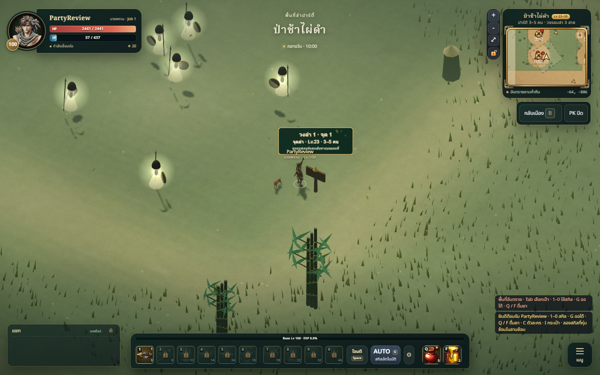
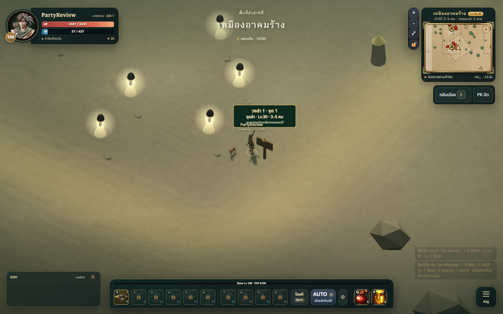
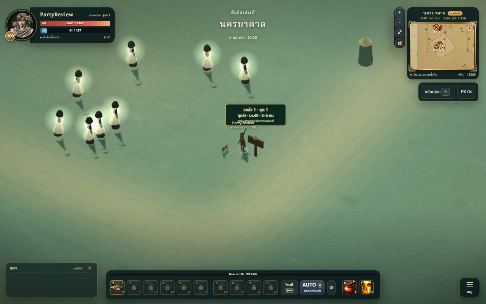
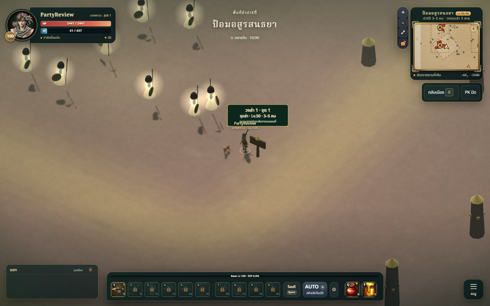
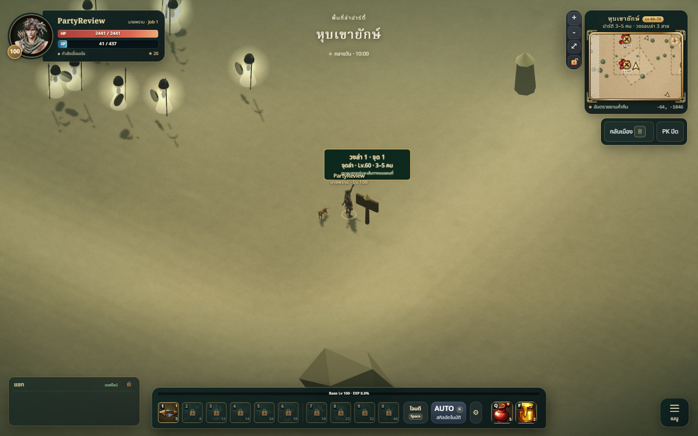
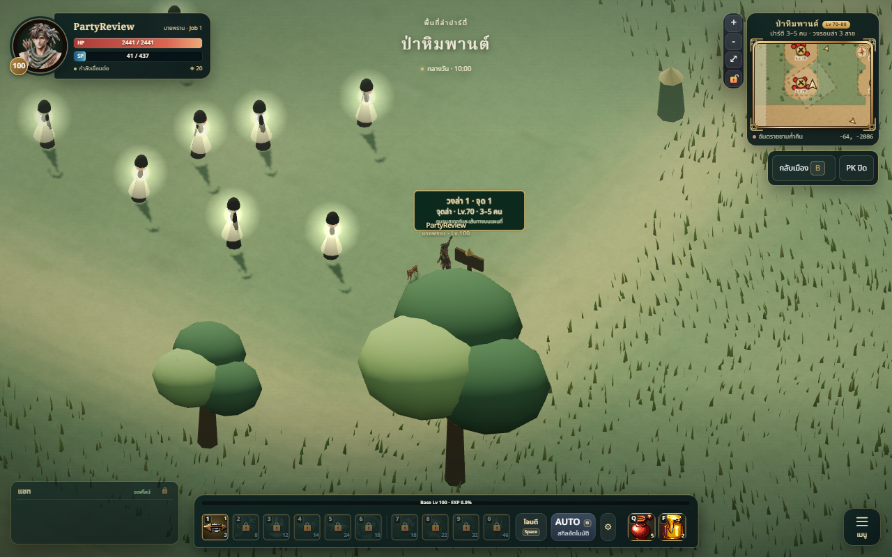
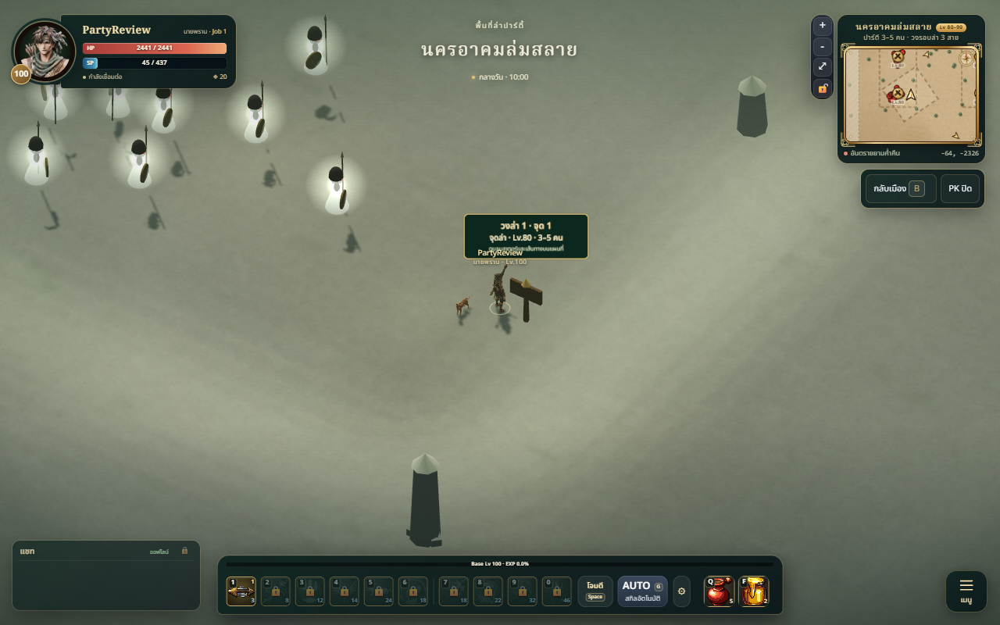
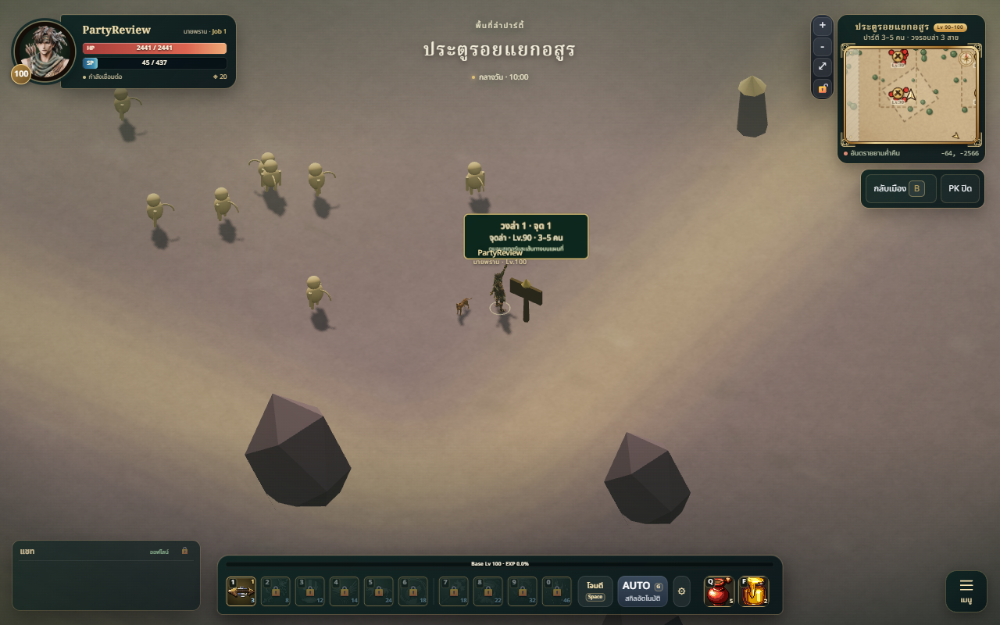
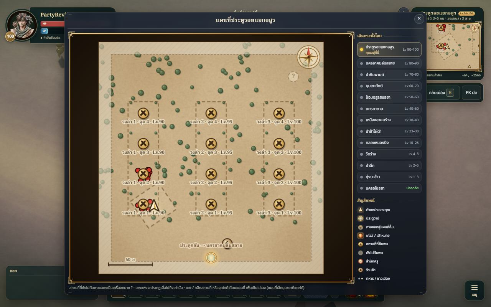
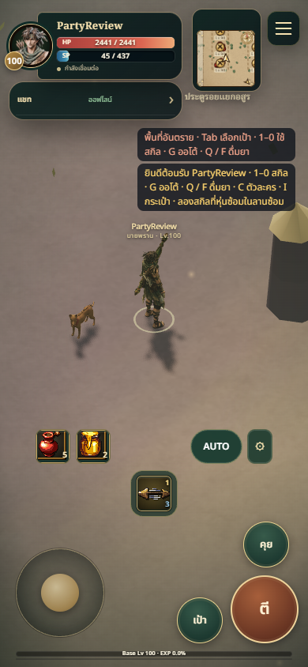

# Party hunting to level 100 — review

Branch `codex/party-hunts-100`, built on PR #27 (`codex/leveling-portals`).

## Summary

13 playable maps, 136 marked hunting pockets (40 regional, 96 expedition),
24 directed gate connections, 32 new monster identities including eight bosses,
64 tiered equipment items and cards for the new identities. Three circuits per
new map for 3–5 player parties. Actual party maximum stays six.

## Changed files

- World: `src/world/expeditions.js`, `ExpeditionWorld.js`, `maps.js`, `Terrain.js`,
  `World.js`, `HuntingGrounds.js`.
- Content: `src/data/hunting.js`, `regional-hunts.js`, `spawns.js`, `npcs.js`,
  `shops.js`, `shopSites.js`, `landmarks.js`, `regions.js`.
- Monsters/economy: `src/combat/data/expedition-monsters.js`, `monsters.js`,
  `loot.js`; `src/character/data/expedition-gear.js`, `items.js`, `cards.js`,
  `progression.js`; `src/character/Character.js`.
- UI: `src/ui/Minimap.js`, `src/net/SocialPanes.js`.
- Server: `server/interest.js`, `index.js`, `monsters.js`, `presence.js`,
  `data/collision.json`; `tools/collision-source-hash.js`.
- Tests: `tests/expeditions.test.js`, `hunting-portals.test.js`, `maps.test.js`,
  `world.test.js`, `job-levels.test.js`, `combatants-server.test.js`.
- Documentation: world progression/map, technical verification and this folder.

## Validation

- Full suite: **322 passed, zero failures**. Build passed; existing large-chunk
  warning remains (~1.73 MB minified JS).
- Rebuilt collision for all 13 maps. All 136 camp approaches and 24 gate centres
  are reachable from their map spawn; posts/pillars block server navigation.
- Day/night server MonsterWorld checks validate pocket counts and positions.
  No portal arrival overlaps a monster's conservative aggro safety margin.
- Server Presence accepts all new rooms and every legitimate portal transfer.
  Location saves resolve on the correct map. Suppliers pass server range checks.
- Character reaches 100 and stops there. Gear IDs/drop tables/cards are known,
  and high-tier equipment cannot be equipped below its minimum level.
- Interest unit tests verify entry, omission of distant rows, no duplicate idle
  updates and refresh on re-entry. Idle AI wakes immediately for an eligible
  nearby player; dead/phase processing stays ahead of idle sleeping.
- Headless Edge, local guest, Lv100: loaded all eight new scenes, 12 signs and
  one supplier each, with 73/97 live monsters. All sampled player positions were
  standable. No page errors in final captures. Desktop 1280×800 and touch mode
  at 390×844 captured using software rendering / low quality.
- Real local server WebSockets: eight concurrent clients, one in each expedition
  room. All received welcomes and 73/97 monster lifecycles. Over 4.5 seconds each
  received 35–41 nearby update packets, with 11–21 rows in the largest packet at
  the entrance, rather than all 73/97 monsters. This is a smoke check, not a load
  benchmark. Full initial lists/lifecycle/reward messages remain authoritative;
  only movement snapshots use the 96 m interest radius.

## Art / technical review

Self-reviewed: Thai rest pavilions and portal frames, muted map colors and
simple silhouettes; scenery is grouped into material batches. Terrain sampling
and collisions are shared with the server. Scene unload frees generated meshes,
materials and textures. No separate specialist or Art Director rating was run.

These scenes and monster silhouettes are **initial procedural art**, with shared
geometry families and reused icons. They are not a bespoke finished art pack.

## Screenshots

### Environment refinement — 2026-10-08

First design pass after feedback that the expedition scenes need more care:

- Added `src/world/ExpeditionArt.js`; `ExpeditionWorld.js` now delegates terrain
  painting and themed dressing to this reusable kit.
- Replaced opaque, square trail stripes with rounded loops, layered translucent
  shoulders, broad ground-color washes and low-contrast litter. Geographic loop
  positions are preserved so the minimap still describes the actual route.
- Bamboo now has segmented stems, lateral branches and narrow pointed leaves.
  Himmapan vegetation has branching trunks and layered broad crowns. Foliage
  materials are separate from the ground palette.
- Existing obstacle sites gain mine timbers, basin algae bands, fort capstones,
  broken masonry, valley markings or muted rift mineral seams. Decorations stay
  at those sites rather than filling the clear combat floor.
- Collision export refreshed; all 13 shape counts remain unchanged. Rechecked
  all eight scenes in the browser, including mobile. 322 tests and build pass;
  the existing bundle-size warning remains. Screenshots below show this pass.

This is a focused environment refinement, not final art approval. Maps still
share the three-circuit layout; unique regional landmarks, deeper environmental
storytelling and bespoke monsters remain unfinished. No independent Art Director
score or physical-device performance result is implied.

## Limitations

Not merged or deployed. Depends on PR #27. Physical mobile FPS, sustained server
load, real party clear rates and the long-term economy need playtesting. Existing
EXP/skill progression and party reward ownership are preserved; no new quest
chain, dungeon or encounter telegraph system was added. New scenery and models
need further visual polish. The rest clearing avoids aggro; it does not disable PK.
