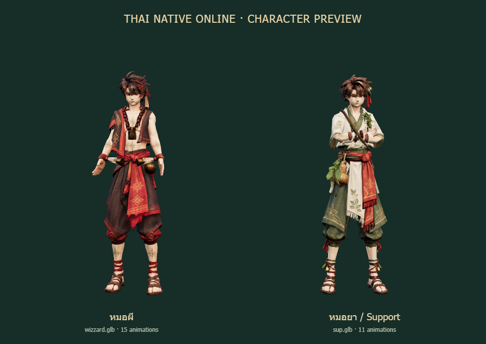
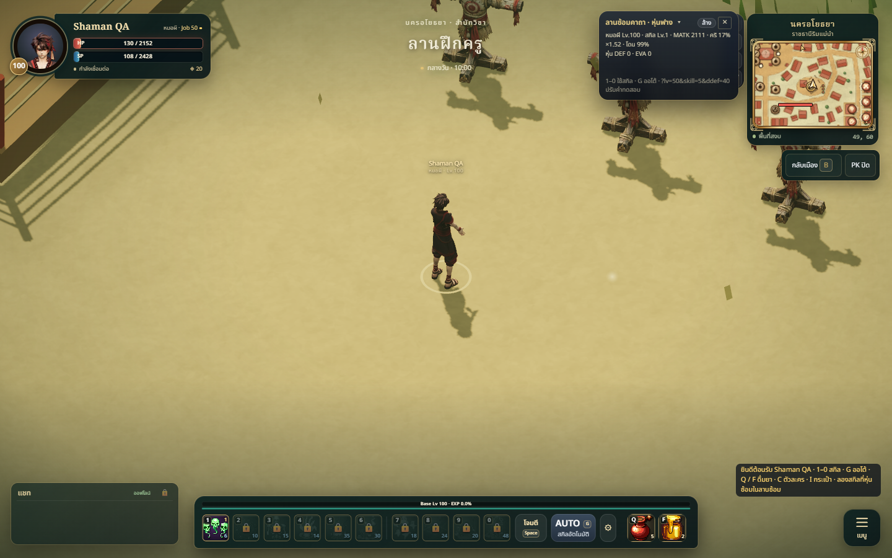
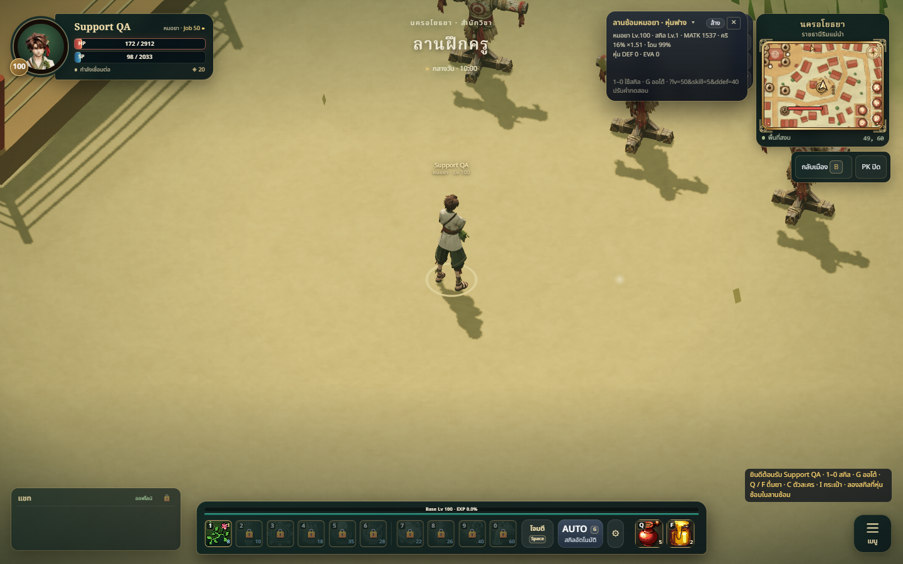
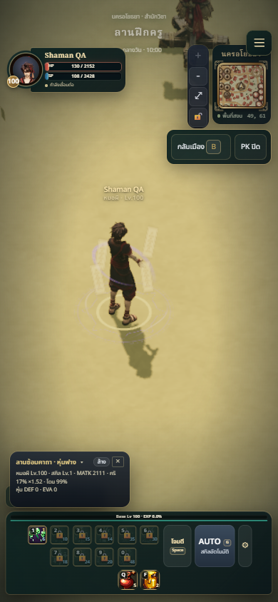
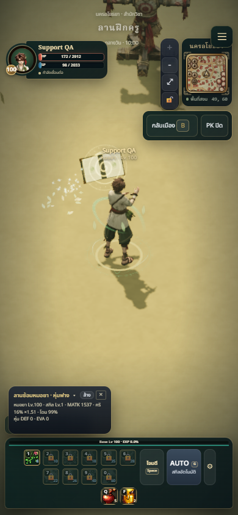

# Supplied shaman and support model refresh — 2026-10-08

## Summary

Replace the shaman with the user's `wizzard.glb` and the herbalist/support with
`sup.glb`. Both files have one skinned mesh and a Mixamo skeleton, but no clips.
The existing class composers generate all gameplay animations on each new rig,
preserving clip names, effect release times and class tempo. The shaman retains
unarmed hand seals; the herbalist retains the separate orbiting spell-book effect.

The new red/black shaman and white/green herbalist have readable silhouettes,
Thai cloth, charms and herb details that suit the Art Bible. New transparent
portraits match the body models. Class portraits now use the same build version
stamp as models so a new deployment refreshes cached portraits across the HUD,
character selection and creation screens.

## Assets and source provenance

| Class | Unchanged source copy | Runtime GLB | Clips | Triangles | Runtime bytes |
| --- | --- | --- | --- | --- | --- |
| Shaman | `tools/shaman-anims/wizzard-tripo.glb` | `public/models/shaman.glb` | 15 | 10,003 | 1,414,356 |
| Herbalist / support | `tools/herbalist-anims/sup-tripo.glb` | `public/models/herbalist.glb` | 11 | 4,903 | 1,447,080 |

Source SHA-256:

- wizzard: `e753d883064a88c67aa70f96b09d9c8effcf1bb369c5ed378b0d4ecb4502b944`
- sup: `d7b3abab98563dcaaa21e3450e432589ee7b989e778712e06b995df3ff09be96`

Runtime SHA-256:

- shaman: `5d7eab845b7a0a05db82c0252c0e238562a09ef69e6cb33bafb1667998adc8ca`
- herbalist: `5ac0cee3bc74bb443e86f3827a740e1768f54990dc265af3bb0fafab7f3bae52`

Original Downloads files remain unchanged. Older repository source models remain
available for recovery. Runtime textures are limited to 1024px at JPEG quality 90,
then geometry/animation buffers are quantized and meshopt compressed using
gltfpack `-cc -kn -ke`. No new runtime dependency or animation loader is required.
Build-time glTF tools were installed only in ignored local QA artifacts; package
manifests and lockfile are unchanged.

## Changed files

- `public/models/shaman.glb`, `public/models/herbalist.glb`: new supplied models with generated clips.
- `public/ui/portraits/shaman.png`, `public/ui/portraits/herbalist.png`: matching 256px transparent portraits.
- `src/ui/icons.js`: versioned portrait URLs for cache refresh.
- `tools/shaman-anims/compose.mjs`, `tools/herbalist-anims/compose.mjs`: new default source paths.
- Both tools' README files and both classes' `ANIMATIONS.md`: provenance, rebuild instructions and limitations.
- `tests/class-model-assets.test.js`: required gameplay clips, release durations, skin bounds, skeleton, triangle/download budgets and idle loop validation.
- This review, `class-model-preview.png`, `shaman-model/*.png`, `herbalist-model/*.png`: visual evidence from the Three.js renderer and actual game.

## Validation

- `npm test`: **343/343 pass**.
- `npm run build`: **pass**; existing approximately 1.74 MB main-bundle warning remains.
- `git diff --check`: pass.
- The actual game loader decodes both meshopt-compressed models. Browser playback
  samples every clip and its skinned vertices without nonfinite geometry or bones.
  Automated asset checks additionally verify bounded deformation relative to hips,
  all mapped skill clip names/authored durations, and seamless idle loops. The
  shaman's lower body stays planted throughout idle.
- Desktop 1440×900 and mobile 390×844 guest gameplay: new bodies and portraits load;
  shaman `mage_akom` and herbalist `heal_vine` run with their existing VFX; no page errors.
- Front, rear and spell poses reviewed at full resolution, with in-game views at
  the existing 2.5D camera and both class heights unchanged (1.8m and 1.75m).

## Known limitations

Animations are procedural/retargeted on the supplied rigs rather than newly
captured performances. Clothing, bags and charms follow skin weights and have no
cloth simulation. Each supplied file is one body appearance; separate gender
variants are not supplied. Some sleeves expose their dark interior when arms lift.
The book remains the existing floating spell effect rather than a new held prop.
Network animation routing is unchanged; local browser checks use guest gameplay.
This branch is stacked on the pending shop PR #30. No deployment is included in
this model request.
