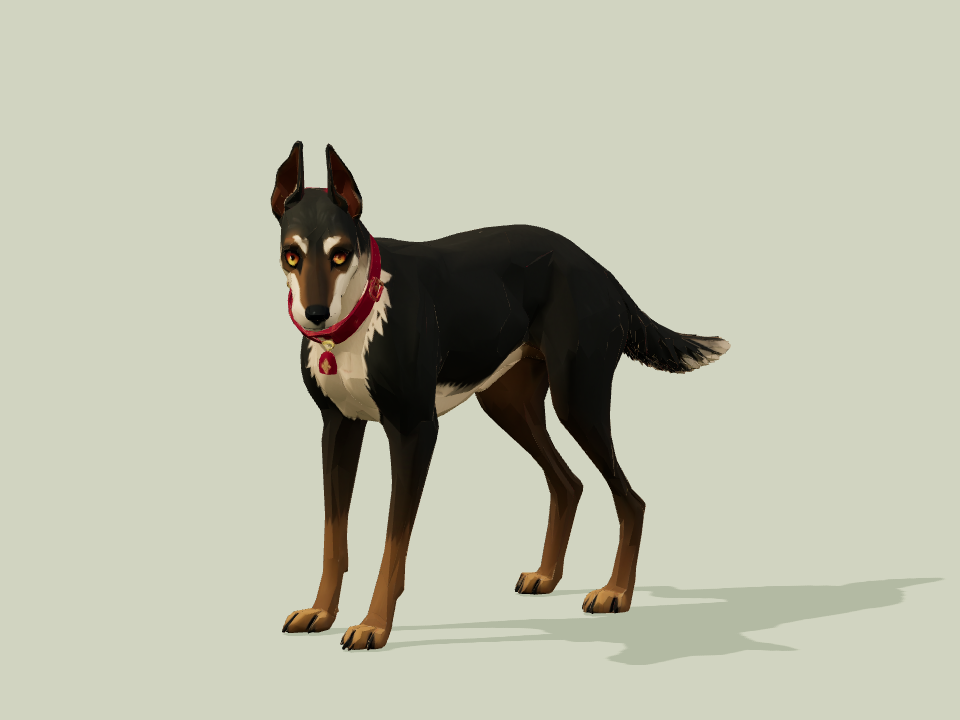
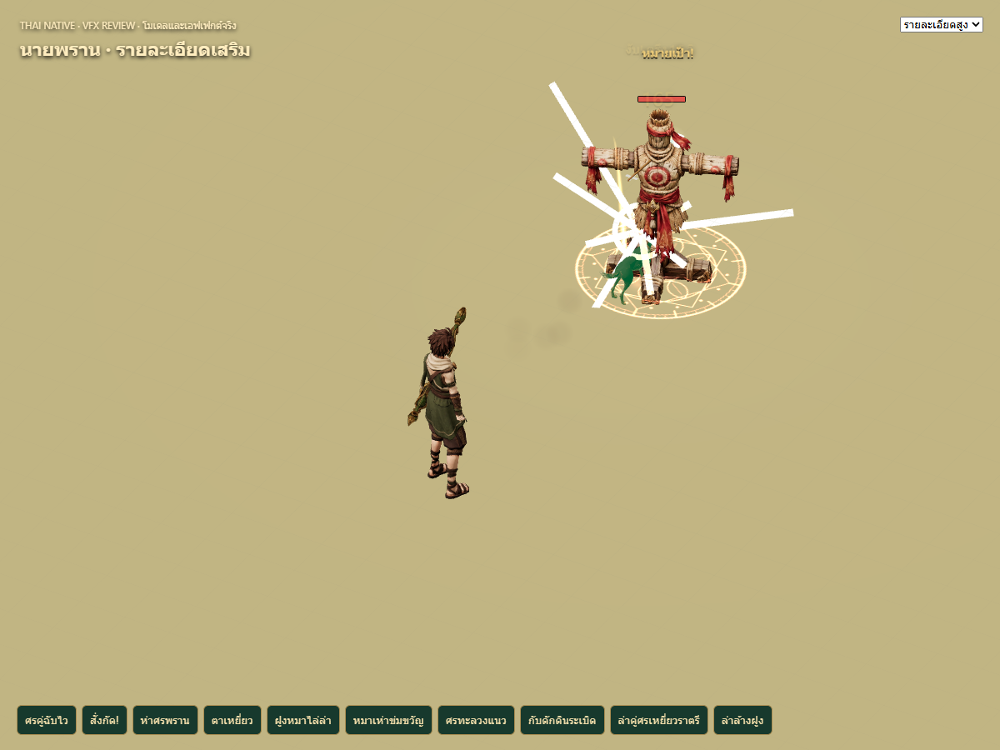

# Hunter companion refresh — 10 October 2026

The hunter's companion uses a new Meshy body with an athletic silhouette,
upright ears, expressive amber eyes, broad charcoal/brown/cream color regions,
and a crimson collar with a small charm. The enemy dhole is outside this task.
The user approved the rendered design and additionally requested an attack pose.

## Source and cost

Meshy CLI 0.4.0 submitted one preview and one refine, both successful. Actual
charges were **20 + 10 = 30 credits**. Task IDs, hashes, generation inputs and
lineage are in `tools/hunter-dog/meshy-provenance.json` and `model-brief.json`.
Original Meshy geometry/texture and the previous canine rig are retained in
`tools/hunter-dog/source/`; credentials and signed URLs are excluded.

The generated body has **6,255 triangles**, one primitive/material, and one
2048² color texture. Meshy did not provide a canine skeleton or clips. Local
rig fitting preserves the existing quadruped controller rather than using
humanoid auto-rigging.

## Static anatomy and design review

All five actual GLB views were inspected: front, side, back, three-quarter and
gameplay. Four distinct canine limbs/paws, coherent hind-leg bends, a continuous
single tail and intact neck/collar are visible. No confirmed extra limb,
backward paw or disconnected accessory was found. The independent static
review scored style **8.5**, readability **8.5**, visible anatomy **8.5** and
static technical suitability **8**. Independent final motion review also passed:
style **8.5**, gameplay readability **8**, technical suitability **8**. The
reviewer inspected actual final-3 follower, attack and borrowed-skill screenshots
and found no new gross deformation or duplicate follower.

The result is Ridgeback-inspired, rather than an exact breed reconstruction:
the tail is naturally lowered and somewhat fluffy, the head is slightly turned,
the dorsal ridge is subtle, and the charm has a red face with brass fittings.
The user approved this design; no paid regeneration was requested or submitted.

## Attack direction

The requested attack adds preparation, forward reach, a head snap and recovery.
Its strongest strike aligns with the existing skill's **0.55** damage phase.
The model revision in the loader URL prevents the previous cached body from
remaining visible after release. Skill damage, timing, follow and borrowing
rules are unchanged.

## Validation

Raw capture passed five views. Final production controller capture passed
**57 screenshots and 128 motion frames**, with matching served/local hashes.
Local binding audit passed **305 poses** including measured edge-extension gates.
Original baseline receipts cover 34 views and retain the old animator hash.

The installed asset has 6,255 triangles, 8,915 vertices, 38 fitted joints,
one opaque material and a 1024 JPEG, totaling **831,080 bytes**. SHA-256:
`341c647c886e302e4485511481042df5abde243a66a8b2ff8ac8668e29caa541`.

Gameplay [final-3](hunter-dog/gameplay/final-3/REVIEW.md) passed **11 cases and
51 screenshots** with actual Character, Combat, CombatView and hunter skills.
The same follower disappeared while borrowed then returned. Normal/fast cooldowns,
spirit copies, recasts and callback ownership passed. One headless page closed
after each run. One unclassified console resource-404 warning was recorded;
required dog loads and requests passed.

`npm test`: **664 passed**. `npm run build`: **passed**, with the existing
bundle-size warning. Model and presentation tests validate the rig/skin contract
and cooldown-reset recovery without changing combat rules.

## Limits

The generated mouth is closed and has no separate jaw control. Bites read
through the neck/head snap, lunge and existing hit effects. The current gait
does not use planted-foot IK or terrain-aware paw placement. Finite transforms
and bounded geometry checks do not prove biological accuracy. The inherited
gait can dip paws about 4.6 cm below origin in a sampled trot; planted-foot IK
remains future work. The separate `onSnap` path and a live authoritative server
and terrain session were not exercised by the isolated gameplay fixture.
