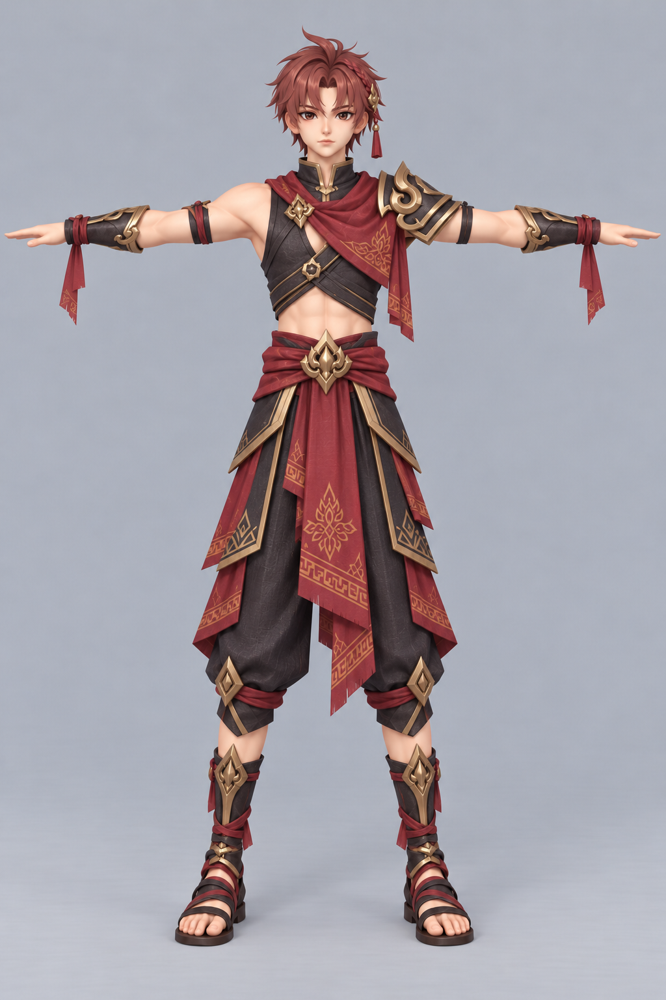
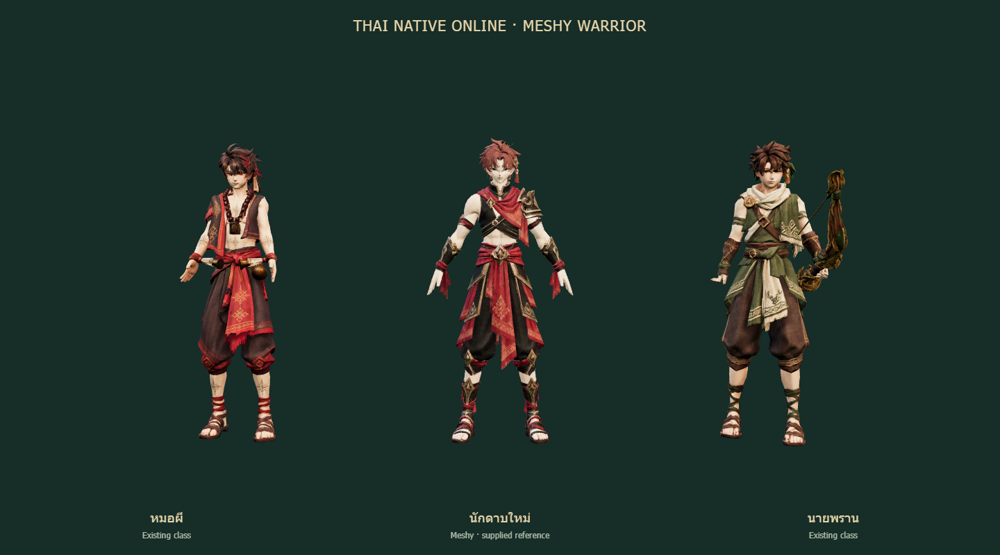
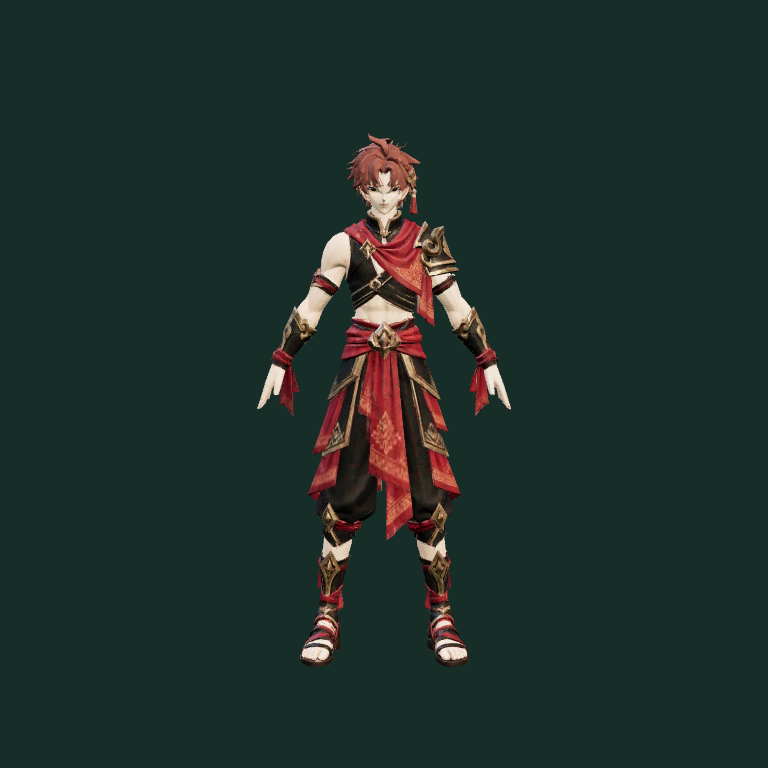
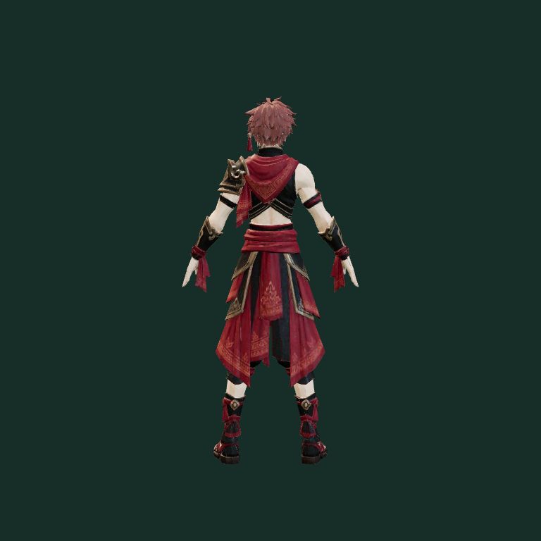
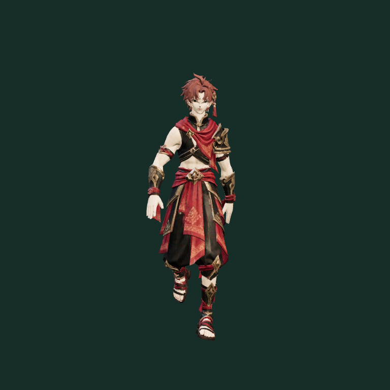
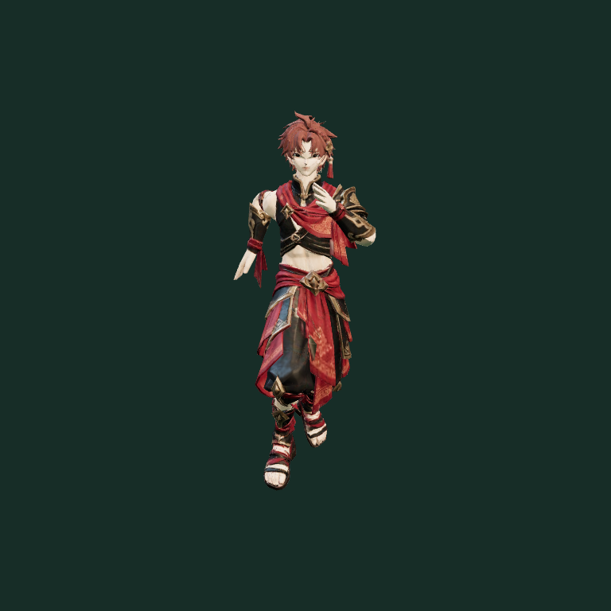

# Meshy warrior from the user's reference — 2026-10-08

## Summary / art and technical review

Generate a new Thai fantasy warrior from the user's supplied T-pose image. The
reference's red/black cloth, restrained gold armour, red hair, sandals and anime
proportions are the target. Meshy Image-to-3D and auto-rigging produced a new
textured body and humanoid skeleton. A small preparation tool adds neutral idle
and Meshy's own native walk/run motions, avoiding reuse of incompatible old
Mixamo bone rotations.

The silhouette and palette fit the shaman and hunter; the outfit retains the
reference's asymmetric shoulder armour and divided woven cloth panels. This is
an initial generated candidate. Facial and hair detail is softer/less clean than
the reference, particularly at close range, and needs artistic cleanup before
production approval. The candidate is stored separately from the active avatar.

## Generation and costs

- Meshy Image-to-3D task: `01a11b98-2092-75cf-8f88-4d40dafccca3` — succeeded, **30 credits**.
- Meshy rigging task: `01a11b9d-af9e-770f-b66d-b8ccb4fbdf43` — succeeded, **5 credits**.
- Total used: **35 credits**. API balance after completion: **1,110 credits**.
- Model `meshy-7.1`, standard generation, 20,000 target triangles, 2k PBR source
  textures, remeshing enabled, exact-image enhancement disabled, GLB output.
- The actual output has **20,391 triangles**, one skinned mesh/material and **24 bones**.
- Untouched rigged source: **14,628,060 bytes**. Packed candidate with idle/walk/run:
  **1,590,608 bytes**, textures capped at 1024px, JPEG quality 90, meshopt compression.
- Input and original output are retained. API keys and signed URLs are absent
  from repository files. The 3D input is the user's reference, not the earlier
  generated image concept.

## Changed files

- `tools/warrior-anims/meshy/reference.png`: exact supplied image.
- `tools/warrior-anims/meshy/generation-parameters.json`, `provenance.json`: reproducible settings and task/cost records.
- `tools/warrior-anims/meshy/warrior-meshy-rigged.glb`: untouched rigged result.
- `tools/warrior-anims/meshy/warrior-meshy-preview.glb`: optimized review model with native locomotion.
- `tools/warrior-anims/meshy/prepare.mjs`, `README.md`: preparation tool, rebuild instructions and rig compatibility limits.
- `tests/meshy-warrior-preview.test.js`: download/triangle budget, humanoid skin and bounded deformation through every 30fps frame.
- This report and `meshy-warrior/{front,back,walk,run,class-comparison}.png`: review evidence.

SHA-256:

- Reference: `77a8956ddde5b72e1924dab25f21efe297f92bc34f10e9ea4ade14d73abe8d35`.
- Original rigged GLB: `09b33eacb3da51ccb3f314e818a8e90efad40c3ae88327a8ec46da0fcccea243`.
- Packed preview GLB: `8a7599747c803e203a432bfe400d6533ab8e68a91d97aff65de7574239e0d33d`.

## Validation

- `npm test`: **346/346 pass**.
- `npm run build`: **pass**, existing approximately 1.74MB main-bundle warning remains.
- `git diff --check`: pass.
- Actual game loader renders the original and packed models, real textures and
  native walk/run poses without browser page errors. Front/rear 768x768 previews
  and a 1440x800 comparison use the same Three.js stage as other class reviews.
- Asset tests inspect every authored 30fps frame for finite vertices and bounded
  deformation relative to hips. All three expected clips are present. The new
  candidate is not referenced by the active class mapping or copied into `public`.

## Known limitations

- This is a body/locomotion candidate. No sword combat animations or attached
  swords are included, and it has not replaced the live class or been deployed.
- Meshy's 24-bone rig has no finger bones and different spine naming from the
  current 65-bone Mixamo avatars. Gripping swords and adapting all class skills
  needs additional rig/animation work; simply copying the old clips is unsafe.
- The requested T-pose was normalized to a lowered-arm neutral pose in the
  delivered rig. Generated facial/hair detail and unseen back surfaces approximate
  the supplied reference. Cloth follows skin weights without cloth simulation.
- Physical phone performance, online playback and combat VFX were not tested
  because this candidate is not active in gameplay.
- Branch `codex/meshy-warrior-reference` is based on pending warrior/ranger PR #32.
  The existing game avatar, its fixes and unrelated local files remain unchanged.
