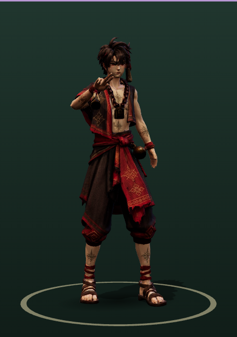
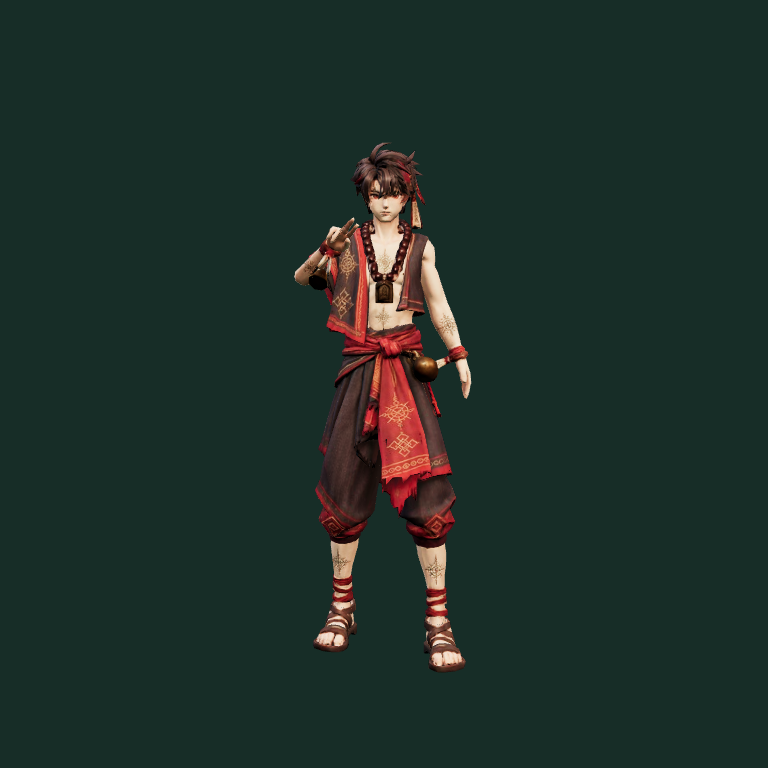
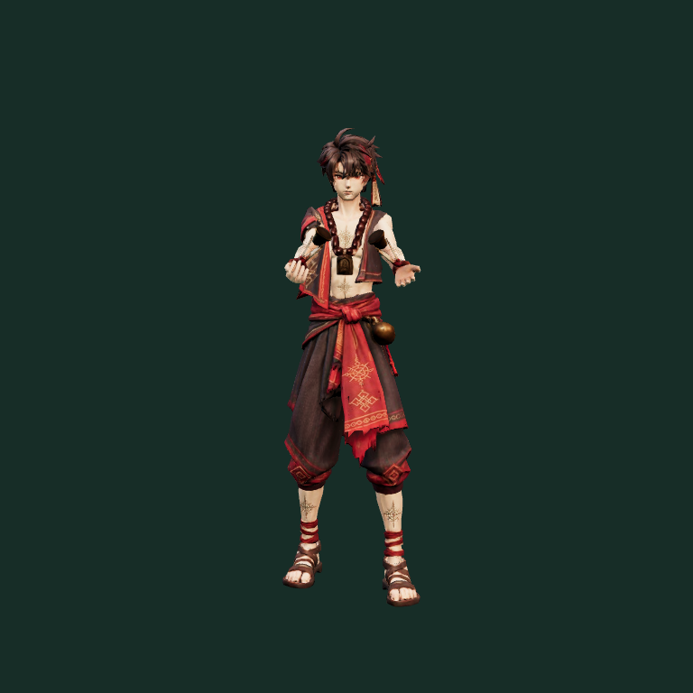
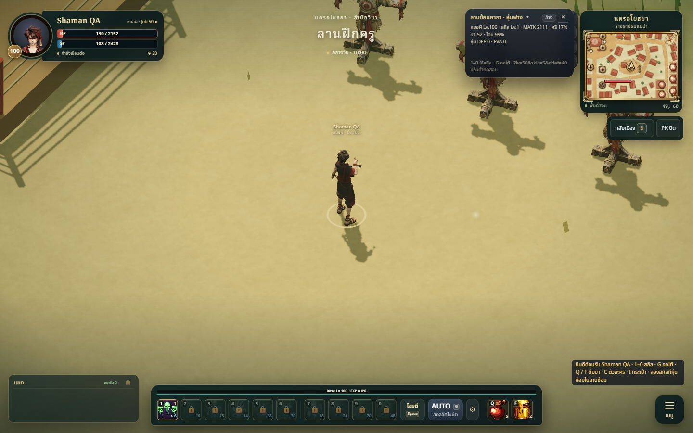
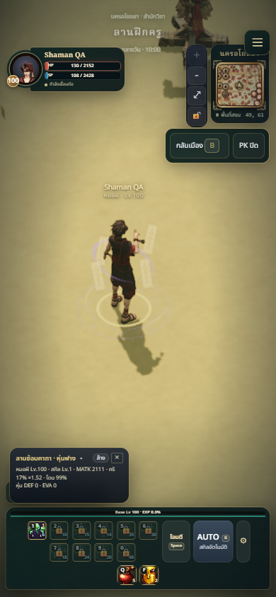
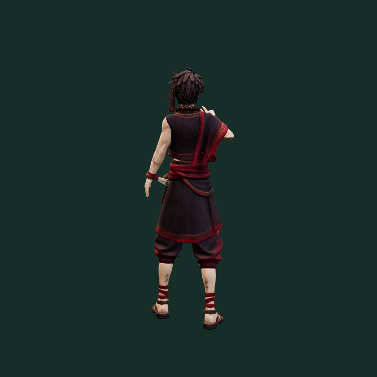
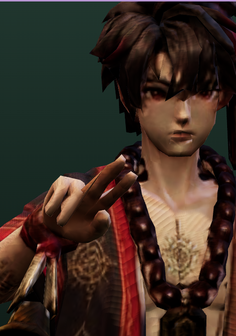

# Shaman anime ready stance — 2026-10-08

## Summary

Replaced the symmetrical, splayed-hand idle with an asymmetric occult caster
stance: right hand raised in a two-finger seal, left arm relaxed, feet staggered,
small torso turn and a forward gaze. Shared spell endpoints now return to this
stance without a finger-pose pop. Hip and foot transforms remain constant during
the seamless 2.6-second idle loop; only the upper body breathes.

## Changed files

- `public/models/shaman.glb`: regenerated runtime animation asset.
- `tools/shaman-anims/compose.mjs`: ready pose, finger blending, upper-body breathing,
  optional locomotion donor argument.
- `tools/shaman-anims/README.md`: reproducible donor selection.
- `docs/art/classes/shaman/ANIMATIONS.md`: stance documentation.
- `tests/class-model-assets.test.js`: raised hand/staggered feet and spell endpoint checks.
- This report and `docs/art/reviews/shaman-idle/*.png`: visual QA evidence.

## Visual review

The same ModelPreview component used by character selection renders the raised
hand with a clear gap from the face, a level gaze and planted feet. Costume and
Thai accessories remain readable; no changes to mesh or textures.

## Validation

- `npm test`: 346 passing.
- `npm run build`: passing; existing large JavaScript chunk warning remains.
- All 15 clips sampled at 30 fps in Edge with finite bone and skin data.
- Idle lower-body tracks stay fixed; loop seam and spell ready-pose endpoints pass.
- Walk/run body track names, times and values match the preceding asset exactly;
  fingers use corrected flexion axes.
- Anatomical regression samples at 30 fps: finger flexion is toward the palm with
  no sideways twist; MCP/PIP/DIP limited to about 66°/80°/49°. Thumb opposition is
  posed separately. The source has three finger joints and no fourth tip bones;
  the previous helper measured missing tips against the origin and could reverse
  flexion. This revision removes that assumption for shaman animations.
- Measured across all clips: wrist axis deviation ≤39.2°, elbow bend ≤129.3°,
  knee bend ≤110°, ankle deviation from source rest ≤41.5°. These are rig checks,
  not a clinical biomechanical simulation. Front/back renders review shoulders,
  head alignment and the silhouette.
- Local game desktop 1440×900 and mobile 390×844: model loads and spell casts;
  no browser page errors. Selection-stage screenshot uses the real ModelPreview.
- Meshopt asset remains below the 1.6 MB mobile budget.

## Limitations

Procedural animation on the supplied rig; no cloth/accessory simulation. Screenshots
are local previews. This change has not been deployed. The PR is stacked on the
existing UAT class-model branch (PR #34).

