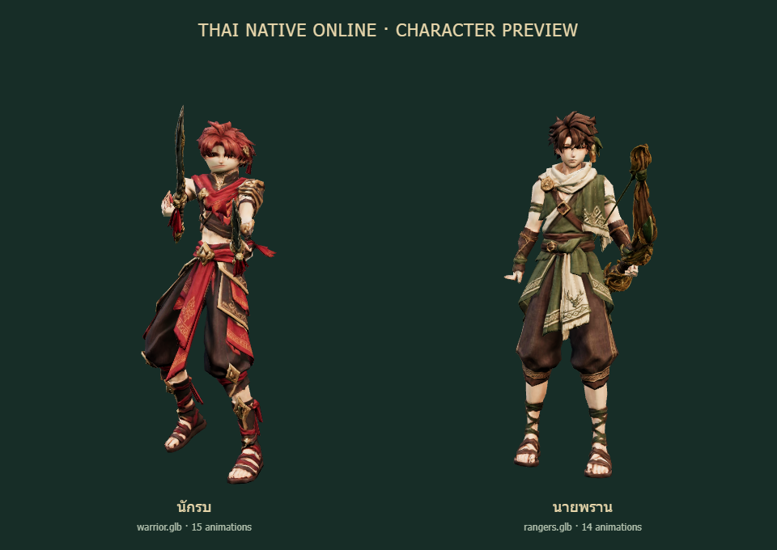
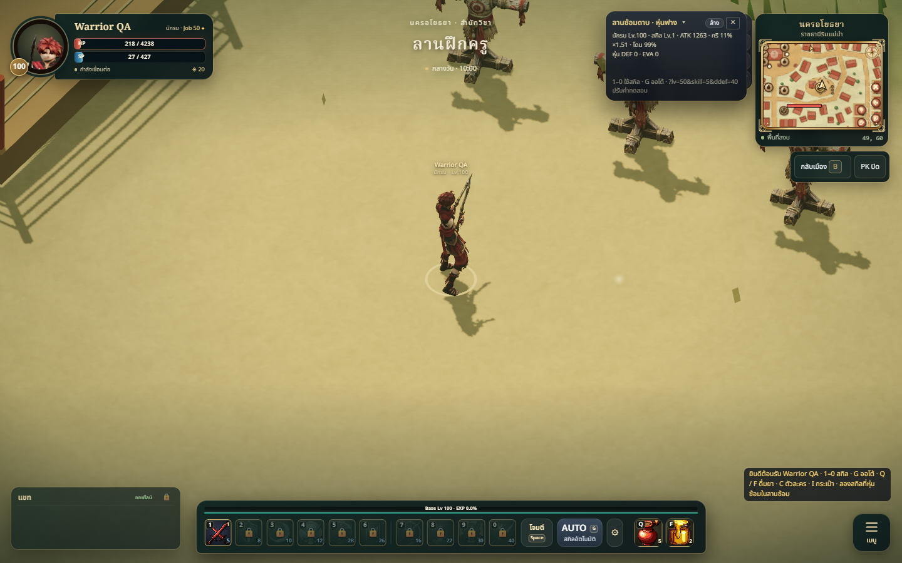
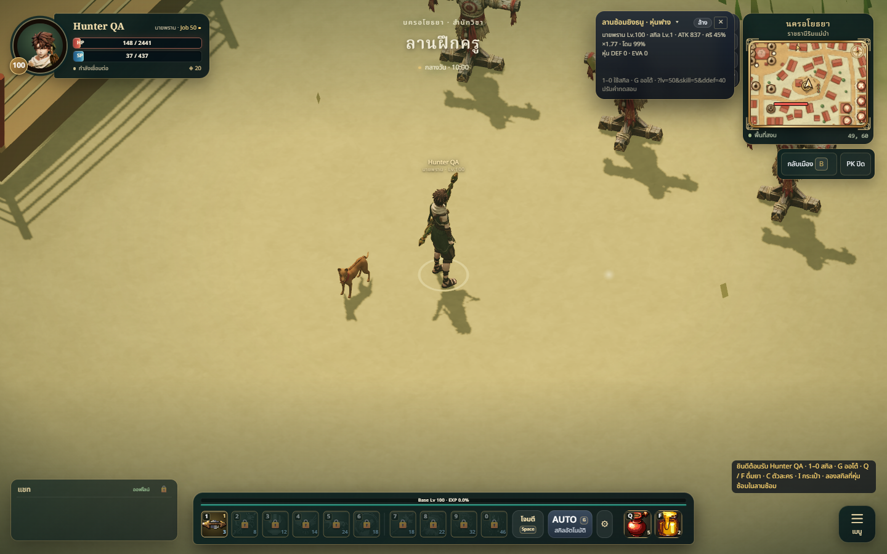
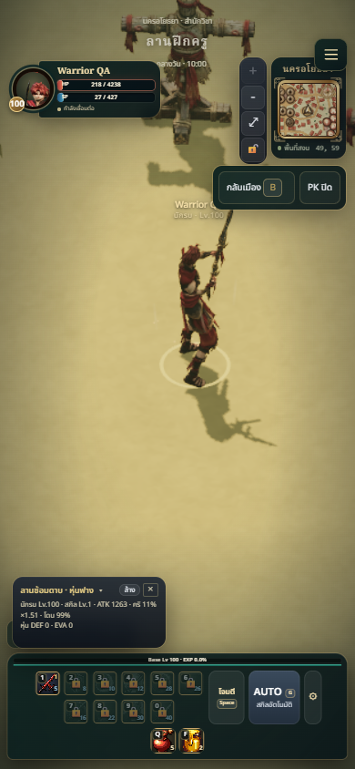
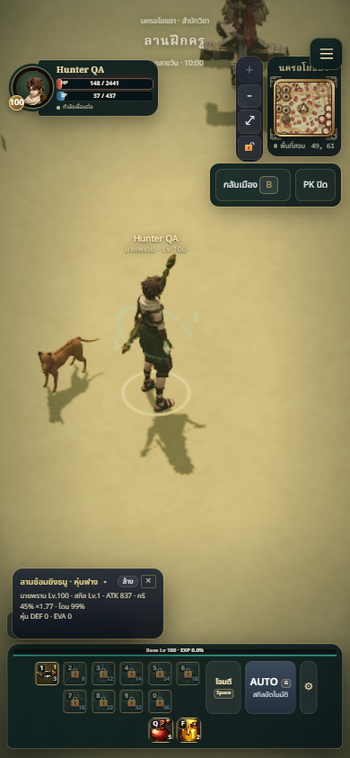
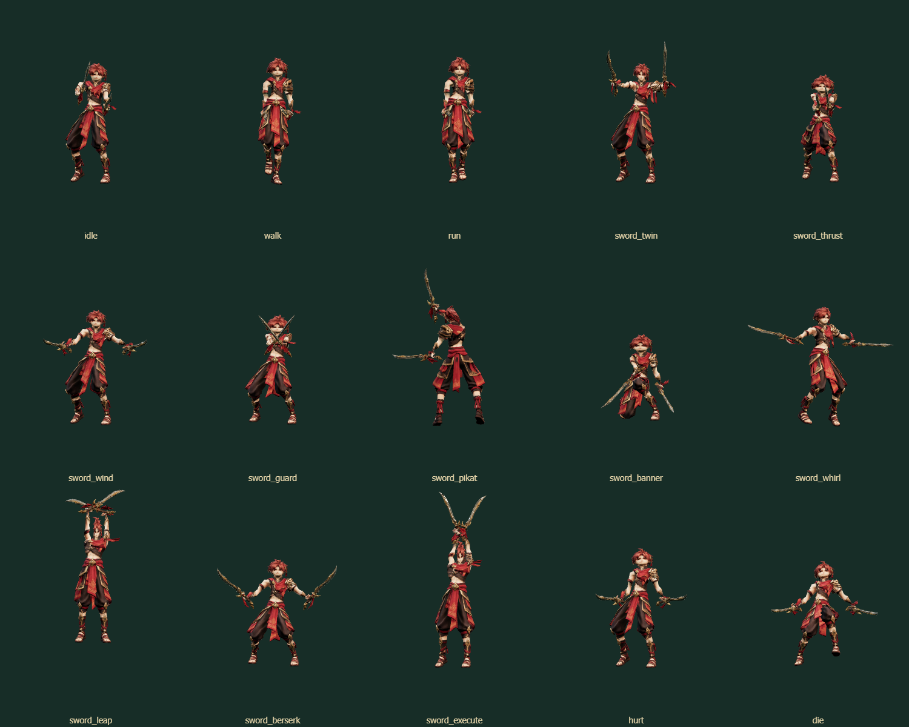

# Warrior and ranger supplied models — 2026-10-08

## Summary and art/tech review

Replace the warrior body with the user's `warrior.glb` and the hunter/ranger body
with `rangers.glb`. Red/gold warrior armour and green/cream hunter clothing give
each class a readable anime-influenced silhouette with Thai ornament, consistent
with GAME_VISION and ART_BIBLE. Matching transparent 256px portraits replace the
old faces in the HUD and class screens. Existing build-stamped URLs refresh both
model and portrait caches on deployment.

The supplied files contain one skinned body each, a 65-bone Mixamo rig and no
animations or separate weapons. A reusable build tool transfers the old class
animations to their original bind poses, and copies the existing twin swords
and bow onto the new hands with corrected grip transforms. No gameplay skill,
damage, tempo, VFX, loader, class height or runtime dependency changes.

## Assets and provenance

| Class | Unchanged source copy | Runtime file | Clips | Triangles including weapons | Runtime bytes |
| --- | --- | --- | --- | --- | --- |
| Warrior | `tools/warrior-anims/warrior-user.glb` | `public/models/warrior.glb` | 15 | 13,995 | 1,944,552 |
| Hunter/ranger | `tools/hunter-anims/rangers-user.glb` | `public/models/hunter.glb` | 14 | 12,567 | 1,593,048 |

Source SHA-256:

- Warrior: `0cc387d9bf437fb720d7aa8c69b5b1a5bc3ea56bc4cda8acfb1f5d37630e2675`
- Rangers: `2576b576423b31b8d45686c6028602f5cb8110cba2d85ff6896e30ac1793edc6`

Runtime SHA-256:

- Warrior: `5825ffc356c9a5875a9087261cd45d9dcfddc38b5ecd4b1e887a0661f26b99c3`
- Hunter: `bb25e4fe001801ec58b6bd3985d1e59de06118b95a7938e9779bc9b5662d7706`

Downloads originals remain unchanged. Runtime textures are limited to 1024px
with JPEG quality 90, followed by meshopt compression and quantization
(`gltfpack -cc -kn -ke`). Original source models are retained for rebuilding;
the previous prepared models remain animation and weapon donors.

## Changed files

- `public/models/warrior.glb`, `public/models/hunter.glb`: replacement bodies with retargeted class clips and weapons.
- `public/ui/portraits/warrior.png`, `public/ui/portraits/hunter.png`: matching 256px portraits.
- `tools/warrior-anims/warrior-user.glb`, `tools/hunter-anims/rangers-user.glb`: exact supplied source copies.
- `tools/class-models/retarget.mjs`, `tools/class-models/README.md`: reusable transfer tool and reproducible rebuild commands.
- `tools/warrior-anims/README.md`, `tools/hunter-anims/README.md`, both classes' `ANIMATIONS.md`: current provenance and donor workflow.
- `tests/weapon-class-model-assets.test.js`: clip routing, impact timing, attachment ancestry, bounded animated geometry, triangle/download budgets and idle seams.
- This report, `warrior-ranger-preview.png`, `warrior-model/*.png`, `hunter-model/*.png`: visual evidence.

## Validation

- `npm test`: **345/345 pass**.
- `npm run build`: **pass**, with the existing approximately 1.74MB main JavaScript bundle warning.
- `git diff --check`: pass.
- Game loader decodes both packed models. Every animation sampled in browser and
  automated asset checks; no nonfinite bone/vertex transforms. Body and weapons
  stay inside bounded pose envelopes, attached to the matching hands. Idle loops
  have matching endpoints. Skill release times remain inside their clips.
- Desktop 1440×900 and resized mobile viewport 390×844 guest gameplay: both new
  bodies and portraits load, `sword_twin` and `arch_quick` run with existing VFX,
  and no browser page errors. This is local guest QA without the online backend.
- Front, back, attack poses and existing 2.5D camera reviewed. Both classes retain
  1.8m runtime height and use the same model mapping for selection and multiplayer.

## Warrior wrist and head correction

The first transfer preserved only world rotation deltas. Different bind bone
directions and palm axes in the new warrior then produced excessive wrist bends;
the donor head pitch/roll also made the anime head look crooked. The initial
finite-geometry checks did not catch this visual defect.

For twin-sword rigs the transfer now aligns anatomical bone-to-child directions
and palm/sole frames before applying animation. Finger grips are rebuilt using
the supplied skeleton, and weapon grips follow the new finger centres. Head and
neck pitch/roll are limited relative to the supplied bind pose during normal
combat/locomotion. Authored yaw remains free so spin attacks turn the head with
the body. Hurt/death retain their falling poses. The hunter transfer is unchanged.

Measurements across every 30fps frame, excluding hurt/death:

| Measurement | Before | After |
| --- | --- | --- |
| Largest forearm-to-knuckles wrist angle | 67.75 degrees | 29.92 degrees |
| Largest head pitch relative to bind pose | 27.81 degrees | 10.38 degrees |
| Largest head roll relative to bind pose | 7.68 degrees | 2.64 degrees |

Asset tests now reject excessive head tilt and wrist bend at every sampled
authored frame. All 15 clips were rendered again; idle, attack, rear, portrait
and desktop/mobile game screenshots were refreshed. Full tests remain 345/345
passing and the production build passes with the same existing bundle warning.

## Known limitations

- Animations are retargeted existing motions, not a new animation set; extreme
  poses may show cloth/body contact. No cloth physics, bowstring deformation or
  new finger rigging was added.
- Existing swords and bow are reused. These are visual attachments, not new
  equipment logic or inventory items. Each class still uses a shared body model.
- Browser screenshots validate rendering locally; physical phone GPU performance
  and two-client online playback have not been measured in this task.
- Builds on pending shaman/support PR #31. This task creates a stacked PR and
  does not merge main or deploy UAT.
