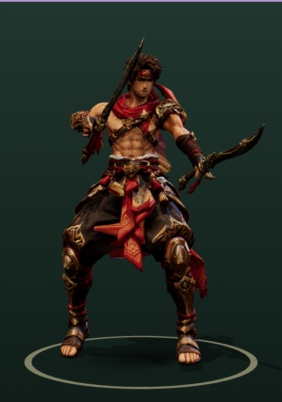
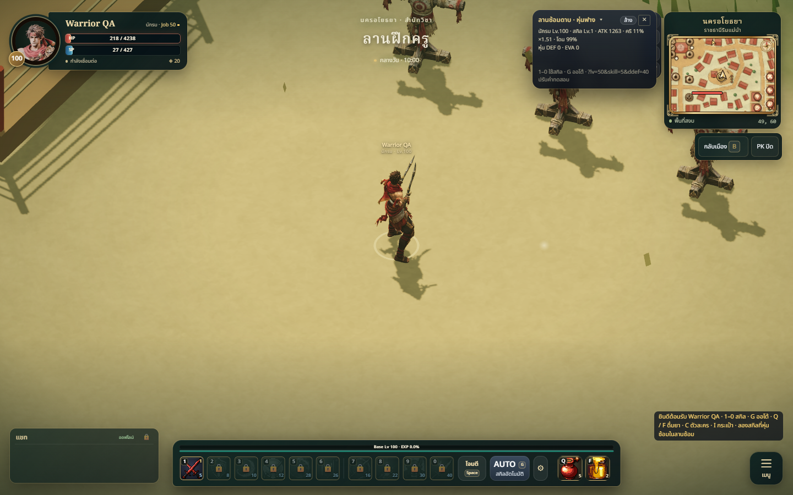
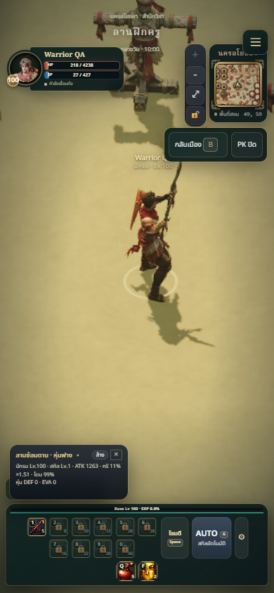

# Original warrior restored — 2026-10-08

The user cancelled the new Meshy warrior and requested the first model again.
Restored `public/models/warrior.glb` and `public/ui/portraits/warrior.png` from
`6ac984c`, retaining the original Tripo body and its previous cutting-edge fix
(`c1e1644`). All 15 clips and both hand-parented swords are present.

## Changed files

- `public/models/warrior.glb`: original packed model, 1,475,400 bytes.
- `public/ui/portraits/warrior.png`: matching original portrait.
- Warrior animation/source documentation and retarget README: mark replacement inactive.
- `tests/weapon-class-model-assets.test.js`: account for the original authored
  head motion; maintain the same strict wrist, skin bounds, clip and size checks.

Original model SHA-256:
`560c3083279c5f736b95800fd6451d5455165e840b20873c73fbfd5c9c4f9c48`.
The downloaded model currently on UAT also has this original version.
The cancelled generation experiments were moved to ignored local
`artifacts/cancelled-warrior/`; their composer, retarget and anatomy test changes
were removed from the active branch. No further generation is running.

## Validation

Desktop 1440x900 and mobile 390x844 guest gameplay load the original model and
cast sword_twin without browser page errors. Selection uses the real ModelPreview.
Across all non-hurt/death animation frames, measured head pitch <= 27.8 degrees,
head roll <= 7.7 degrees, wrist deviation <= 29.8 degrees. Tests retain limits of
28.6 / 8.6 / 30.4 degrees respectively, rather than applying the cancelled
replacement rig's artificially stabilized head limits to the original animation.

## Limits

This restores the earlier asset exactly; it does not claim a new anatomical or
cutting-edge correction. No physical-phone benchmark or signed-in multiplayer
check was performed. This local restoration has not itself been deployed.

Final combined recovery branch validation: 346/346 tests and npm run build pass.

