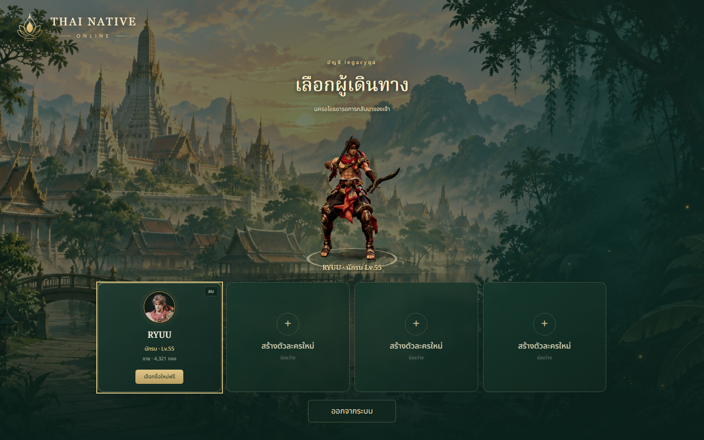
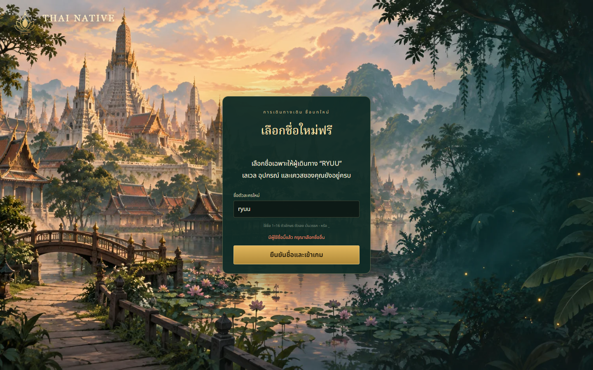
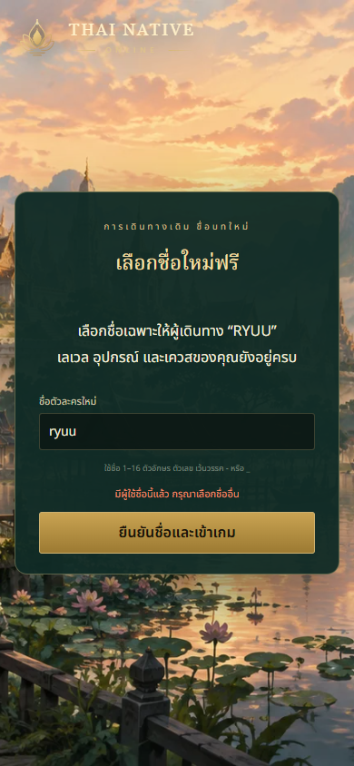
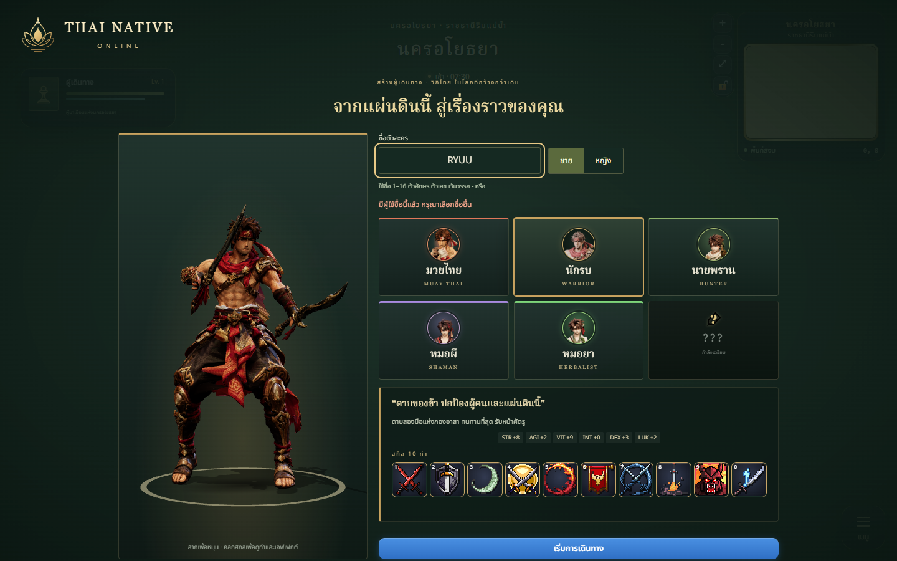
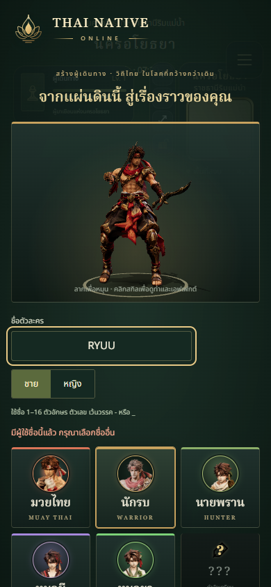

# Unique character names — 2026-10-08

Registered characters now reserve a globally unique name before entering the game.
Case, NFKC Unicode equivalents and redundant whitespace share one reservation.
Creation failures keep the player on the class screen with a Thai error message.
Legacy duplicates retain their entire save and choose a replacement name for free.
One keeper is selected by oldest account registration date, then account ID/slot.

## Changed files

- `src/data/character-names.js`: shared validation, identity keys and guest labels.
- `server/character-names.js`, `server/store.js`: transactional migration, unique
  index, rename transaction and preservation of names during ordinary writes.
- `server/accounts.js`, `server/index.js`: conflict responses, free recovery rename,
  queue semantics and online gate for unresolved names.
- `server/presence.js`, `src/net/Multiplayer.js`: authoritative guest identities and
  return to selection if the server requires name recovery.
- `src/account/{AccountStore,ServerAccounts,index,screens}.js`: confirmed creation,
  recovery flags, slot selection and rename dialog.
- `src/account/account.css`, `src/character/ui/{CreationScreen.js,character.css}`:
  error feedback and recovery form using the existing green/gold visual language.
- `tests/character-names.test.js`, `tests/character-names-online.integration.test.js`:
  identity normalization, competing claims, migration, persistence, real HTTP/WS.
- `docs/technical/SERVER_SPLIT.md`: rules, migration and release boundary.

## Validation

- `npm test`: 352/352 pass. `npm run build`: pass; existing large-bundle warning.
- Actual PostgreSQL SQL exercised in isolated PGlite 0.5.8 (Postgres WASM): idempotent
  migration, unique index rejection, transaction rollback, duplicate recovery,
  competing Accounts objects, deletion/reuse and occupied-slot protection.
  Direct old-process SQL cannot overwrite a recovered name while retaining its key.
- Real isolated HTTP/WebSocket server: duplicate creation returns 409, invalid names
  fail, permanent conflicts do not stall saves, unresolved duplicates cannot join,
  renamed users join under their authoritative name, active renames are refused,
  and two guests with the same chosen name get distinct connection labels.
- Browser QA with the actual built client/API: duplicate name remains on creation;
  choosing an available name enters as the selected class at level 1. Legacy
  recovery rejects an occupied name, accepts a free one and enters with level 55
  and gold 4321 retained. No browser page errors. Desktop 1440×900 and 390×844 layouts.

## Screenshots

## Limits / release

- Pre-release validation used `codex/unique-character-names`, targeting main,
  and isolated fixtures. Deployment verification is recorded separately. Recovery
  release 6d80679 is the baseline for this change.
- Database QA uses Postgres WASM, not a distributed PostgreSQL server/driver load
  test. Browser checks use emulation, not a physical phone.
- Characters had no recorded creation date; keeper order uses account registration.
  Existing friend lists reference names, so contacts of renamed characters may
  need to add the new name. Converting contacts to durable character IDs is separate.
- Guest labels identify a connection during this server process, not a permanent
  guest identity. No progress, equipment or quest reset is part of the migration.
