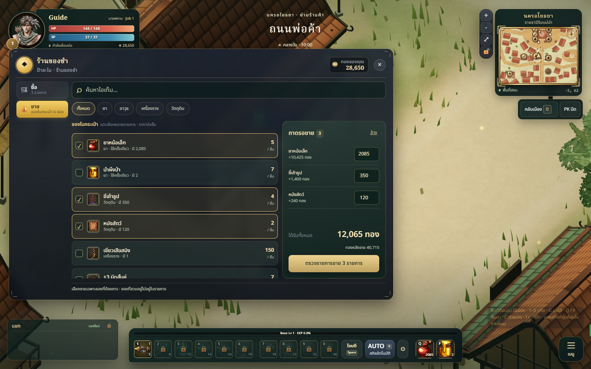
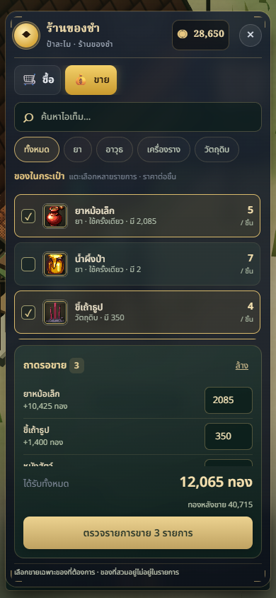
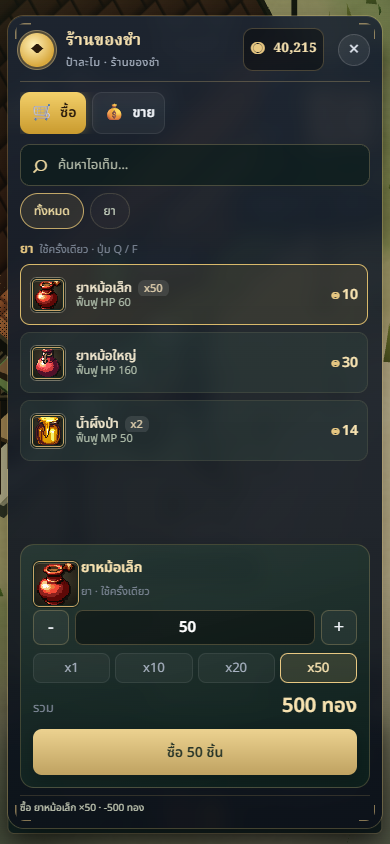

# Vendor HUD and bulk transaction review — 2026-10-08

## Result and reference

The vendor counter now has a searchable inventory, category filters and an explicit sale basket. Players choose several bag cells, edit each quantity, review proceeds and remaining gold, then confirm the whole basket. Enhanced/card-equipped gear is labeled and warned about; worn items are absent. Both buying and selling show a persistent receipt. Mobile uses full-size text and a 46px action button, independent of the compact HUD zoom.

Reference: [ArenaNet: Introducing the New Trading Post](https://www.guildwars2.com/en/news/introducing-the-new-trading-post/) — persistent categories, search and item/quantity/proceeds review. This is an NPC vendor, with the game's own dark jade and warm brass palette, Thai labels, existing item art and selective ornament. It introduces no auction economy or new assets.

## Defect and fix

The previous sell-all loop invoked `sellAt` once per unit. Each unit updated inventory, rebuilt the shop, saved locally and sent an online operation. A 9,999-unit test exhausts the unchanged 40 messages/second budget: 9,959 messages are dropped in the fixed-time reproduction. Server code drops over-budget messages rather than explicitly closing the socket, so this explains loss of progress/acknowledgement and heavy UI stalls; a separate socket-close cause was not observed.

`sellBatch` validates every unique index, quantity and total before mutating anything, then emits one inventory/change pair. The online operation includes each selected cell's item id, cards and enhancement. The server verifies these against its own inventory and calculates all prices itself. Invalid/stale baskets fail atomically. Existing proximity/death checks also cover batch sales. Bulk purchases now validate the entire quantity, available gold, weight and bag space before adding it, and send one operation. Older single-item operations remain supported.

The basket keeps the exact item instance and its contents. Reconciliation, sorting or changing that cell clears its selection, preventing accidental substitution. Stale sync replies request one fresh copy after the latest acknowledgement instead of requesting one per stale response.

## Changed files

| Files | Responsibility |
| --- | --- |
| `src/ui/ShopPanel.js`, `src/ui/shop.css` | Search, categories, basket, quantity editing, review, receipt, responsive layout |
| `src/shop/SaleBasket.js` | Exact-instance selection and stale-selection invalidation |
| `src/character/Character.js`, `src/shop/ShopSystem.js` | Atomic basket sale and quantity purchase |
| `src/net/NetProgress.js` | Single batch message and coalesced resync |
| `server/progress.js`, `server/combatants.js` | Authoritative identity/quantity validation and shop/life guards |
| `tests/shop-bulk.test.js`, `tests/shop-online.integration.test.js` | Large stacks, malformed/stale requests, capacity, identity, actual authenticated WS and persisted reconnect |
| This review and three PNGs | Design rationale and browser evidence |

## Validation

- Real Character + server Combatants: sell 9,999 units across two stacks using one operation and one inventory notification; client/server totals match.
- Real HTTP registration and authenticated WebSocket: sell 9,999 units, buy 999, verify the socket remains open, disconnect and reconnect, and verify persisted gold/items.
- Reject fractional, negative, excessive, duplicate, stale and missing rows without partial mutations. Reject mismatched enhancement/cards, remote sales and dead-player sales.
- Browser: desktop 1440×900, mobile 390×844; successful 2,555-unit sale, 50-unit purchase, search, category filtering, special-gear warning and clear basket. Additional viewport checks at 360×640, 390×844, 844×390 and 768×1024 verify the counter and action stay inside the screen. No page errors in the browser run.
- `npm test`: **341/341 pass**. `npm run build`: **pass**; retains the existing 1.74 MB main-chunk warning. `git diff --check`: pass.

## Screenshots

## Limits

Transactions remain optimistic like other inventory actions; the server restores its authoritative state on rejection. There is no buyback/undo. Confirmation covers every basket, with an extra visible warning for enhanced/card-equipped gear. Other kinds of network actions retain the existing rate budget. Local authenticated integration uses an isolated seeded memory store, not production PostgreSQL. New client and server must ship together, and existing tabs should reload. Deployment is outside this task; the PR is stacked on the pending boss-skills branch to preserve the current project changes.
