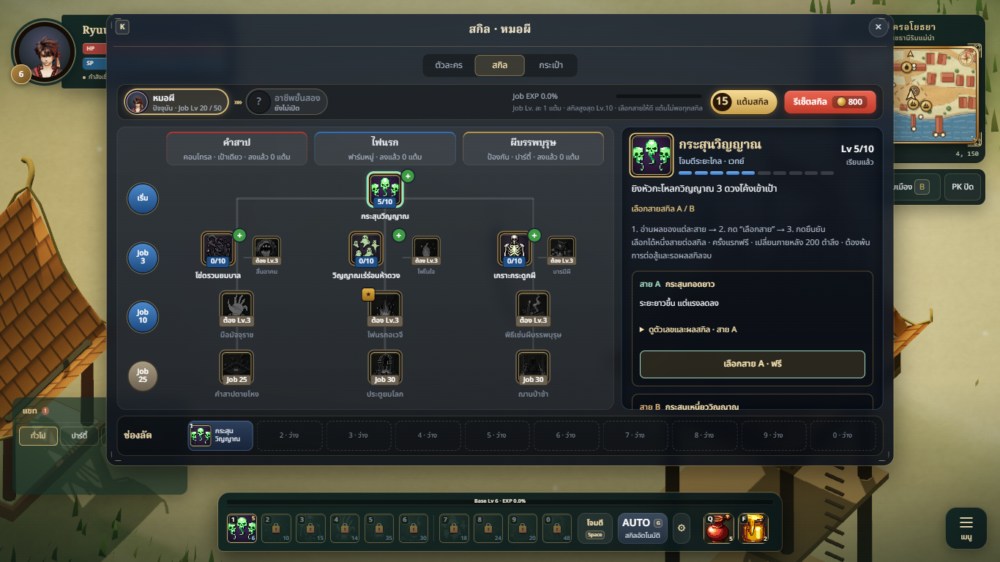
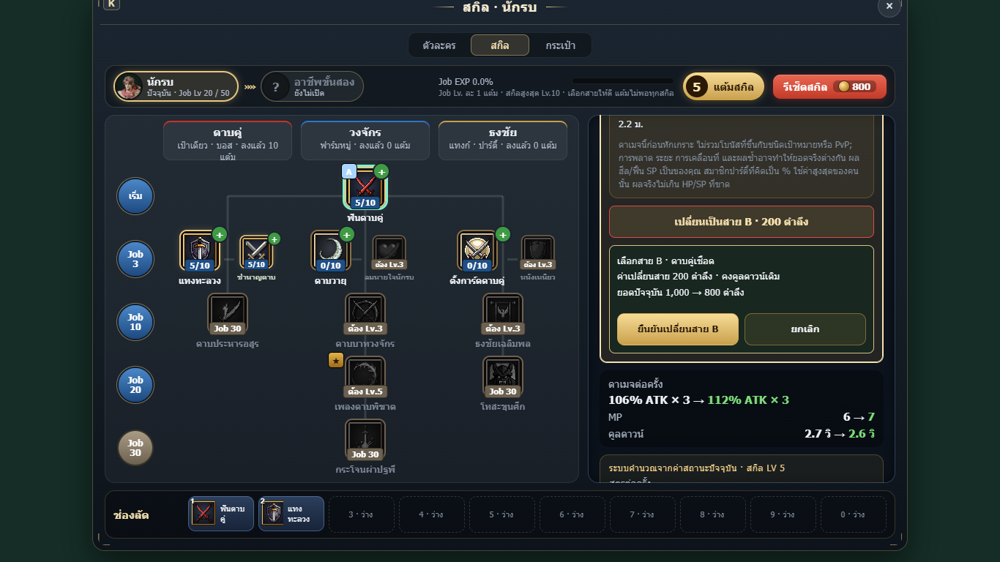

# Clear A/B skill choice

The path description used to double as the choice button, and two narrow columns made long numerical descriptions difficult to read. Each path is now a full-width card with a separate disclosure for numerical results and an explicit Select/Switch button. The current path is labelled and cannot be selected again. A three-step instruction and level requirement sit above the choices, before the longer current-character calculations.

Selection opens a confirmation immediately underneath that path, showing its name, cost and resulting balance. Focus moves to confirmation; cancellation returns focus to the originating button. Changing the selected skill clears pending confirmation. Character refreshes preserve open disclosures, keyboard focus and card scroll, update the displayed fee, and disable confirmation if combat or another existing guard blocks the choice. Saved choices, fees and server authority are unchanged.

## Changed files

- src/character/ui/SkillPanel.js
- src/character/ui/skill-choice.css
- tools/skill-choice-capture.mjs

## Validation

- npm test: 789 passed, 0 failed, 0 skipped.
- npm run build: passed; existing bundle-size warning remains.
- Browser checks at 1366×768, 1920×1080 and 390×844: all 65 active/passive skills with expanded A and B previews have no horizontal detail-card or option overflow. Verified free first choice, paid switch, cancellation, current-path disabled state, focus transfer/return, skill-switch cancellation and combat guard.
- Dynamic refresh checks: open disclosures and focused confirmation survive gold changes; combat disables confirmation; Job changes update the fee from 200 to 210 and back without mutating the choice.
- Isolated actual game: modern/classic PC layouts fit the viewport with expanded descriptions; first choice needs explicit confirmation and costs zero. Zero page errors.
- Reproduce the standalone checks: node tools/skill-choice-capture.mjs http://127.0.0.1:5181 (with dev server running). One browser/page is reused and closed afterward.
- Independent Art/Tech review: style 8/10, readability 9/10, technical usability 8/10; refresh-state follow-up implemented and checked.

## Screenshots

## Limits

Checks use isolated character fixtures and local guest gameplay; no live account or server changes. The 390px check is a browser viewport, not a physical touch-device test. Deployment is not included.
