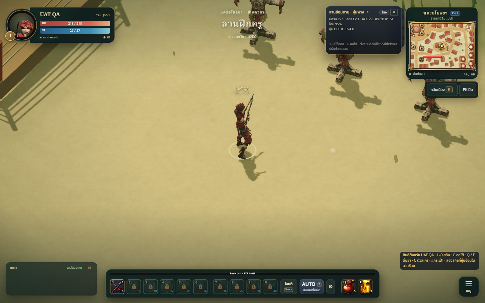

# UAT deployment — 2026-10-08

## Summary

Deployed the current class-model work and its existing feature stack to
https://thainative-uat.up.railway.app/. Preserved the newer Muay Thai fighter
already deployed from `origin/main` by merging main into a separate release
branch, `codex/uat-class-models`. Main itself was not changed.

- Application source revision: `1eba4f2`.
- Railway deployment: `2585ea0e-a4d4-4037-bd6e-9c778e95de97`, **SUCCESS**.
- Project: `603724c8-6a0b-41ba-bebb-f7351a57a176`.
- UAT environment: `0107c83a-e342-476a-b227-04f0c9eb5d45`.
- Application service: `7c7f23f3-4d05-4d3e-bf0d-512cc199eaab`.
- Live JavaScript bundle: `/assets/main-4KFeppsc.js`.

The clean upload contained only committed application files: package manifests,
index/config, `src`, `server` and `public`. It excluded local `.codex`, Claude
outputs, secrets, QA artifacts and build/source tooling. Existing Railway
environment variables and PostgreSQL were retained.

The release includes the prior portal/party leveling maps, boss skills, vendor
bulk transaction fixes, new shaman/support/hunter/warrior bodies and the warrior
head/wrist correction. The separate Meshy warrior candidate remains a tooling
review asset and does not replace the active class.

## Changes in this release branch

- Merge `origin/main` to retain `public/models/muay-thai-fighter.glb` and
  `tools/muaythai-anims/fighter-tripo.glb` from the latest main revision `ce80f08`.
- This deployment report and `2026-10-08-uat-warrior.png`.
- Prior pending feature/model changes are described in their existing reports
  and PRs; this deployment adds no new gameplay logic or account migrations.

## Validation

- Merged source: **346/346 tests pass** and `npm run build` passes. The existing
  approximately 1.74MB main-bundle warning remains.
- Live `/api/health`: `accounts: true`, `store: postgres`.
- SHA-256 comparisons over HTTPS match local committed files for all five class
  GLBs and both warrior/hunter portraits. The Muay Thai fighter is 1,188,104 bytes;
  the corrected warrior is 1,944,552 bytes.
- Live WebSocket guest handshake receives `welcome` in channel 1 and disconnects
  cleanly. No signed-in accounts were used for QA.
- Live Edge/Chromium guest gameplay at 1440x900 loads the corrected warrior and
  all 15 expected clips without browser page errors. Screenshot below.

## Known limitations

- Meshy remains a separate candidate requiring sword-combat/finger adaptation.
  It is not shipped into the game's public asset directory by this deployment.
- No fresh physical-phone or two-account combat test was performed during this
  deployment; model animation validation is recorded in the art review reports.
- Application source `1eba4f2` was deployed before this documentation-only
  follow-up commit; the running application's source is unchanged by the report.
